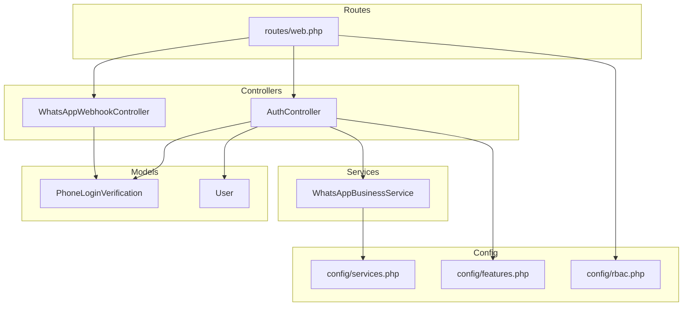
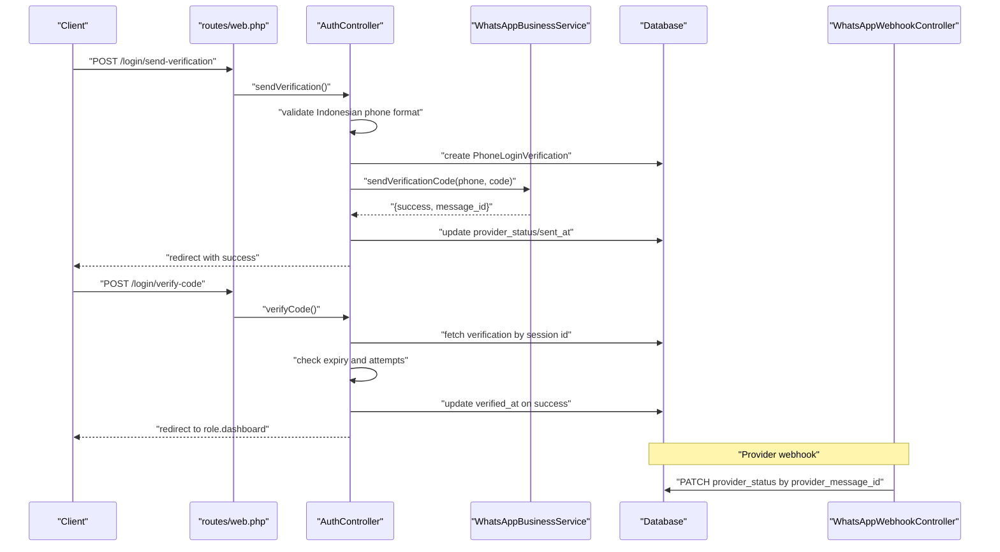
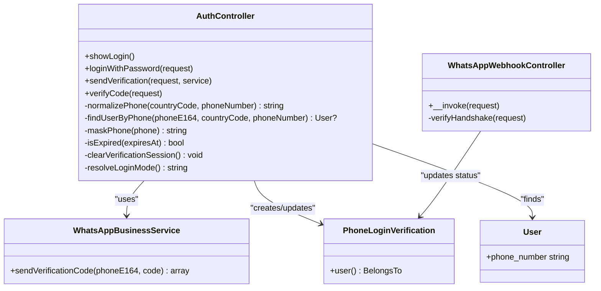

# Authentication API

<cite>
**Referenced Files in This Document**
- [routes/web.php](file://routes/web.php)
- [app/Http/Controllers/Auth/AuthController.php](file://app/Http/Controllers/Auth/AuthController.php)
- [app/Http/Controllers/Auth/WhatsAppWebhookController.php](file://app/Http/Controllers/Auth/WhatsAppWebhookController.php)
- [app/Services/WhatsAppBusinessService.php](file://app/Services/WhatsAppBusinessService.php)
- [app/Models/PhoneLoginVerification.php](file://app/Models/PhoneLoginVerification.php)
- [database/migrations/2026_04_17_045745_create_phone_login_verifications_table.php](file://database/migrations/2026_04_17_045745_create_phone_login_verifications_table.php)
- [config/services.php](file://config/services.php)
- [config/features.php](file://config/features.php)
- [config/rbac.php](file://config/rbac.php)
- [app/Models/User.php](file://app/Models/User.php)
- [database/migrations/2026_04_17_043615_add_phone_number_to_users_table.php](file://database/migrations/2026_04_17_043615_add_phone_number_to_users_table.php)
</cite>

## Update Summary
**Changes Made**
- Updated phone number validation to reflect simplified Indonesian-only format
- Modified authentication endpoints documentation to reflect fixed country code '+62'
- Updated validation rules and error messages to match new Indonesian phone number requirements
- Enhanced security considerations for Indonesian phone number format

## Table of Contents
1. [Introduction](#introduction)
2. [Project Structure](#project-structure)
3. [Core Components](#core-components)
4. [Architecture Overview](#architecture-overview)
5. [Detailed Component Analysis](#detailed-component-analysis)
6. [Dependency Analysis](#dependency-analysis)
7. [Performance Considerations](#performance-considerations)
8. [Troubleshooting Guide](#troubleshooting-guide)
9. [Conclusion](#conclusion)
10. [Appendices](#appendices)

## Introduction
This document describes the authentication system with phone-based login verification and WhatsApp webhook integration. The system has been simplified to support Indonesian phone numbers only, using a fixed country code format. It covers HTTP endpoints, request/response considerations, authentication middleware, security controls, rate limiting, and integration patterns with the WhatsApp Business API. The goal is to provide a clear, actionable guide for developers and operators to implement, test, and maintain the authentication flows.

## Project Structure
The authentication endpoints are defined in the web routes and handled by dedicated controllers. Supporting services and models encapsulate business logic and persistence.

**Diagram sources**
- [routes/web.php:41-55](file://routes/web.php#L41-L55)
- [app/Http/Controllers/Auth/AuthController.php:17](file://app/Http/Controllers/Auth/AuthController.php#L17)
- [app/Http/Controllers/Auth/WhatsAppWebhookController.php:11](file://app/Http/Controllers/Auth/WhatsAppWebhookController.php#L11)
- [app/Services/WhatsAppBusinessService.php:8](file://app/Services/WhatsAppBusinessService.php#L8)
- [app/Models/PhoneLoginVerification.php:8](file://app/Models/PhoneLoginVerification.php#L8)
- [config/services.php:38-51](file://config/services.php#L38-L51)
- [config/features.php:4-6](file://config/features.php#L4-L6)
- [config/rbac.php:31-36](file://config/rbac.php#L31-L36)

**Section sources**
- [routes/web.php:41-55](file://routes/web.php#L41-L55)
- [app/Http/Controllers/Auth/AuthController.php:17](file://app/Http/Controllers/Auth/AuthController.php#L17)
- [app/Http/Controllers/Auth/WhatsAppWebhookController.php:11](file://app/Http/Controllers/Auth/WhatsAppWebhookController.php#L11)
- [app/Services/WhatsAppBusinessService.php:8](file://app/Services/WhatsAppBusinessService.php#L8)
- [app/Models/PhoneLoginVerification.php:8](file://app/Models/PhoneLoginVerification.php#L8)
- [config/services.php:38-51](file://config/services.php#L38-L51)
- [config/features.php:4-6](file://config/features.php#L4-L6)
- [config/rbac.php:31-36](file://config/rbac.php#L31-L36)

## Core Components
- Phone-based login endpoints:
  - Send verification code
  - Verify code
- WhatsApp webhook endpoint for delivery status updates
- Supporting model for phone login verification records
- WhatsApp Business service abstraction for sending messages
- Configuration for service endpoints, tokens, templates, and webhook verification
- Feature flag for login mode selection
- RBAC middleware aliases for role-aware routing

Key responsibilities:
- Validate Indonesian phone numbers with fixed '+62' country code format
- Normalize phone numbers to E164 format (+62XXXXXXXXXX)
- Create verification records with expiry and attempt limits
- Send OTP via WhatsApp Business or compatible provider
- Persist provider message ID and status
- Update status upon webhook reception
- Authenticate user on successful verification

**Section sources**
- [routes/web.php:46-51](file://routes/web.php#L46-L51)
- [routes/web.php:54-55](file://routes/web.php#L54-L55)
- [app/Http/Controllers/Auth/AuthController.php:55-131](file://app/Http/Controllers/Auth/AuthController.php#L55-L131)
- [app/Http/Controllers/Auth/AuthController.php:133-203](file://app/Http/Controllers/Auth/AuthController.php#L133-L203)
- [app/Http/Controllers/Auth/WhatsAppWebhookController.php:13-40](file://app/Http/Controllers/Auth/WhatsAppWebhookController.php#L13-L40)
- [app/Services/WhatsAppBusinessService.php:13-97](file://app/Services/WhatsAppBusinessService.php#L13-L97)
- [app/Models/PhoneLoginVerification.php:8-35](file://app/Models/PhoneLoginVerification.php#L8-L35)
- [database/migrations/2026_04_17_045745_create_phone_login_verifications_table.php:14-29](file://database/migrations/2026_04_17_045745_create_phone_login_verifications_table.php#L14-L29)
- [config/services.php:38-51](file://config/services.php#L38-L51)
- [config/features.php:4-6](file://config/features.php#L4-L6)
- [config/rbac.php:31-36](file://config/rbac.php#L31-L36)

## Architecture Overview
High-level flow:
- Client requests phone login with Indonesian phone number format
- Backend validates input against Indonesian format, creates a verification record, and sends an OTP via WhatsApp
- Client receives the code and submits it for verification
- On success, the backend authenticates the user and redirects to the role-specific dashboard
- Provider sends delivery status updates via webhook; backend updates the verification record

**Diagram sources**
- [routes/web.php:46-51](file://routes/web.php#L46-L51)
- [app/Http/Controllers/Auth/AuthController.php:55-131](file://app/Http/Controllers/Auth/AuthController.php#L55-L131)
- [app/Http/Controllers/Auth/AuthController.php:133-203](file://app/Http/Controllers/Auth/AuthController.php#L133-L203)
- [app/Services/WhatsAppBusinessService.php:13-97](file://app/Services/WhatsAppBusinessService.php#L13-L97)
- [app/Http/Controllers/Auth/WhatsAppWebhookController.php:13-40](file://app/Http/Controllers/Auth/WhatsAppWebhookController.php#L13-L40)
- [app/Models/PhoneLoginVerification.php:31-34](file://app/Models/PhoneLoginVerification.php#L31-L34)

## Detailed Component Analysis

### Authentication Endpoints

#### Endpoint: Send Verification Code
- Method: POST
- URL: /login/send-verification
- Purpose: Initiate phone-based login by validating Indonesian phone number format, creating a verification record, and sending an OTP via WhatsApp
- Authentication: guest middleware (not authenticated yet)
- Rate limit: throttle:10 per minute
- Request body (JSON):
  - phone_number: string, required, format "0[0-9]{6,14}" (Indonesian format starting with 0)
- Response: Redirect with flash message
- Behavior:
  - Validates Indonesian phone number format (must start with 0, 6-14 digits total)
  - Normalizes to E164 format (+62XXXXXXXXXX)
  - Finds user by multiple candidate formats
  - Creates verification record with expiry and attempt limits
  - Sends OTP via configured WhatsApp provider
  - Stores masked phone and identifiers in session for subsequent verification

Security and validation:
- **Updated**: Now enforces Indonesian-only phone number format with regex `/^0[0-9]{6,14}$/`
- **Updated**: Fixed country code '+62' is automatically applied
- User lookup supports multiple formats to improve usability
- Verification expires after 5 minutes
- Maximum 3 attempts per verification session

**Section sources**
- [routes/web.php:46](file://routes/web.php#L46)
- [routes/web.php:47](file://routes/web.php#L47)
- [routes/web.php:41-52](file://routes/web.php#L41-L52)
- [app/Http/Controllers/Auth/AuthController.php:55-131](file://app/Http/Controllers/Auth/AuthController.php#L55-L131)
- [app/Http/Controllers/Auth/AuthController.php:205-225](file://app/Http/Controllers/Auth/AuthController.php#L205-L225)
- [app/Models/PhoneLoginVerification.php:10-23](file://app/Models/PhoneLoginVerification.php#L10-L23)
- [database/migrations/2026_04_17_045745_create_phone_login_verifications_table.php:14-29](file://database/migrations/2026_04_17_045745_create_phone_login_verifications_table.php#L14-L29)

#### Endpoint: Verify Code
- Method: POST
- URL: /login/verify-code
- Purpose: Validate the 6-digit OTP against the stored hash, enforce expiry and attempt limits, and authenticate the user on success
- Authentication: guest middleware
- Rate limit: throttle:15 per minute
- Request body (JSON):
  - verification_code: string, required, exactly 6 digits
- Response: Redirect with flash message
- Behavior:
  - Loads verification from session-stored ID
  - Checks expiry and maximum attempts
  - Compares hashed code with submitted value
  - Increments attempt count on failure
  - On success, sets verified timestamp, logs in the user, regenerates session, clears verification session, and redirects to role dashboard

Security and validation:
- Enforces 6-digit numeric code
- Tracks attempt counts and locks after threshold
- Enforces expiration window
- Clears sensitive session data on completion

**Section sources**
- [routes/web.php:49](file://routes/web.php#L49)
- [routes/web.php:50](file://routes/web.php#L50)
- [routes/web.php:41-52](file://routes/web.php#L41-L52)
- [app/Http/Controllers/Auth/AuthController.php:133-203](file://app/Http/Controllers/Auth/AuthController.php#L133-L203)
- [app/Models/PhoneLoginVerification.php:10-23](file://app/Models/PhoneLoginVerification.php#L10-L23)

#### Endpoint: WhatsApp Webhook
- Method: GET or POST
- URL: /webhooks/whatsapp
- Purpose: Handle provider delivery status updates and optional webhook verification handshake
- Authentication: none (public endpoint)
- GET verification:
  - Query parameters:
    - hub_mode: "subscribe"
    - hub_verify_token: configured token
    - hub_challenge: challenge string
  - Returns challenge on successful verification; otherwise 403
- POST delivery status:
  - Parses payload for status entries
  - Updates provider_status for each message ID found
  - Logs received events

Security and validation:
- Requires configured webhook verify token
- Updates provider_status for tracked messages
- Ignores empty message IDs

**Section sources**
- [routes/web.php:54](file://routes/web.php#L54)
- [routes/web.php:55](file://routes/web.php#L55)
- [app/Http/Controllers/Auth/WhatsAppWebhookController.php:13-40](file://app/Http/Controllers/Auth/WhatsAppWebhookController.php#L13-L40)
- [app/Http/Controllers/Auth/WhatsAppWebhookController.php:42-53](file://app/Http/Controllers/Auth/WhatsAppWebhookController.php#L42-L53)
- [config/services.php:44-51](file://config/services.php#L44-L51)

### Data Model: PhoneLoginVerification
Represents a single phone-based login attempt with associated metadata and provider status.

Fields:
- id: auto-increment integer
- user_id: foreign key to users
- country_code: string (fixed "+62" for Indonesian numbers)
- phone_e164: string (E164 format), indexed
- verification_code_hash: string (hashed OTP)
- attempt_count: tiny integer (default 0)
- max_attempts: tiny integer (default 3)
- expires_at: timestamp, indexed
- sent_at: nullable timestamp
- verified_at: nullable timestamp
- provider_message_id: nullable string, indexed
- provider_status: string (default "pending")
- last_error: nullable text
- timestamps: created_at, updated_at

Relationships:
- belongs to User

Indexes:
- phone_e164
- provider_message_id
- expires_at

**Section sources**
- [app/Models/PhoneLoginVerification.php:8-35](file://app/Models/PhoneLoginVerification.php#L8-L35)
- [database/migrations/2026_04_17_045745_create_phone_login_verifications_table.php:14-29](file://database/migrations/2026_04_17_045745_create_phone_login_verifications_table.php#L14-L29)

### Service: WhatsAppBusinessService
Encapsulates sending verification codes via WhatsApp Business or compatible providers.

Capabilities:
- Supports Meta WhatsApp Business Cloud API and Wablas
- Reads base URL, endpoint, access token, template, and enabled flags from configuration
- Sends templated message with OTP and expiry notice
- Handles provider-specific payload differences
- Returns structured result with success flag, message ID, and error message
- Logs failures and successes

Behavior:
- If service disabled or missing credentials, returns failure with message
- For Wablas: posts to base URL with Authorization header
- For Meta: posts to base_url/messages with Bearer token
- Extracts message ID from provider response
- Logs warnings and errors appropriately

**Section sources**
- [app/Services/WhatsAppBusinessService.php:8-99](file://app/Services/WhatsAppBusinessService.php#L8-L99)
- [config/services.php:38-51](file://config/services.php#L38-L51)

### Configuration
- Login mode:
  - Value: "password", "whatsapp", or "both"
  - Controls whether phone login is enabled
- WhatsApp Business:
  - enabled: boolean flag
  - base_url: provider endpoint
  - messages_endpoint: API endpoint for sending messages
  - access_token: provider token
  - template: template name for OTP
  - webhook_verify_token: token for webhook verification
- Legacy WhatsApp fallback:
  - enabled, base_url, token for compatibility

**Section sources**
- [config/features.php:4-6](file://config/features.php#L4-L6)
- [config/services.php:44-51](file://config/services.php#L44-L51)
- [config/services.php:38-42](file://config/services.php#L38-L42)

### Authentication Middleware and RBAC
- Guest middleware: restricts login endpoints to unauthenticated users
- Role redirect middleware: redirects to role-specific dashboard route
- Admin gate middleware alias: used for protected admin routes
- Throttles:
  - /login: throttle:20,1
  - /login/send-verification: throttle:10,1
  - /login/verify-code: throttle:15,1
  - Additional throttles exist for admin and evaluator routes

**Section sources**
- [routes/web.php:41-52](file://routes/web.php#L41-L52)
- [routes/web.php:72-147](file://routes/web.php#L72-L147)
- [config/rbac.php:31-36](file://config/rbac.php#L31-L36)

## Dependency Analysis

**Diagram sources**
- [app/Http/Controllers/Auth/AuthController.php:17](file://app/Http/Controllers/Auth/AuthController.php#L17)
- [app/Http/Controllers/Auth/WhatsAppWebhookController.php:11](file://app/Http/Controllers/Auth/WhatsAppWebhookController.php#L11)
- [app/Services/WhatsAppBusinessService.php:8](file://app/Services/WhatsAppBusinessService.php#L8)
- [app/Models/PhoneLoginVerification.php:31-34](file://app/Models/PhoneLoginVerification.php#L31-L34)
- [app/Models/User.php:12](file://app/Models/User.php#L12)

**Section sources**
- [app/Http/Controllers/Auth/AuthController.php:17](file://app/Http/Controllers/Auth/AuthController.php#L17)
- [app/Http/Controllers/Auth/WhatsAppWebhookController.php:11](file://app/Http/Controllers/Auth/WhatsAppWebhookController.php#L11)
- [app/Services/WhatsAppBusinessService.php:8](file://app/Services/WhatsAppBusinessService.php#L8)
- [app/Models/PhoneLoginVerification.php:31-34](file://app/Models/PhoneLoginVerification.php#L31-L34)

## Performance Considerations
- Throttling:
  - Use the provided throttles to prevent abuse on login endpoints
  - Consider additional rate limiting at the infrastructure level (load balancer, CDN)
- Database:
  - Indexes on phone_e164, provider_message_id, and expires_at support efficient lookups
  - Keep verification records small; consider pruning expired rows periodically
- Network:
  - Set timeouts for external provider calls
  - Monitor provider latency and error rates
- Caching:
  - Consider caching frequently accessed configuration values
- Logging:
  - Use structured logs for audit trails and incident response

## Troubleshooting Guide
Common issues and resolutions:
- Service not enabled or missing credentials:
  - Symptom: Failure to send OTP with a descriptive message
  - Resolution: Enable service and set base_url, access_token, template, and webhook_verify_token
- Invalid phone number format:
  - Symptom: Validation errors with message "Format nomor telepon tidak valid. Gunakan format 08xxxxxxxxxx."
  - Resolution: Ensure phone_number follows Indonesian format (starts with 0, 6-14 digits total)
- Expired code:
  - Symptom: Verification fails with expiry message
  - Resolution: Request a new code; codes expire after 5 minutes
- Attempt limit exceeded:
  - Symptom: Locked status after repeated wrong codes
  - Resolution: Wait for reset or request a new code
- Webhook not updating status:
  - Symptom: provider_status remains pending
  - Resolution: Verify webhook URL, token, and payload structure; ensure provider_message_id matches
- Session cleared unexpectedly:
  - Symptom: Verification session lost
  - Resolution: Ensure browser accepts session cookies and does not block redirects

**Section sources**
- [app/Services/WhatsAppBusinessService.php:28-35](file://app/Services/WhatsAppBusinessService.php#L28-L35)
- [app/Http/Controllers/Auth/AuthController.php:61-65](file://app/Http/Controllers/Auth/AuthController.php#L61-L65)
- [app/Http/Controllers/Auth/AuthController.php:156-162](file://app/Http/Controllers/Auth/AuthController.php#L156-L162)
- [app/Http/Controllers/Auth/AuthController.php:164-170](file://app/Http/Controllers/Auth/AuthController.php#L164-L170)
- [app/Http/Controllers/Auth/WhatsAppWebhookController.php:22-32](file://app/Http/Controllers/Auth/WhatsAppWebhookController.php#L22-L32)

## Conclusion
The authentication system provides a robust phone-based login flow integrated with WhatsApp delivery and webhook status updates. The system has been simplified to support Indonesian phone numbers only, using a fixed '+62' country code format. By leveraging validated Indonesian phone number inputs, strict expiry and attempt limits, and configurable provider settings, it balances usability with security. Proper configuration of service credentials, webhook verification, and rate limiting ensures reliable operation.

## Appendices

### API Definition Summary
- Base URL: application root
- Authentication:
  - /login/send-verification: guest
  - /login/verify-code: guest
  - /webhooks/whatsapp: public
- Rate limits:
  - /login: throttle:20,1
  - /login/send-verification: throttle:10,1
  - /login/verify-code: throttle:15,1

**Section sources**
- [routes/web.php:41-52](file://routes/web.php#L41-L52)
- [routes/web.php:54-55](file://routes/web.php#L54-L55)

### Security Best Practices
- Enforce Indonesian phone number format validation (0XXXXXXXXXXX)
- Use HTTPS and secure cookies
- Limit OTP lifetime and attempts
- Monitor and log all authentication events
- Regularly rotate provider tokens
- Restrict webhook URL exposure to trusted providers
- **Updated**: Implement fixed country code '+62' for Indonesian phone numbers only

### Indonesian Phone Number Format Requirements
- **Updated**: Must start with '0' followed by 6-14 digits
- **Updated**: Automatically normalized to '+62' country code
- **Updated**: Supports all Indonesian mobile network prefixes
- **Updated**: Validation ensures compliance with Indonesian telecommunications standards

**Section sources**
- [app/Http/Controllers/Auth/AuthController.php:61-65](file://app/Http/Controllers/Auth/AuthController.php#L61-L65)
- [app/Http/Controllers/Auth/AuthController.php:203-208](file://app/Http/Controllers/Auth/AuthController.php#L203-L208)
- [database/migrations/2026_04_17_043615_add_phone_number_to_users_table.php:14-16](file://database/migrations/2026_04_17_043615_add_phone_number_to_users_table.php#L14-L16)