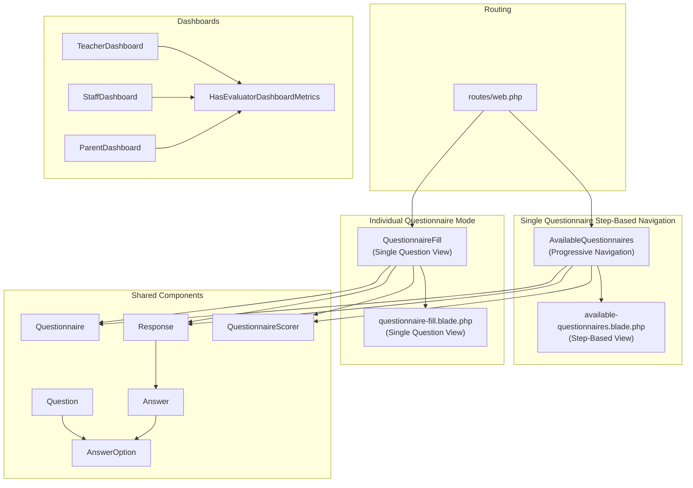
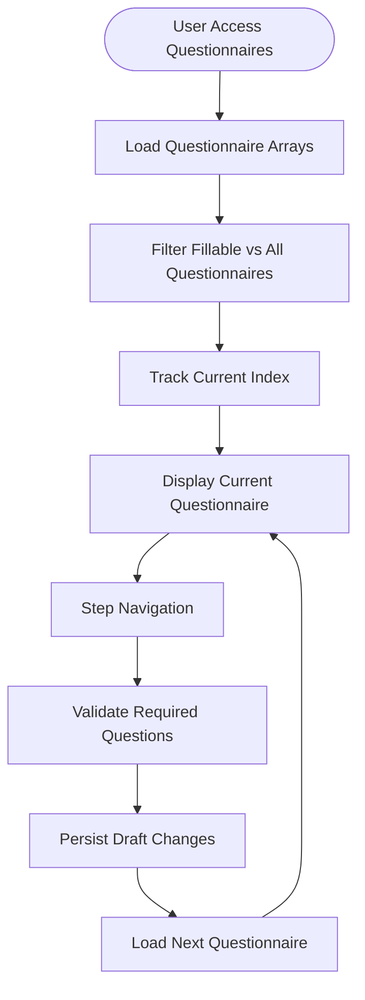
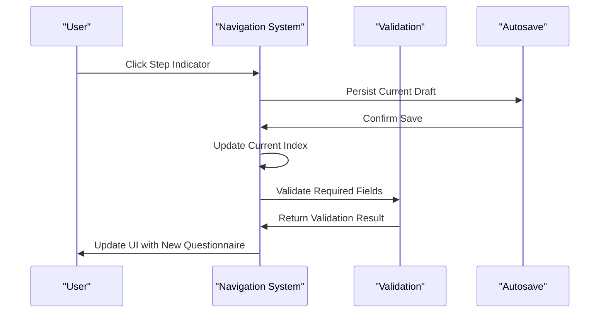
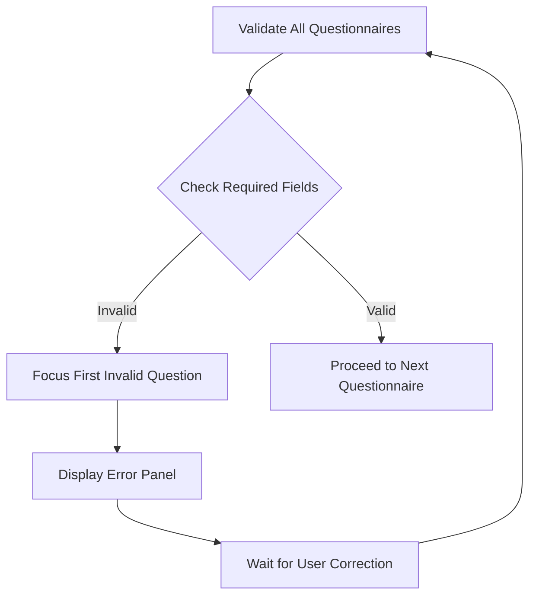
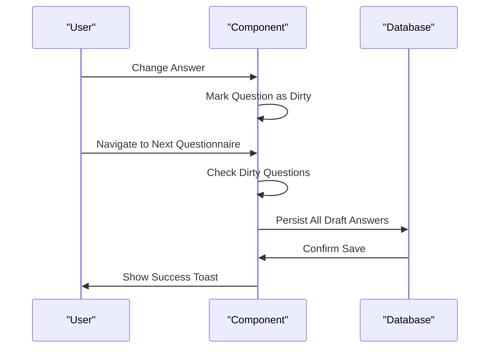
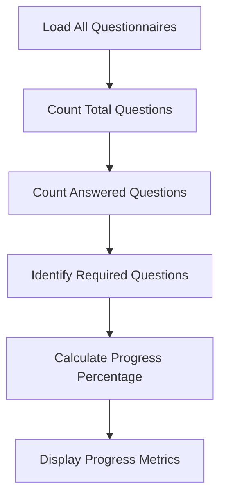
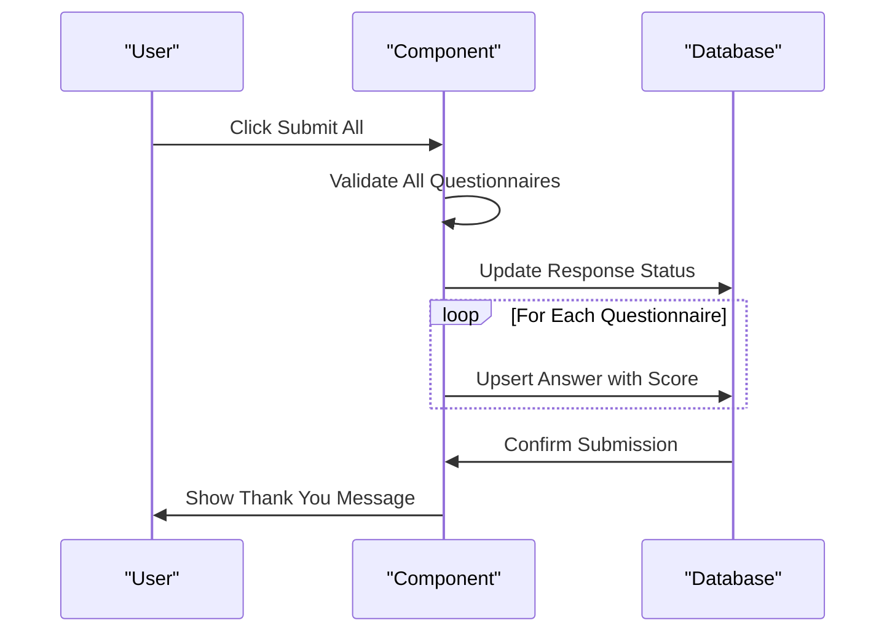

# Questionnaire Filling Interface

<cite>
**Referenced Files in This Document**
- [AvailableQuestionnaires.php](file://app/Livewire/Fill/AvailableQuestionnaires.php)
- [available-questionnaires.blade.php](file://resources/views/livewire/fill/available-questionnaires.blade.php)
- [QuestionnaireFill.php](file://app/Livewire/Fill/QuestionnaireFill.php)
- [questionnaire-fill.blade.php](file://resources/views/livewire/fill/questionnaire-fill.blade.php)
- [Questionnaire.php](file://app/Models/Questionnaire.php)
- [Question.php](file://app/Models/Question.php)
- [AnswerOption.php](file://app/Models/AnswerOption.php)
- [Response.php](file://app/Models/Response.php)
- [Answer.php](file://app/Models/Answer.php)
- [QuestionnaireScorer.php](file://app/Services/QuestionnaireScorer.php)
- [TeacherDashboard.php](file://app/Livewire/Fill/TeacherDashboard.php)
- [StaffDashboard.php](file://app/Livewire/Fill/StaffDashboard.php)
- [ParentDashboard.php](file://app/Livewire/Fill/ParentDashboard.php)
- [HasEvaluatorDashboardMetrics.php](file://app/Livewire/Fill/Concerns/HasEvaluatorDashboardMetrics.php)
- [features.php](file://config/features.php)
- [web.php](file://routes/web.php)
</cite>

## Update Summary
**Changes Made**
- Complete rewrite of navigation system documentation to reflect transformation from grouped questionnaire display to streamlined single-questionnaire step-based navigation
- Updated core components documentation to focus on AvailableQuestionnaires component with new $questionnaireIds/$allQuestionnaireIds arrays and $dirtyQuestionIds tracking system
- Revised autosave and draft management documentation to cover the new progressive questionnaire navigation model
- Updated progress tracking documentation to reflect enhanced monitoring across multiple questionnaires
- Removed documentation for grouped questionnaire system and simplified architecture explanations
- Enhanced validation mechanisms documentation for the new single-questionnaire step-based approach

## Table of Contents
1. [Introduction](#introduction)
2. [System Architecture](#system-architecture)
3. [Core Components](#core-components)
4. [Single Questionnaire Step-Based Navigation](#single-questionnaire-step-based-navigation)
5. [Navigation and User Experience](#navigation-and-user-experience)
6. [Question Types and Input Handling](#question-types-and-input-handling)
7. [Validation and Error Handling](#validation-and-error-handling)
8. [Autosave and Draft Management](#autosave-and-draft-management)
9. [Progress Tracking and Analytics](#progress-tracking-and-analytics)
10. [Submission and Finalization](#submission-and-finalization)
11. [Dashboard Components](#dashboard-components)
12. [Accessibility and Mobile Responsiveness](#accessibility-and-mobile-responsiveness)
13. [Performance Considerations](#performance-considerations)
14. [Troubleshooting Guide](#troubleshooting-guide)
15. [Conclusion](#conclusion)

## Introduction
This document describes the interactive questionnaire filling interface used by evaluators to complete assessment forms through a streamlined single-questionnaire step-based navigation system. The interface features progressive questionnaire navigation, autosave functionality, step indicators, and comprehensive validation mechanisms. It covers step-by-step navigation, question types (single choice, essay, combined), validation mechanisms, autosave and draft management, progress tracking, UI components, keyboard shortcuts, accessibility, and mobile responsiveness. The interface is built with Laravel Livewire and Blade, styled with Tailwind CSS and Flux UI components.

## System Architecture
The questionnaire filling system operates through a single-questionnaire step-based navigation approach that streamlines the user experience by focusing on one questionnaire at a time while maintaining cross-questionnaire progress tracking:



**Diagram sources**
- [AvailableQuestionnaires.php:18-670](file://app/Livewire/Fill/AvailableQuestionnaires.php#L18-L670)
- [available-questionnaires.blade.php:1-488](file://resources/views/livewire/fill/available-questionnaires.blade.php#L1-L488)
- [QuestionnaireFill.php:19-515](file://app/Livewire/Fill/QuestionnaireFill.php#L19-L515)
- [questionnaire-fill.blade.php:1-402](file://resources/views/livewire/fill/questionnaire-fill.blade.php#L1-L402)
- [TeacherDashboard.php:10-23](file://app/Livewire/Fill/TeacherDashboard.php#L10-L23)
- [StaffDashboard.php:10-23](file://app/Livewire/Fill/StaffDashboard.php#L10-L23)
- [ParentDashboard.php:10-23](file://app/Livewire/Fill/ParentDashboard.php#L10-L23)
- [HasEvaluatorDashboardMetrics.php:9-73](file://app/Livewire/Fill/Concerns/HasEvaluatorDashboardMetrics.php#L9-L73)

**Section sources**
- [AvailableQuestionnaires.php:56-60](file://app/Livewire/Fill/AvailableQuestionnaires.php#L56-L60)
- [QuestionnaireFill.php:44-122](file://app/Livewire/Fill/QuestionnaireFill.php#L44-L122)
- [web.php:149-160](file://routes/web.php#L149-L160)

## Core Components
The system consists of two main components that work together to provide a streamlined questionnaire filling experience:

### AvailableQuestionnaires Component
- **Progressive Navigation**: Manages multiple questionnaires through step-based navigation with $questionnaireIds/$allQuestionnaireIds arrays
- **Enhanced Tracking**: Implements $dirtyQuestionIds tracking system for efficient autosave operations
- **Cross-Questionnaire Progress**: Provides overall progress tracking across all fillable questionnaires
- **Time Limit Management**: Handles time-expired scenarios with automatic submission
- **Step Indicators**: Visual step markers showing current position in questionnaire sequence

### QuestionnaireFill Component
- **Single Question Focus**: Provides focused, distraction-free question answering for individual questionnaires
- **Step Navigation**: Sequential navigation with previous/next buttons and direct question access
- **Individual State Management**: Standalone response tracking with independent autosave functionality
- **Progress Monitoring**: Separate progress tracking for each questionnaire

### Dashboard Components
- **TeacherDashboard**, **StaffDashboard**, **ParentDashboard**: Role-specific dashboards with metrics and navigation
- **HasEvaluatorDashboardMetrics**: Shared trait for dashboard metric calculation

**Section sources**
- [AvailableQuestionnaires.php:25-45](file://app/Livewire/Fill/AvailableQuestionnaires.php#L25-L45)
- [AvailableQuestionnaires.php:53-54](file://app/Livewire/Fill/AvailableQuestionnaires.php#L53-L54)
- [AvailableQuestionnaires.php:42-42](file://app/Livewire/Fill/AvailableQuestionnaires.php#L42-L42)
- [QuestionnaireFill.php:21-42](file://app/Livewire/Fill/QuestionnaireFill.php#L21-L42)
- [TeacherDashboard.php:10-23](file://app/Livewire/Fill/TeacherDashboard.php#L10-L23)
- [StaffDashboard.php:10-23](file://app/Livewire/Fill/StaffDashboard.php#L10-L23)
- [ParentDashboard.php:10-23](file://app/Livewire/Fill/ParentDashboard.php#L10-L23)
- [HasEvaluatorDashboardMetrics.php:9-73](file://app/Livewire/Fill/Concerns/HasEvaluatorDashboardMetrics.php#L9-L73)

## Single Questionnaire Step-Based Navigation
The system implements a streamlined step-based navigation approach that focuses on one questionnaire at a time while maintaining cross-questionnaire awareness:

### Progressive Questionnaire Management
- **Ordered Questionnaire Arrays**: $questionnaireIds contains fillable questionnaire IDs, $allQuestionnaireIds includes all questionnaires
- **Current Index Tracking**: $currentIndex (0-based) manages position within the fillable questionnaire sequence
- **Step-by-Step Navigation**: Previous/Next buttons with automatic draft saving and validation
- **Direct Access**: Step indicators allow jumping to any questionnaire in the sequence

### Enhanced State Management
- **Dirty Question Tracking**: $dirtyQuestionIds array efficiently tracks which questions have unsaved changes
- **Cross-Questionnaire Persistence**: Maintains separate responses for each questionnaire with selective autosave
- **Time Limit Integration**: Automatic time-expired detection with deadline calculation and auto-submission



**Diagram sources**
- [AvailableQuestionnaires.php:234-301](file://app/Livewire/Fill/AvailableQuestionnaires.php#L234-L301)
- [AvailableQuestionnaires.php:153-184](file://app/Livewire/Fill/AvailableQuestionnaires.php#L153-L184)
- [AvailableQuestionnaires.php:342-363](file://app/Livewire/Fill/AvailableQuestionnaires.php#L342-L363)

**Section sources**
- [AvailableQuestionnaires.php:25-32](file://app/Livewire/Fill/AvailableQuestionnaires.php#L25-L32)
- [AvailableQuestionnaires.php:53-54](file://app/Livewire/Fill/AvailableQuestionnaires.php#L53-L54)
- [AvailableQuestionnaires.php:153-184](file://app/Livewire/Fill/AvailableQuestionnaires.php#L153-L184)
- [available-questionnaires.blade.php:144-196](file://resources/views/livewire/fill/available-questionnaires.blade.php#L144-L196)

## Navigation and User Experience
The system provides intuitive step-based navigation with enhanced user experience features:

### Step-Based Navigation
- **Visual Step Indicators**: Dots showing current, visited, and upcoming questionnaires with clear visual hierarchy
- **Progressive Loading**: Only loads current questionnaire questions to optimize performance
- **Automatic Draft Saving**: Persists changes when navigating between questionnaires
- **Boundary Management**: Prevents navigation beyond questionnaire array bounds

### Enhanced User Experience Features
- **Time Limit Visualization**: Countdown timer with color-coded warnings as expiration approaches
- **Validation Feedback**: Real-time validation with error highlighting and scroll positioning
- **Responsive Design**: Adapts to different screen sizes with horizontal scrolling for step indicators
- **Accessibility Support**: Keyboard navigation and screen reader compatibility



**Diagram sources**
- [AvailableQuestionnaires.php:153-184](file://app/Livewire/Fill/AvailableQuestionnaires.php#L153-L184)
- [AvailableQuestionnaires.php:342-363](file://app/Livewire/Fill/AvailableQuestionnaires.php#L342-L363)
- [available-questionnaires.blade.php:448-470](file://resources/views/livewire/fill/available-questionnaires.blade.php#L448-L470)

**Section sources**
- [AvailableQuestionnaires.php:153-184](file://app/Livewire/Fill/AvailableQuestionnaires.php#L153-L184)
- [available-questionnaires.blade.php:144-196](file://resources/views/livewire/fill/available-questionnaires.blade.php#L144-L196)
- [available-questionnaires.blade.php:198-212](file://resources/views/livewire/fill/available-questionnaires.blade.php#L198-L212)

## Question Types and Input Handling
The system supports three question types with specialized input handling optimized for the step-based navigation:

### Single Choice Questions
- **Radio Button Interface**: Exclusive selection with immediate validation
- **Required Field Handling**: Enforced selection for required questions
- **Option Scoring**: Automatic score calculation based on selected option

### Essay Questions
- **Textarea Input**: Multi-line text input with character limits
- **Live Validation**: Real-time validation with character counter
- **Debounced Updates**: Input debouncing to optimize performance

### Combined Questions
- **Dual Input System**: Radio button selection followed by essay explanation
- **Conditional Display**: Essay field appears only after option selection
- **Comprehensive Validation**: Both selection and explanation required

```mermaid
classDiagram
class Question {
+int id
+string question_text
+string type
+bool is_required
+int order
}
class AnswerOption {
+int id
+int question_id
+string option_text
+int score
+int order
}
class Answer {
+int id
+int response_id
+int question_id
+int answer_option_id
+string essay_answer
+int calculated_score
}
Question "1" o-- "many" AnswerOption : "has many"
Answer "belongs to" Question : "question_id"
Answer "belongs to" AnswerOption : "answer_option_id"
```

**Diagram sources**
- [Question.php:16-26](file://app/Models/Question.php#L16-L26)
- [AnswerOption.php:15-21](file://app/Models/AnswerOption.php#L15-L21)
- [Answer.php:15-22](file://app/Models/Answer.php#L15-L22)

**Section sources**
- [available-questionnaires.blade.php:283-377](file://resources/views/livewire/fill/available-questionnaires.blade.php#L283-L377)
- [QuestionnaireFill.php:301-335](file://app/Livewire/Fill/QuestionnaireFill.php#L301-L335)
- [questionnaire-fill.blade.php:196-283](file://resources/views/livewire/fill/questionnaire-fill.blade.php#L196-L283)

## Validation and Error Handling
The system implements comprehensive validation at both individual question and cross-questionnaire levels:

### Per-Question Validation
- **Individual Question Validation**: Validates current question immediately on change
- **Real-time Feedback**: Visual highlighting and error messages for invalid inputs
- **Type-Specific Rules**: Different validation rules based on question type

### Cross-Questionnaire Validation
- **Global Validation**: Validates all required questions across all fillable questionnaires
- **Step Validation**: Ensures each questionnaire has valid responses before proceeding
- **Error Aggregation**: Collects and displays all validation errors in a unified panel

### Error Handling Mechanisms
- **Automatic Focus**: Automatically focuses on first invalid question
- **Scroll Positioning**: Scrolls to invalid questions for better user experience
- **Persistent Error States**: Maintains error states until corrections are made



**Diagram sources**
- [AvailableQuestionnaires.php:446-486](file://app/Livewire/Fill/AvailableQuestionnaires.php#L446-L486)
- [AvailableQuestionnaires.php:204-209](file://app/Livewire/Fill/AvailableQuestionnaires.php#L204-L209)

**Section sources**
- [AvailableQuestionnaires.php:446-486](file://app/Livewire/Fill/AvailableQuestionnaires.php#L446-L486)
- [available-questionnaires.blade.php:198-212](file://resources/views/livewire/fill/available-questionnaires.blade.php#L198-L212)
- [questionnaire-fill.blade.php:102-115](file://resources/views/livewire/fill/questionnaire-fill.blade.php#L102-L115)

## Autosave and Draft Management
The enhanced autosave system provides robust draft persistence optimized for the step-based navigation model:

### Progressive Autosave System
- **Navigation-Based Autosave**: Primary autosave triggered on navigation actions with $dirtyQuestionIds tracking
- **Manual Save Option**: Users can manually trigger autosave at any time
- **Efficient Persistence**: Only persists questions with actual answers, removing empty entries

### Cross-Questionnaire Draft Management
- **Individual Response Tracking**: Each questionnaire maintains its own response state
- **Batch Processing**: Efficiently processes multiple questionnaires during autosave
- **Status Management**: Maintains draft status with timestamps for audit trails

### Draft Persistence Logic
- **Selective Persistence**: Only persists questions with actual answers
- **Empty Answer Cleanup**: Removes entries when both answer option and essay are empty
- **Time Limit Integration**: Automatically handles time-expired scenarios with forced submission



**Diagram sources**
- [AvailableQuestionnaires.php:186-197](file://app/Livewire/Fill/AvailableQuestionnaires.php#L186-L197)
- [AvailableQuestionnaires.php:342-363](file://app/Livewire/Fill/AvailableQuestionnaires.php#L342-L363)

**Section sources**
- [AvailableQuestionnaires.php:186-197](file://app/Livewire/Fill/AvailableQuestionnaires.php#L186-L197)
- [AvailableQuestionnaires.php:342-444](file://app/Livewire/Fill/AvailableQuestionnaires.php#L342-L444)
- [QuestionnaireFill.php:146-154](file://app/Livewire/Fill/QuestionnaireFill.php#L146-L154)

## Progress Tracking and Analytics
The system provides comprehensive progress tracking across multiple questionnaires with real-time updates:

### Cross-Questionnaire Metrics
- **Overall Progress**: Tracks answered vs total questions across all fillable questionnaires
- **Required Question Tracking**: Separates required from optional questions with completion percentages
- **Percentage Calculation**: Real-time progress percentage computation across all questionnaires
- **Time Limit Monitoring**: Visual countdown timers with color-coded warnings

### Individual Questionnaire Metrics
- **Question-Level Progress**: Tracks answered vs total questions for current questionnaire
- **Required Question Tracking**: Separates required from optional questions
- **Percentage Calculation**: Real-time progress percentage computation

### Dashboard Integration
- **Role-Based Metrics**: Different metrics for teachers, staff, and parents
- **Submission Status**: Tracks completed vs pending questionnaire submissions
- **Time-Based Analytics**: Completion timing and response patterns



**Diagram sources**
- [AvailableQuestionnaires.php:75-111](file://app/Livewire/Fill/AvailableQuestionnaires.php#L75-L111)
- [AvailableQuestionnaires.php:252-299](file://app/Livewire/Fill/QuestionnaireFill.php#L252-L299)

**Section sources**
- [AvailableQuestionnaires.php:75-111](file://app/Livewire/Fill/AvailableQuestionnaires.php#L75-L111)
- [AvailableQuestionnaires.php:117-119](file://app/Livewire/Fill/AvailableQuestionnaires.php#L117-L119)
- [QuestionnaireFill.php:252-299](file://app/Livewire/Fill/QuestionnaireFill.php#L252-L299)

## Submission and Finalization
The submission process is streamlined with enhanced validation and user confirmation:

### Cross-Questionnaire Submission
- **Bulk Submission**: Submits all fillable questionnaires simultaneously with validation
- **Cross-Questionnaire Validation**: Validates all required questions across all questionnaires
- **Individual Response Creation**: Creates separate responses for each questionnaire

### Finalization Process
- **Confirmation Dialog**: Shows summary of all responses before final submission
- **Transaction Processing**: Uses database transactions for data integrity
- **Success Feedback**: Provides clear success messages and navigation options
- **Time Limit Handling**: Automatic submission when time expires with appropriate messaging

### Single Questionnaire Submission
- **Individual Questionnaire Finalization**: Direct submission of one questionnaire
- **Immediate Validation**: Validates all required questions before submission
- **Score Calculation**: Calculates scores for all answered questions



**Diagram sources**
- [AvailableQuestionnaires.php:216-232](file://app/Livewire/Fill/AvailableQuestionnaires.php#L216-L232)
- [AvailableQuestionnaires.php:582-668](file://app/Livewire/Fill/AvailableQuestionnaires.php#L582-L668)

**Section sources**
- [AvailableQuestionnaires.php:204-232](file://app/Livewire/Fill/AvailableQuestionnaires.php#L204-L232)
- [AvailableQuestionnaires.php:582-668](file://app/Livewire/Fill/AvailableQuestionnaires.php#L582-L668)
- [QuestionnaireFill.php:172-245](file://app/Livewire/Fill/QuestionnaireFill.php#L172-L245)

## Dashboard Components
The system includes role-specific dashboards with comprehensive metrics:

### Dashboard Architecture
- **Trait-Based Implementation**: Uses HasEvaluatorDashboardMetrics trait for common functionality
- **Role-Based Filtering**: Filters questionnaires based on user roles and aliases
- **Metric Aggregation**: Provides statistics for available, completed, and active questionnaires

### Dashboard Features
- **Available Questionnaires List**: Shows questionnaires eligible for the current user
- **Completed Questionnaires**: Lists previously submitted questionnaires
- **Statistics Display**: Shows counts for active questionnaires, available to fill, and completed total
- **Navigation Integration**: Direct links to questionnaire filling interfaces

### Role-Specific Dashboards
- **Teacher Dashboard**: Metrics tailored for educational staff
- **Staff Dashboard**: Administrative staff questionnaire management
- **Parent Dashboard**: Parent portal for student-related questionnaires

**Section sources**
- [TeacherDashboard.php:10-23](file://app/Livewire/Fill/TeacherDashboard.php#L10-L23)
- [StaffDashboard.php:10-23](file://app/Livewire/Fill/StaffDashboard.php#L10-L23)
- [ParentDashboard.php:10-23](file://app/Livewire/Fill/ParentDashboard.php#L10-L23)
- [HasEvaluatorDashboardMetrics.php:9-73](file://app/Livewire/Fill/Concerns/HasEvaluatorDashboardMetrics.php#L9-L73)

## Accessibility and Mobile Responsiveness
The interface is designed with accessibility and mobile usability in mind:

### Accessibility Features
- **Keyboard Navigation**: Full keyboard support for all interactive elements
- **Screen Reader Support**: Proper ARIA attributes and semantic HTML
- **Focus Management**: Logical tab order and focus indication
- **Color Contrast**: High contrast ratios for text and interactive elements

### Mobile Responsiveness
- **Adaptive Layouts**: Responsive grid systems adapt to different screen sizes
- **Touch-Friendly Controls**: Appropriately sized touch targets for mobile devices
- **Horizontal Scrolling**: Step indicators adapt to narrow screens
- **Performance Optimization**: Optimized rendering for mobile browsers

### User Experience Enhancements
- **Toast Notifications**: Non-intrusive status updates with appropriate timing
- **Loading States**: Visual feedback during autosave and submission operations
- **Error Communication**: Clear error messages with actionable guidance
- **Progress Visualization**: Intuitive progress indicators and completion tracking

**Section sources**
- [available-questionnaires.blade.php:472-487](file://resources/views/livewire/fill/available-questionnaires.blade.php#L472-L487)
- [questionnaire-fill.blade.php:387-401](file://resources/views/livewire/fill/questionnaire-fill.blade.php#L387-L401)

## Performance Considerations
The system is optimized for efficient operation across multiple scenarios:

### Rendering Optimization
- **Component-Level Rendering**: Only renders visible components and current questionnaire
- **Lazy Loading**: Questionnaires are loaded as needed based on user navigation
- **Efficient Data Structures**: Optimized data structures for questionnaire and answer management

### Database Performance
- **Batch Operations**: Efficient batch processing for autosave and submission operations
- **Query Optimization**: Optimized queries for loading questionnaires and responses
- **Connection Pooling**: Proper database connection management for concurrent users

### Memory Management
- **State Cleanup**: Automatic cleanup of unused state data
- **Event Management**: Efficient event handling for autosave and validation
- **Resource Optimization**: Minimized memory footprint for large questionnaire sets

## Troubleshooting Guide
Common issues and their solutions:

### Access and Authentication Issues
- **Cannot Access Questionnaires**: Verify user role matches questionnaire target groups
- **Permission Denied**: Check RBAC configuration and role aliases for proper access
- **Session Timeout**: Ensure user authentication is maintained throughout the session

### Navigation Problems
- **Step Navigation Not Working**: Verify autosave completes successfully before navigation
- **Questionnaire Jump Issues**: Check that questionnaire IDs are properly mapped in arrays
- **Progress Tracking Errors**: Validate that progress calculations account for all question types

### Autosave and Draft Issues
- **Autosave Not Triggering**: Ensure navigation events are firing correctly
- **Draft Not Saved**: Verify that answers meet validation criteria before autosave
- **Data Loss**: Check that database transactions are completing successfully

### Validation and Submission Problems
- **Validation Errors**: Review validation error messages and fix required fields
- **Submission Failures**: Check database connectivity and transaction status
- **Score Calculation Issues**: Verify that scoring logic matches expected outcomes

**Section sources**
- [AvailableQuestionnaires.php:56-60](file://app/Livewire/Fill/AvailableQuestionnaires.php#L56-L60)
- [AvailableQuestionnaires.php:153-184](file://app/Livewire/Fill/AvailableQuestionnaires.php#L153-L184)
- [questionnaire-fill.blade.php:102-115](file://resources/views/livewire/fill/questionnaire-fill.blade.php#L102-L115)

## Conclusion
The streamlined questionnaire filling interface provides a comprehensive, accessible, and responsive solution for evaluator assessment through progressive step-based navigation. The system's transformation from grouped questionnaire display to single-questionnaire step-based navigation delivers an excellent user experience with robust autosave functionality, comprehensive validation, and rich progress tracking across all device types and user roles. The modular design ensures maintainability and extensibility for future enhancements while providing efficient performance optimization for large-scale questionnaire management.