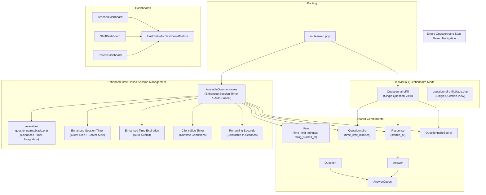
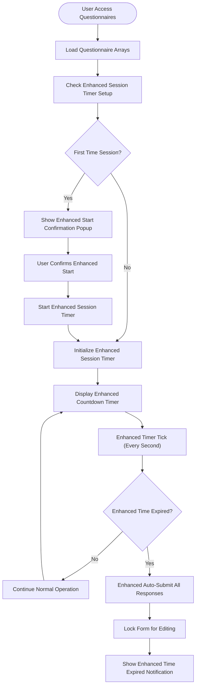
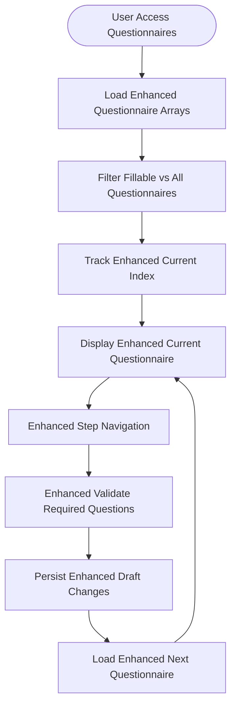
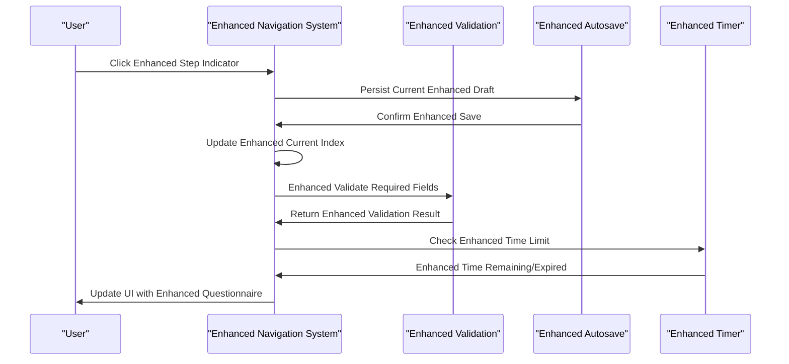
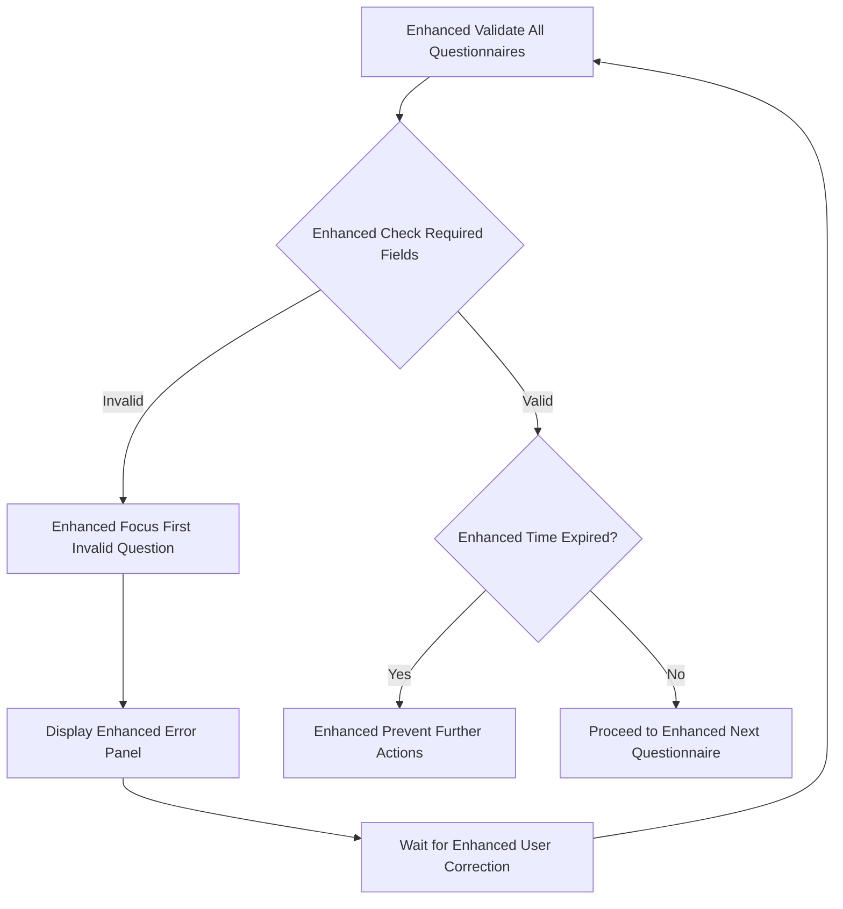
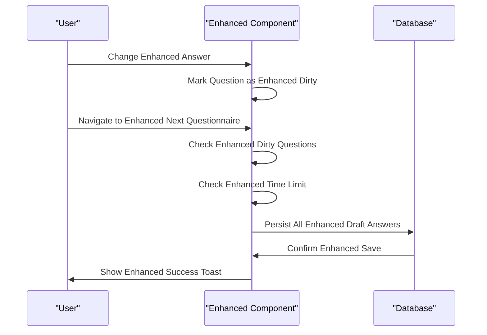
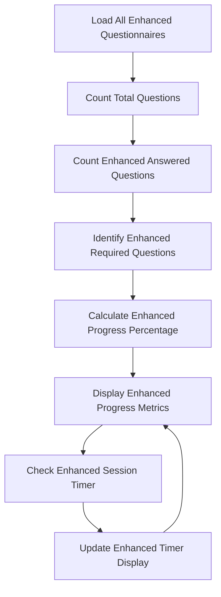
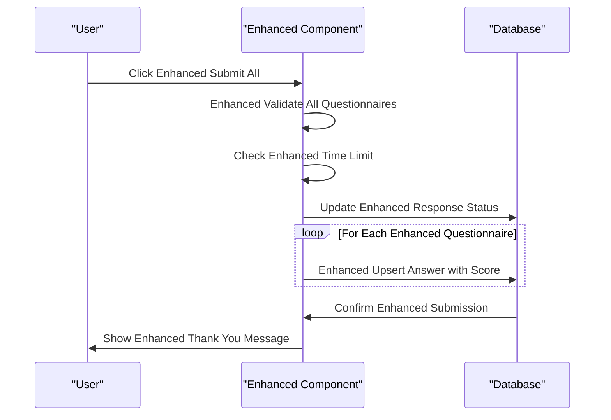

# Questionnaire Filling Interface

<cite>
**Referenced Files in This Document**
- [AvailableQuestionnaires.php](file://app/Livewire/Fill/AvailableQuestionnaires.php)
- [available-questionnaires.blade.php](file://resources/views/livewire/fill/available-questionnaires.blade.php)
- [QuestionnaireFill.php](file://app/Livewire/Fill/QuestionnaireFill.php)
- [questionnaire-fill.blade.php](file://resources/views/livewire/fill/questionnaire-fill.blade.php)
- [Questionnaire.php](file://app/Models/Questionnaire.php)
- [Question.php](file://app/Models/Question.php)
- [AnswerOption.php](file://app/Models/AnswerOption.php)
- [Response.php](file://app/Models/Response.php)
- [Answer.php](file://app/Models/Answer.php)
- [User.php](file://app/Models/User.php)
- [QuestionnaireScorer.php](file://app/Services/QuestionnaireScorer.php)
- [TeacherDashboard.php](file://app/Livewire/Fill/TeacherDashboard.php)
- [StaffDashboard.php](file://app/Livewire/Fill/StaffDashboard.php)
- [ParentDashboard.php](file://app/Livewire/Fill/ParentDashboard.php)
- [HasEvaluatorDashboardMetrics.php](file://app/Livewire/Fill/Concerns/HasEvaluatorDashboardMetrics.php)
- [2026_04_21_003136_add_time_limit_to_questionnaires_table.php](file://database/migrations/2026_04_21_003136_add_time_limit_to_questionnaires_table.php)
- [2026_04_21_003142_add_started_at_to_responses_table.php](file://database/migrations/2026_04_21_003142_add_started_at_to_responses_table.php)
- [2026_04_21_020644_add_time_limit_and_filling_started_at_to_users_table.php](file://database/migrations/2026_04_21_020644_add_time_limit_and_filling_started_at_to_users_table.php)
- [features.php](file://config/features.php)
- [web.php](file://routes/web.php)
</cite>

## Update Summary
**Changes Made**
- Enhanced documentation to reflect comprehensive time-based questionnaire completion system with improved timer functionality
- Updated core components documentation to include enhanced session management, time limit display, and automatic submission features
- Added detailed coverage of improved time limit initialization, enhanced countdown timers, and robust session status indicators
- Expanded navigation system documentation to include enhanced time-expired scenarios and automatic submission handling
- Updated autosave and draft management documentation to integrate with improved time-based constraints
- Enhanced progress tracking documentation to include advanced time-based analytics and session status
- Added comprehensive coverage of the enhanced start confirmation popup and improved session timer integration

## Table of Contents
1. [Introduction](#introduction)
2. [System Architecture](#system-architecture)
3. [Core Components](#core-components)
4. [Enhanced Time-Based Questionnaire Completion System](#enhanced-time-based-questionnaire-completion-system)
5. [Single Questionnaire Step-Based Navigation](#single-questionnaire-step-based-navigation)
6. [Navigation and User Experience](#navigation-and-user-experience)
7. [Question Types and Input Handling](#question-types-and-input-handling)
8. [Validation and Error Handling](#validation-and-error-handling)
9. [Autosave and Draft Management](#autosave-and-draft-management)
10. [Progress Tracking and Analytics](#progress-tracking-and-analytics)
11. [Submission and Finalization](#submission-and-finalization)
12. [Dashboard Components](#dashboard-components)
13. [Accessibility and Mobile Responsiveness](#accessibility-and-mobile-responsiveness)
14. [Performance Considerations](#performance-considerations)
15. [Troubleshooting Guide](#troubleshooting-guide)
16. [Conclusion](#conclusion)

## Introduction
This document describes the interactive questionnaire filling interface used by evaluators to complete assessment forms through a streamlined single-questionnaire step-based navigation system with comprehensive time-based completion capabilities. The interface features progressive questionnaire navigation, autosave functionality, step indicators, enhanced time limit management, automatic submission when time expires, and comprehensive validation mechanisms. It covers step-by-step navigation, question types (single choice, essay, combined), validation mechanisms, autosave and draft management, progress tracking, enhanced time-based session management, UI components, keyboard shortcuts, accessibility, and mobile responsiveness. The interface is built with Laravel Livewire and Blade, styled with Tailwind CSS and Flux UI components.

## System Architecture
The questionnaire filling system operates through a single-questionnaire step-based navigation approach with integrated enhanced time-based completion that streamlines the user experience by focusing on one questionnaire at a time while maintaining cross-questionnaire progress tracking and robust time constraints:



**Diagram sources**
- [AvailableQuestionnaires.php:18-677](file://app/Livewire/Fill/AvailableQuestionnaires.php#L18-L677)
- [available-questionnaires.blade.php:1-616](file://resources/views/livewire/fill/available-questionnaires.blade.php#L1-L616)
- [Questionnaire.php:23](file://app/Models/Questionnaire.php#L23)
- [Response.php:19](file://app/Models/Response.php#L19)
- [User.php:26-27](file://app/Models/User.php#L26-L27)
- [QuestionnaireFill.php:19-515](file://app/Livewire/Fill/QuestionnaireFill.php#L19-L515)
- [TeacherDashboard.php:10-23](file://app/Livewire/Fill/TeacherDashboard.php#L10-L23)
- [StaffDashboard.php:10-23](file://app/Livewire/Fill/StaffDashboard.php#L10-L23)
- [ParentDashboard.php:10-23](file://app/Livewire/Fill/ParentDashboard.php#L10-L23)
- [HasEvaluatorDashboardMetrics.php:9-73](file://app/Livewire/Fill/Concerns/HasEvaluatorDashboardMetrics.php#L9-L73)

**Section sources**
- [AvailableQuestionnaires.php:56-60](file://app/Livewire/Fill/AvailableQuestionnaires.php#L56-L60)
- [QuestionnaireFill.php:44-122](file://app/Livewire/Fill/QuestionnaireFill.php#L44-L122)
- [web.php:149-160](file://routes/web.php#L149-L160)

## Core Components
The system consists of two main components that work together to provide a streamlined questionnaire filling experience with comprehensive time-based completion capabilities and enhanced timer functionality:

### AvailableQuestionnaires Component
- **Progressive Navigation**: Manages multiple questionnaires through step-based navigation with $questionnaireIds/$allQuestionnaireIds arrays
- **Enhanced Tracking**: Implements $dirtyQuestionIds tracking system for efficient autosave operations
- **Cross-Questionnaire Progress**: Provides overall progress tracking across all fillable questionnaires
- **Enhanced Time Limit Management**: Handles time-expired scenarios with automatic submission and session status indicators
- **Enhanced Session Timer Integration**: Manages user-level time limits and session start/end times with improved error handling
- **Enhanced Step Indicators**: Visual step markers showing current position in questionnaire sequence with enhanced time-based status

### QuestionnaireFill Component
- **Single Question Focus**: Provides focused, distraction-free question answering for individual questionnaires
- **Step Navigation**: Sequential navigation with previous/next buttons and direct question access
- **Individual State Management**: Standalone response tracking with independent autosave functionality
- **Enhanced Progress Monitoring**: Separate progress tracking for each questionnaire with improved validation

### Dashboard Components
- **TeacherDashboard**, **StaffDashboard**, **ParentDashboard**: Role-specific dashboards with metrics and navigation
- **HasEvaluatorDashboardMetrics**: Shared trait for dashboard metric calculation

**Section sources**
- [AvailableQuestionnaires.php:25-45](file://app/Livewire/Fill/AvailableQuestionnaires.php#L25-L45)
- [AvailableQuestionnaires.php:53-54](file://app/Livewire/Fill/AvailableQuestionnaires.php#L53-L54)
- [AvailableQuestionnaires.php:42-42](file://app/Livewire/Fill/AvailableQuestionnaires.php#L42-L42)
- [QuestionnaireFill.php:21-42](file://app/Livewire/Fill/QuestionnaireFill.php#L21-L42)
- [TeacherDashboard.php:10-23](file://app/Livewire/Fill/TeacherDashboard.php#L10-L23)
- [StaffDashboard.php:10-23](file://app/Livewire/Fill/StaffDashboard.php#L10-L23)
- [ParentDashboard.php:10-23](file://app/Livewire/Fill/ParentDashboard.php#L10-L23)
- [HasEvaluatorDashboardMetrics.php:9-73](file://app/Livewire/Fill/Concerns/HasEvaluatorDashboardMetrics.php#L9-L73)

## Enhanced Time-Based Questionnaire Completion System
The system implements a comprehensive enhanced time-based completion mechanism that manages user sessions, enforces time limits, and handles automatic submission when time expires with improved timer functionality:

### Enhanced Session Management and Time Limits
- **User-Level Time Limits**: Configured through user.time_limit_minutes property with null indicating no time limit
- **Enhanced Session Start Tracking**: Managed via user.filling_started_at timestamp for session lifecycle with improved error handling
- **Questionnaire-Level Time Limits**: Optional per-questionnaire time limits via questionnaire.time_limit_minutes
- **Enhanced Session Timer Initialization**: Automatic timer setup with improved start confirmation popup for first-time sessions

### Enhanced Time Limit Display and Countdown
- **Enhanced Timer Display**: Visual countdown timer with color-coded warnings as expiration approaches
- **Dynamic Time Formatting**: Hours:minutes:seconds display with automatic formatting
- **Enhanced Session Status Indicators**: Real-time status updates showing remaining time and session state
- **Enhanced Warning System**: Color-coded timer with amber for 10+ minutes remaining, red for 5 minutes or less
- **Enhanced Remaining Seconds Calculation**: Precise second-level countdown with improved accuracy

### Enhanced Automatic Submission and Time Expiration
- **Enhanced Automatic Time-Expired Detection**: Client-side and server-side time limit checking with improved error handling
- **Enhanced Auto-Submit on Expiration**: Automatic submission of all completed questionnaires when time runs out
- **Enhanced Session Locking**: Form locking mechanism preventing further modifications after expiration
- **Enhanced Graceful Degradation**: Smooth handling of time expiration with user-friendly notifications



**Diagram sources**
- [AvailableQuestionnaires.php:528-583](file://app/Livewire/Fill/AvailableQuestionnaires.php#L528-L583)
- [AvailableQuestionnaires.php:253-260](file://app/Livewire/Fill/AvailableQuestionnaires.php#L253-L260)
- [available-questionnaires.blade.php:13-39](file://resources/views/livewire/fill/available-questionnaires.blade.php#L13-L39)

**Section sources**
- [AvailableQuestionnaires.php:47-58](file://app/Livewire/Fill/AvailableQuestionnaires.php#L47-L58)
- [AvailableQuestionnaires.php:528-583](file://app/Livewire/Fill/AvailableQuestionnaires.php#L528-L583)
- [available-questionnaires.blade.php:188-298](file://resources/views/livewire/fill/available-questionnaires.blade.php#L188-L298)
- [available-questionnaires.blade.php:300-322](file://resources/views/livewire/fill/available-questionnaires.blade.php#L300-L322)

## Single Questionnaire Step-Based Navigation
The system implements a streamlined step-based navigation approach that focuses on one questionnaire at a time while maintaining cross-questionnaire awareness and integrating with the enhanced time-based completion system:

### Enhanced Progressive Questionnaire Management
- **Ordered Questionnaire Arrays**: $questionnaireIds contains fillable questionnaire IDs, $allQuestionnaireIds includes all questionnaires
- **Current Index Tracking**: $currentIndex (0-based) manages position within the fillable questionnaire sequence
- **Enhanced Step-by-Step Navigation**: Previous/Next buttons with automatic draft saving and validation
- **Direct Access**: Step indicators allow jumping to any questionnaire in the sequence
- **Enhanced Time-Expired Navigation Control**: Navigation disabled when time has expired

### Enhanced State Management
- **Enhanced Dirty Question Tracking**: $dirtyQuestionIds array efficiently tracks which questions have unsaved changes
- **Enhanced Cross-Questionnaire Persistence**: Maintains separate responses for each questionnaire with selective autosave
- **Enhanced Time Limit Integration**: Automatic time-expired detection with deadline calculation and auto-submission
- **Enhanced Session Status Awareness**: Navigation and UI elements respond to enhanced session timer state



**Diagram sources**
- [AvailableQuestionnaires.php:234-301](file://app/Livewire/Fill/AvailableQuestionnaires.php#L234-L301)
- [AvailableQuestionnaires.php:153-184](file://app/Livewire/Fill/AvailableQuestionnaires.php#L153-L184)
- [AvailableQuestionnaires.php:342-363](file://app/Livewire/Fill/AvailableQuestionnaires.php#L342-L363)

**Section sources**
- [AvailableQuestionnaires.php:25-32](file://app/Livewire/Fill/AvailableQuestionnaires.php#L25-L32)
- [AvailableQuestionnaires.php:53-54](file://app/Livewire/Fill/AvailableQuestionnaires.php#L53-L54)
- [AvailableQuestionnaires.php:153-184](file://app/Livewire/Fill/AvailableQuestionnaires.php#L153-L184)
- [available-questionnaires.blade.php:144-196](file://resources/views/livewire/fill/available-questionnaires.blade.php#L144-L196)

## Navigation and User Experience
The system provides intuitive step-based navigation with enhanced user experience features including comprehensive time-based completion capabilities and improved timer functionality:

### Enhanced Step-Based Navigation
- **Enhanced Visual Step Indicators**: Dots showing current, visited, and upcoming questionnaires with clear visual hierarchy
- **Progressive Loading**: Only loads current questionnaire questions to optimize performance
- **Enhanced Automatic Draft Saving**: Persists changes when navigating between questionnaires
- **Boundary Management**: Prevents navigation beyond questionnaire array bounds
- **Enhanced Time-Expired Navigation Control**: Navigation disabled when time has expired

### Enhanced User Experience Features
- **Enhanced Time Limit Visualization**: Comprehensive countdown timer with color-coded warnings as expiration approaches
- **Enhanced Start Confirmation Popup**: First-time session confirmation with time limit explanation
- **Enhanced Validation Feedback**: Real-time validation with error highlighting and scroll positioning
- **Responsive Design**: Adapts to different screen sizes with horizontal scrolling for step indicators
- **Accessibility Support**: Keyboard navigation and screen reader compatibility
- **Enhanced Session Status Indicators**: Clear visual indicators showing session state and remaining time



**Diagram sources**
- [AvailableQuestionnaires.php:153-184](file://app/Livewire/Fill/AvailableQuestionnaires.php#L153-L184)
- [AvailableQuestionnaires.php:342-363](file://app/Livewire/Fill/AvailableQuestionnaires.php#L342-L363)
- [available-questionnaires.blade.php:448-470](file://resources/views/livewire/fill/available-questionnaires.blade.php#L448-L470)

**Section sources**
- [AvailableQuestionnaires.php:153-184](file://app/Livewire/Fill/AvailableQuestionnaires.php#L153-L184)
- [available-questionnaires.blade.php:144-196](file://resources/views/livewire/fill/available-questionnaires.blade.php#L144-L196)
- [available-questionnaires.blade.php:198-212](file://resources/views/livewire/fill/available-questionnaires.blade.php#L198-L212)

## Question Types and Input Handling
The system supports three question types with specialized input handling optimized for the step-based navigation and enhanced time-based completion:

### Single Choice Questions
- **Radio Button Interface**: Exclusive selection with immediate validation
- **Required Field Handling**: Enforced selection for required questions
- **Option Scoring**: Automatic score calculation based on selected option
- **Enhanced Time-Expired Input Control**: Disabled input when time has expired

### Essay Questions
- **Textarea Input**: Multi-line text input with character limits
- **Enhanced Live Validation**: Real-time validation with character counter
- **Debounced Updates**: Input debouncing to optimize performance
- **Enhanced Time-Expired Input Control**: Disabled input when time has expired

### Combined Questions
- **Dual Input System**: Radio button selection followed by essay explanation
- **Conditional Display**: Essay field appears only after option selection
- **Enhanced Comprehensive Validation**: Both selection and explanation required
- **Enhanced Time-Expired Input Control**: Disabled input when time has expired

```mermaid
classDiagram
class Question {
+int id
+string question_text
+string type
+bool is_required
+int order
+int time_limit_minutes
}
class AnswerOption {
+int id
+int question_id
+string option_text
+int score
+int order
}
class Answer {
+int id
+int response_id
+int question_id
+int answer_option_id
+string essay_answer
+int calculated_score
}
class User {
+int time_limit_minutes
+datetime filling_started_at
}
class Response {
+int id
+int questionnaire_id
+int user_id
+datetime started_at
+datetime submitted_at
+string status
}
Question "1" o-- "many" AnswerOption : "has many"
Answer "belongs to" Question : "question_id"
Answer "belongs to" AnswerOption : "answer_option_id"
Response "belongs to" Questionnaire : "questionnaire_id"
Response "belongs to" User : "user_id"
Answer "belongs to" Response : "response_id"
```

**Diagram sources**
- [Question.php:16-26](file://app/Models/Question.php#L16-L26)
- [AnswerOption.php:15-21](file://app/Models/AnswerOption.php#L15-L21)
- [Answer.php:15-22](file://app/Models/Answer.php#L15-L22)
- [User.php:26-27](file://app/Models/User.php#L26-L27)
- [Response.php:19](file://app/Models/Response.php#L19)

**Section sources**
- [available-questionnaires.blade.php:283-377](file://resources/views/livewire/fill/available-questionnaires.blade.php#L283-L377)
- [QuestionnaireFill.php:301-335](file://app/Livewire/Fill/QuestionnaireFill.php#L301-L335)
- [questionnaire-fill.blade.php:196-283](file://resources/views/livewire/fill/questionnaire-fill.blade.php#L196-L283)

## Validation and Error Handling
The system implements comprehensive validation at both individual question and cross-questionnaire levels with integrated enhanced time-based completion:

### Enhanced Per-Question Validation
- **Individual Question Validation**: Validates current question immediately on change
- **Enhanced Real-time Feedback**: Visual highlighting and error messages for invalid inputs
- **Type-Specific Rules**: Different validation rules based on question type
- **Enhanced Time-Expired Validation Control**: Validation bypassed when time has expired

### Enhanced Cross-Questionnaire Validation
- **Global Validation**: Validates all required questions across all fillable questionnaires
- **Step Validation**: Ensures each questionnaire has valid responses before proceeding
- **Error Aggregation**: Collects and displays all validation errors in a unified panel
- **Enhanced Time-Expired Validation Prevention**: Validation prevented when time has expired

### Enhanced Error Handling Mechanisms
- **Automatic Focus**: Automatically focuses on first invalid question
- **Scroll Positioning**: Scrolls to invalid questions for better user experience
- **Persistent Error States**: Maintains error states until corrections are made
- **Enhanced Session Status Error Handling**: Graceful handling of time expiration errors



**Diagram sources**
- [AvailableQuestionnaires.php:446-486](file://app/Livewire/Fill/AvailableQuestionnaires.php#L446-L486)
- [AvailableQuestionnaires.php:204-209](file://app/Livewire/Fill/AvailableQuestionnaires.php#L204-L209)

**Section sources**
- [AvailableQuestionnaires.php:446-486](file://app/Livewire/Fill/AvailableQuestionnaires.php#L446-L486)
- [available-questionnaires.blade.php:198-212](file://resources/views/livewire/fill/available-questionnaires.blade.php#L198-L212)
- [questionnaire-fill.blade.php:102-115](file://resources/views/livewire/fill/questionnaire-fill.blade.php#L102-L115)

## Autosave and Draft Management
The enhanced autosave system provides robust draft persistence optimized for the step-based navigation model with integrated enhanced time-based completion:

### Enhanced Progressive Autosave System
- **Navigation-Based Autosave**: Primary autosave triggered on navigation actions with $dirtyQuestionIds tracking
- **Manual Save Option**: Users can manually trigger autosave at any time
- **Efficient Persistence**: Only persists questions with actual answers, removing empty entries
- **Enhanced Time-Expired Autosave Control**: Autosave prevented when time has expired

### Enhanced Cross-Questionnaire Draft Management
- **Individual Response Tracking**: Each questionnaire maintains its own response state
- **Batch Processing**: Efficiently processes multiple questionnaires during autosave
- **Status Management**: Maintains draft status with timestamps for audit trails
- **Enhanced Session-Aware Draft Persistence**: Respects enhanced session timer and time limit constraints

### Enhanced Draft Persistence Logic
- **Selective Persistence**: Only persists questions with actual answers
- **Empty Answer Cleanup**: Removes entries when both answer option and essay are empty
- **Enhanced Time Limit Integration**: Automatically handles time-expired scenarios with forced submission
- **Enhanced Session Timer Coordination**: Coordinates with enhanced session timer for optimal autosave timing



**Diagram sources**
- [AvailableQuestionnaires.php:186-197](file://app/Livewire/Fill/AvailableQuestionnaires.php#L186-L197)
- [AvailableQuestionnaires.php:342-363](file://app/Livewire/Fill/AvailableQuestionnaires.php#L342-L363)

**Section sources**
- [AvailableQuestionnaires.php:186-197](file://app/Livewire/Fill/AvailableQuestionnaires.php#L186-L197)
- [AvailableQuestionnaires.php:342-444](file://app/Livewire/Fill/AvailableQuestionnaires.php#L342-L444)
- [QuestionnaireFill.php:146-154](file://app/Livewire/Fill/QuestionnaireFill.php#L146-L154)

## Progress Tracking and Analytics
The system provides comprehensive progress tracking across multiple questionnaires with real-time updates and integrated enhanced time-based analytics:

### Enhanced Cross-Questionnaire Metrics
- **Overall Progress**: Tracks answered vs total questions across all fillable questionnaires
- **Required Question Tracking**: Separates required from optional questions with completion percentages
- **Percentage Calculation**: Real-time progress percentage computation across all questionnaires
- **Enhanced Time Limit Monitoring**: Visual countdown timers with color-coded warnings
- **Enhanced Session Status Tracking**: Real-time session state and remaining time display

### Enhanced Individual Questionnaire Metrics
- **Question-Level Progress**: Tracks answered vs total questions for current questionnaire
- **Required Question Tracking**: Separates required from optional questions
- **Percentage Calculation**: Real-time progress percentage computation
- **Enhanced Time-Based Progress**: Progress tracking integrated with enhanced session timer

### Enhanced Dashboard Integration
- **Role-Based Metrics**: Different metrics for teachers, staff, and parents
- **Submission Status**: Tracks completed vs pending questionnaire submissions
- **Enhanced Time-Based Analytics**: Completion timing and response patterns
- **Enhanced Session Statistics**: Time limit utilization and session effectiveness metrics



**Diagram sources**
- [AvailableQuestionnaires.php:75-111](file://app/Livewire/Fill/AvailableQuestionnaires.php#L75-L111)
- [AvailableQuestionnaires.php:252-299](file://app/Livewire/Fill/QuestionnaireFill.php#L252-L299)

**Section sources**
- [AvailableQuestionnaires.php:75-111](file://app/Livewire/Fill/AvailableQuestionnaires.php#L75-L111)
- [AvailableQuestionnaires.php:117-119](file://app/Livewire/Fill/AvailableQuestionnaires.php#L117-L119)
- [QuestionnaireFill.php:252-299](file://app/Livewire/Fill/QuestionnaireFill.php#L252-L299)

## Submission and Finalization
The submission process is streamlined with enhanced validation, user confirmation, and comprehensive enhanced time-based completion handling:

### Enhanced Cross-Questionnaire Submission
- **Bulk Submission**: Submits all fillable questionnaires simultaneously with validation
- **Enhanced Cross-Questionnaire Validation**: Validates all required questions across all questionnaires
- **Individual Response Creation**: Creates separate responses for each questionnaire
- **Enhanced Time-Expired Submission Handling**: Automatic submission when time expires

### Enhanced Finalization Process
- **Confirmation Dialog**: Shows summary of all responses before final submission
- **Transaction Processing**: Uses database transactions for data integrity
- **Success Feedback**: Provides clear success messages and navigation options
- **Enhanced Time Limit Handling**: Automatic submission when time expires with appropriate messaging
- **Enhanced Session Status Update**: Updates enhanced session timer and status indicators

### Enhanced Single Questionnaire Submission
- **Individual Questionnaire Finalization**: Direct submission of one questionnaire
- **Immediate Validation**: Validates all required questions before submission
- **Score Calculation**: Calculates scores for all answered questions
- **Enhanced Time-Expired Single Submission**: Handles single questionnaire submission with time constraints



**Diagram sources**
- [AvailableQuestionnaires.php:216-232](file://app/Livewire/Fill/AvailableQuestionnaires.php#L216-L232)
- [AvailableQuestionnaires.php:582-668](file://app/Livewire/Fill/AvailableQuestionnaires.php#L582-L668)

**Section sources**
- [AvailableQuestionnaires.php:204-232](file://app/Livewire/Fill/AvailableQuestionnaires.php#L204-L232)
- [AvailableQuestionnaires.php:582-668](file://app/Livewire/Fill/AvailableQuestionnaires.php#L582-L668)
- [QuestionnaireFill.php:172-245](file://app/Livewire/Fill/QuestionnaireFill.php#L172-L245)

## Dashboard Components
The system includes role-specific dashboards with comprehensive metrics and enhanced time-based completion analytics:

### Enhanced Dashboard Architecture
- **Trait-Based Implementation**: Uses HasEvaluatorDashboardMetrics trait for common functionality
- **Role-Based Filtering**: Filters questionnaires based on user roles and aliases
- **Enhanced Metric Aggregation**: Provides statistics for available, completed, and active questionnaires
- **Enhanced Time-Based Analytics**: Integrates time limit and session completion metrics

### Enhanced Dashboard Features
- **Available Questionnaires List**: Shows questionnaires eligible for the current user with time limit information
- **Completed Questionnaires**: Lists previously submitted questionnaires with completion timestamps
- **Statistics Display**: Shows counts for active questionnaires, available to fill, and completed total
- **Navigation Integration**: Direct links to questionnaire filling interfaces
- **Enhanced Session Status Display**: Shows current session state and remaining time

### Enhanced Role-Specific Dashboards
- **Teacher Dashboard**: Metrics tailored for educational staff with enhanced time-based completion analytics
- **Staff Dashboard**: Administrative staff questionnaire management with enhanced session tracking
- **Parent Dashboard**: Parent portal for student-related questionnaires with enhanced time limit awareness

**Section sources**
- [TeacherDashboard.php:10-23](file://app/Livewire/Fill/TeacherDashboard.php#L10-L23)
- [StaffDashboard.php:10-23](file://app/Livewire/Fill/StaffDashboard.php#L10-L23)
- [ParentDashboard.php:10-23](file://app/Livewire/Fill/ParentDashboard.php#L10-L23)
- [HasEvaluatorDashboardMetrics.php:9-73](file://app/Livewire/Fill/Concerns/HasEvaluatorDashboardMetrics.php#L9-L73)

## Accessibility and Mobile Responsiveness
The interface is designed with accessibility and mobile usability in mind, including comprehensive enhanced time-based completion features:

### Enhanced Accessibility Features
- **Keyboard Navigation**: Full keyboard support for all interactive elements including enhanced timer controls
- **Screen Reader Support**: Proper ARIA attributes and semantic HTML for enhanced timer and session status
- **Focus Management**: Logical tab order and focus indication for enhanced timer display and controls
- **Color Contrast**: High contrast ratios for text and interactive elements, especially for enhanced time warnings
- **Enhanced Time-Expired Accessibility**: Special handling for time-expired state with clear accessibility cues

### Enhanced Mobile Responsiveness
- **Adaptive Layouts**: Responsive grid systems adapt to different screen sizes with enhanced timer display adjustments
- **Touch-Friendly Controls**: Appropriately sized touch targets for mobile devices including enhanced timer controls
- **Horizontal Scrolling**: Step indicators adapt to narrow screens with enhanced timer display optimization
- **Performance Optimization**: Optimized rendering for mobile browsers with enhanced timer efficiency
- **Enhanced Time Display Optimization**: Timer display adapts to small screens with clear readability

### Enhanced User Experience Enhancements
- **Enhanced Toast Notifications**: Non-intrusive status updates with appropriate timing including enhanced time limit warnings
- **Loading States**: Visual feedback during enhanced autosave and submission operations with enhanced timer synchronization
- **Error Communication**: Clear error messages with actionable guidance including enhanced time expiration notifications
- **Progress Visualization**: Intuitive progress indicators and completion tracking with enhanced time-based updates
- **Enhanced Session Status Communication**: Clear communication of session state and remaining time to users

**Section sources**
- [available-questionnaires.blade.php:472-487](file://resources/views/livewire/fill/available-questionnaires.blade.php#L472-L487)
- [questionnaire-fill.blade.php:387-401](file://resources/views/livewire/fill/questionnaire-fill.blade.php#L387-L401)

## Performance Considerations
The system is optimized for efficient operation across multiple scenarios with integrated enhanced time-based completion:

### Enhanced Rendering Optimization
- **Component-Level Rendering**: Only renders visible components and current questionnaire with enhanced timer display
- **Lazy Loading**: Questionnaires are loaded as needed based on user navigation with enhanced timer efficiency
- **Efficient Data Structures**: Enhanced optimized data structures for questionnaire and answer management with enhanced time limit tracking
- **Enhanced Timer Efficiency**: Client-side timer optimization to minimize performance impact

### Enhanced Database Performance
- **Batch Operations**: Efficient batch processing for autosave and submission operations with enhanced time-based constraints
- **Query Optimization**: Optimized queries for loading questionnaires and responses with enhanced time limit filtering
- **Connection Pooling**: Proper database connection management for concurrent users with enhanced timer synchronization
- **Enhanced Session Data Optimization**: Efficient handling of user session data and enhanced time limit information

### Enhanced Memory Management
- **State Cleanup**: Automatic cleanup of unused state data including enhanced timer state and session information
- **Event Management**: Efficient event handling for autosave, validation, and enhanced timer operations
- **Resource Optimization**: Minimized memory footprint for large questionnaire sets with enhanced timer efficiency
- **Enhanced Timer Resource Management**: Optimized timer resource usage to prevent memory leaks

## Troubleshooting Guide
Common issues and their solutions with comprehensive enhanced time-based completion troubleshooting:

### Enhanced Access and Authentication Issues
- **Cannot Access Questionnaires**: Verify user role matches questionnaire target groups
- **Permission Denied**: Check RBAC configuration and role aliases for proper access
- **Session Timeout**: Ensure user authentication is maintained throughout the enhanced session
- **Enhanced Time Limit Not Applied**: Verify user.time_limit_minutes is properly configured

### Enhanced Navigation Problems
- **Step Navigation Not Working**: Verify enhanced autosave completes successfully before navigation
- **Questionnaire Jump Issues**: Check that questionnaire IDs are properly mapped in arrays
- **Progress Tracking Errors**: Validate that enhanced progress calculations account for all question types
- **Enhanced Timer Not Starting**: Check that enhanced session timer initialization completes successfully

### Enhanced Autosave and Draft Issues
- **Enhanced Autosave Not Triggering**: Ensure navigation events are firing correctly
- **Draft Not Saved**: Verify that answers meet enhanced validation criteria before autosave
- **Data Loss**: Check that database transactions are completing successfully
- **Enhanced Time-Expired Autosave Issues**: Verify that autosave respects enhanced time limit constraints

### Enhanced Validation and Submission Problems
- **Enhanced Validation Errors**: Review enhanced validation error messages and fix required fields
- **Submission Failures**: Check database connectivity and transaction status
- **Score Calculation Issues**: Verify that enhanced scoring logic matches expected outcomes
- **Enhanced Time-Expired Submission Issues**: Check that enhanced auto-submit functionality works correctly

### Enhanced Time-Based Completion Issues
- **Enhanced Timer Not Displaying**: Verify that enhanced timeLimitInfo is properly computed and passed to the view
- **Time Expiration Not Detected**: Check that enhanced checkTimeExpiry function executes correctly
- **Auto-Submit Not Working**: Verify that enhanced autoSubmitOnTimeExpired function triggers submission
- **Enhanced Session Timer Issues**: Check that enhanced initializeSessionTimer and confirmStart functions work correctly

**Section sources**
- [AvailableQuestionnaires.php:56-60](file://app/Livewire/Fill/AvailableQuestionnaires.php#L56-L60)
- [AvailableQuestionnaires.php:153-184](file://app/Livewire/Fill/AvailableQuestionnaires.php#L153-L184)
- [questionnaire-fill.blade.php:102-115](file://resources/views/livewire/fill/questionnaire-fill.blade.php#L102-L115)

## Conclusion
The streamlined questionnaire filling interface provides a comprehensive, accessible, and responsive solution for evaluator assessment through progressive step-based navigation with integrated enhanced time-based completion capabilities. The system's transformation from grouped questionnaire display to single-questionnaire step-based navigation delivers an excellent user experience with robust autosave functionality, comprehensive validation, rich progress tracking, and sophisticated enhanced time-based session management across all device types and user roles. The enhanced time-based completion system provides seamless session management, automatic submission handling, and comprehensive enhanced timer integration that ensures reliable and efficient questionnaire completion. The modular design ensures maintainability and extensibility for future enhancements while providing efficient performance optimization for large-scale questionnaire management with enhanced time-based constraints.