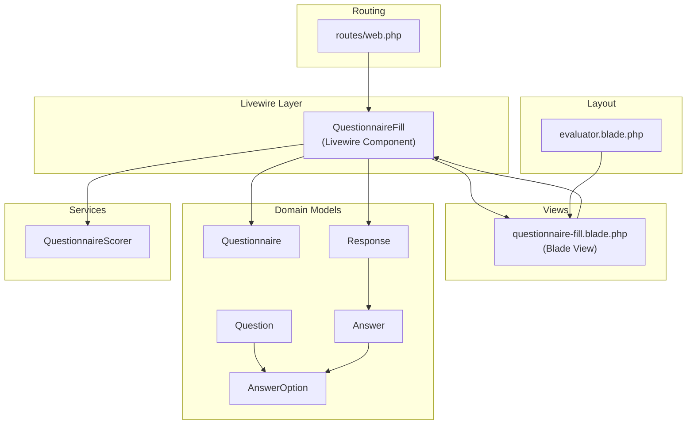
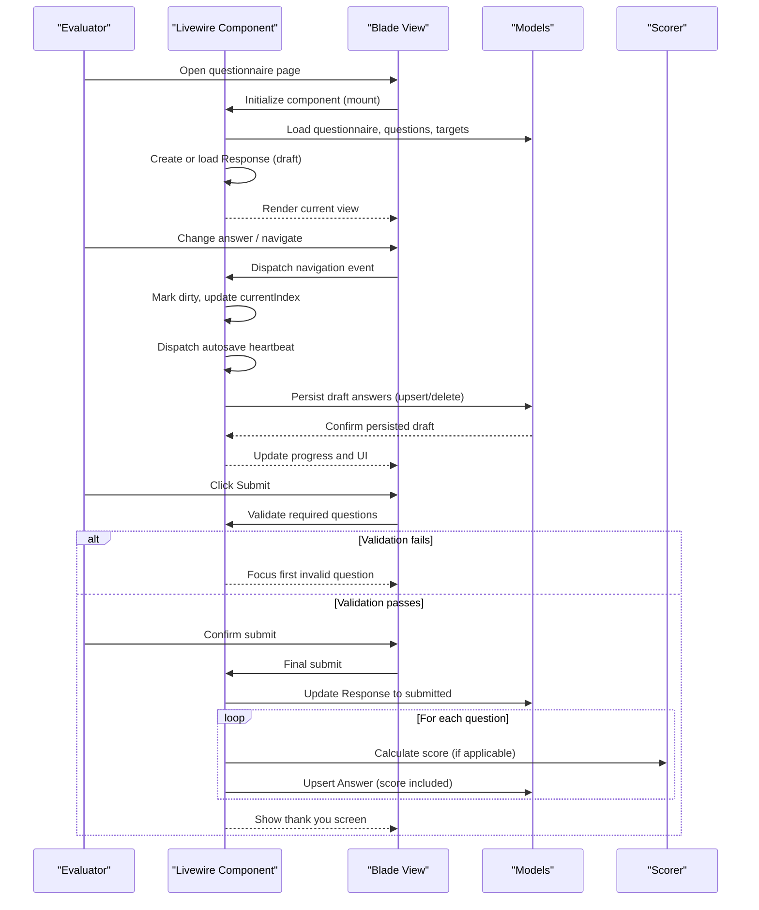
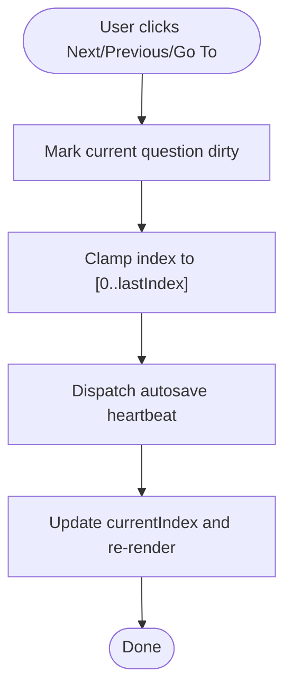
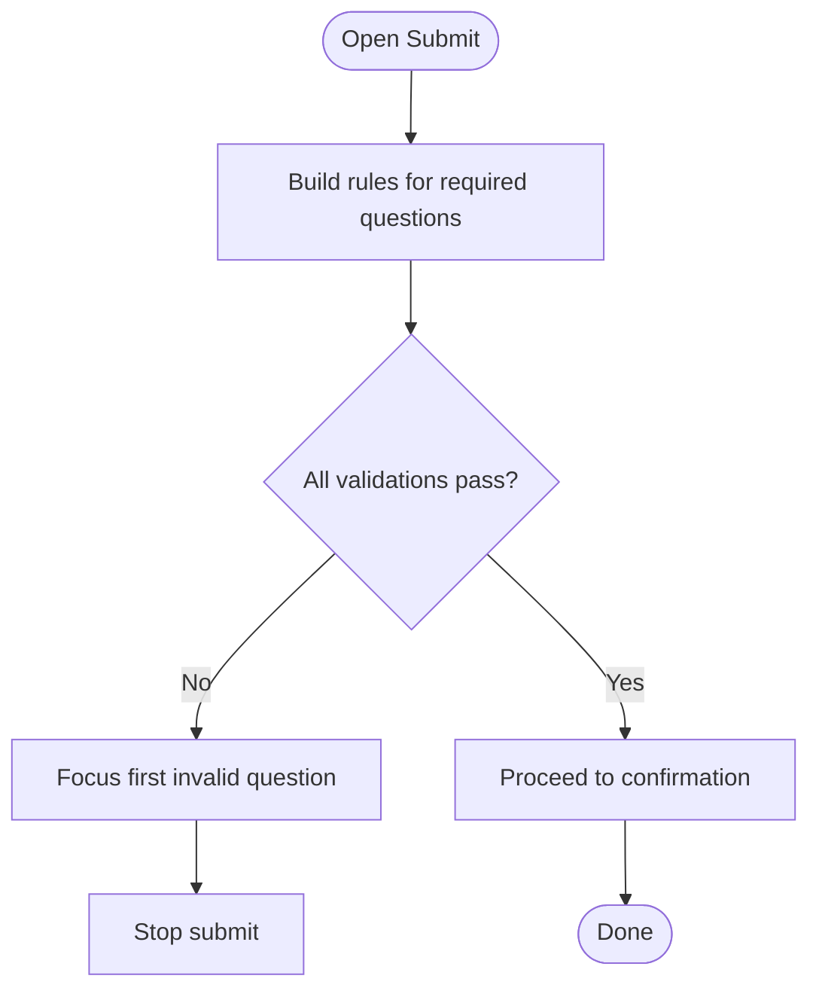
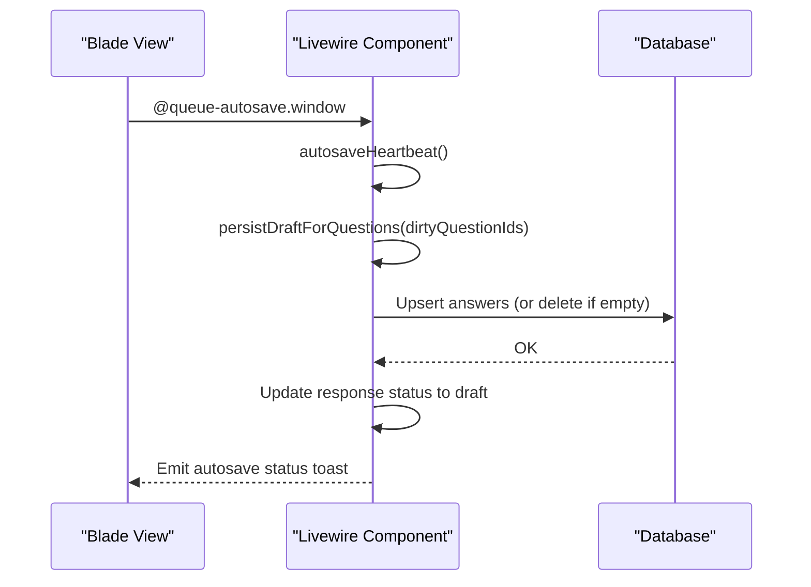
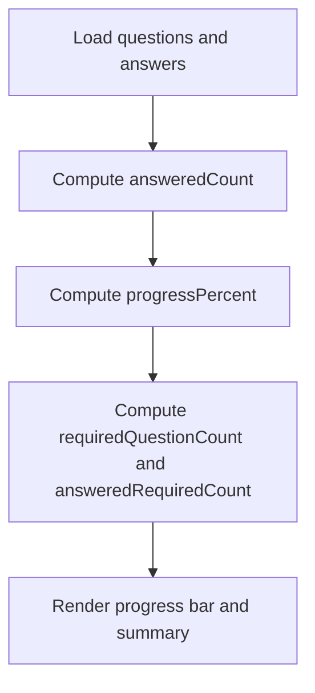
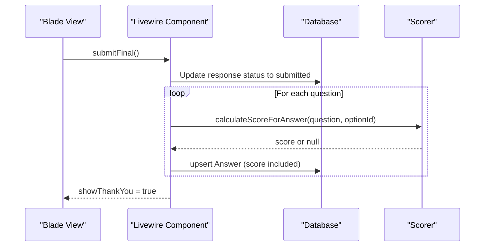
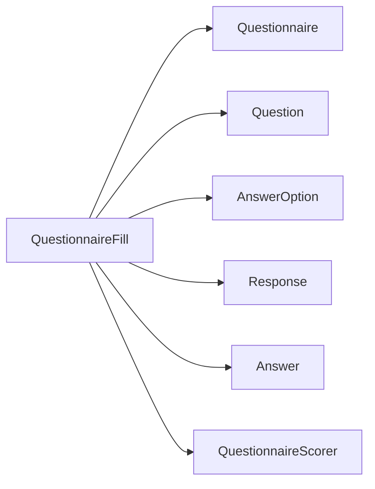

# Questionnaire Filling Interface

<cite>
**Referenced Files in This Document**
- [QuestionnaireFill.php](file://app/Livewire/Fill/QuestionnaireFill.php)
- [questionnaire-fill.blade.php](file://resources/views/livewire/fill/questionnaire-fill.blade.php)
- [Questionnaire.php](file://app/Models/Questionnaire.php)
- [Question.php](file://app/Models/Question.php)
- [AnswerOption.php](file://app/Models/AnswerOption.php)
- [Response.php](file://app/Models/Response.php)
- [Answer.php](file://app/Models/Answer.php)
- [QuestionnaireScorer.php](file://app/Services/QuestionnaireScorer.php)
- [evaluator.blade.php](file://resources/views/layouts/evaluator.blade.php)
- [features.php](file://config/features.php)
- [web.php](file://routes/web.php)
</cite>

## Table of Contents
1. [Introduction](#introduction)
2. [Project Structure](#project-structure)
3. [Core Components](#core-components)
4. [Architecture Overview](#architecture-overview)
5. [Detailed Component Analysis](#detailed-component-analysis)
6. [Dependency Analysis](#dependency-analysis)
7. [Performance Considerations](#performance-considerations)
8. [Troubleshooting Guide](#troubleshooting-guide)
9. [Conclusion](#conclusion)
10. [Appendices](#appendices)

## Introduction
This document describes the interactive questionnaire filling interface used by evaluators to complete assessment forms. It covers step-by-step navigation, question types (single choice, essay, combined), validation mechanisms, autosave and draft management, progress tracking, UI components, keyboard shortcuts, accessibility, and mobile responsiveness. The interface is built with Laravel Livewire and Blade, styled with Tailwind CSS and Flux UI components.

## Project Structure
The questionnaire filling feature spans Livewire components, Blade views, Eloquent models, and routing:

- Livewire component: handles state, navigation, autosave triggers, validation, and submission
- Blade view: renders question cards, answer inputs, navigation controls, progress indicators, and confirmation dialogs
- Models: define the domain entities (Questionnaire, Question, AnswerOption, Response, Answer)
- Scoring service: computes scores for submitted answers
- Layout: provides the evaluator dashboard shell with navigation and theming
- Routes: expose the fill endpoints for available questionnaires and the questionnaire form



**Diagram sources**
- [QuestionnaireFill.php:19-515](file://app/Livewire/Fill/QuestionnaireFill.php#L19-L515)
- [questionnaire-fill.blade.php:1-402](file://resources/views/livewire/fill/questionnaire-fill.blade.php#L1-L402)
- [Questionnaire.php:13-131](file://app/Models/Questionnaire.php#L13-L131)
- [Question.php:11-43](file://app/Models/Question.php#L11-L43)
- [AnswerOption.php:10-38](file://app/Models/AnswerOption.php#L10-L38)
- [Response.php:11-42](file://app/Models/Response.php#L11-L42)
- [Answer.php:10-44](file://app/Models/Answer.php#L10-L44)
- [QuestionnaireScorer.php:12-139](file://app/Services/QuestionnaireScorer.php#L12-L139)
- [evaluator.blade.php:1-82](file://resources/views/layouts/evaluator.blade.php#L1-L82)
- [web.php:149-160](file://routes/web.php#L149-L160)

**Section sources**
- [QuestionnaireFill.php:44-122](file://app/Livewire/Fill/QuestionnaireFill.php#L44-L122)
- [questionnaire-fill.blade.php:117-325](file://resources/views/livewire/fill/questionnaire-fill.blade.php#L117-L325)
- [web.php:149-160](file://routes/web.php#L149-L160)

## Core Components
- QuestionnaireFill (Livewire Component)
  - Manages current question index, answers collection, draft persistence, and submission lifecycle
  - Provides navigation actions (previous, next, go to index), autosave triggers, and validation helpers
  - Computes progress metrics and required/answered counts
- Blade View (questionnaire-fill.blade.php)
  - Renders question cards, answer inputs, progress bar, quick navigation, and submit confirmation
  - Implements client-side validation feedback and toast notifications
- Models
  - Questionnaire, Question, AnswerOption, Response, Answer define the data model and relationships
- Scoring Service
  - Calculates per-answer scores and supports summary analytics
- Layout
  - evaluator.blade.php provides the dashboard header, navigation, and theming

**Section sources**
- [QuestionnaireFill.php:19-515](file://app/Livewire/Fill/QuestionnaireFill.php#L19-L515)
- [questionnaire-fill.blade.php:1-402](file://resources/views/livewire/fill/questionnaire-fill.blade.php#L1-L402)
- [Questionnaire.php:13-131](file://app/Models/Questionnaire.php#L13-L131)
- [Question.php:11-43](file://app/Models/Question.php#L11-L43)
- [AnswerOption.php:10-38](file://app/Models/AnswerOption.php#L10-L38)
- [Response.php:11-42](file://app/Models/Response.php#L11-L42)
- [Answer.php:10-44](file://app/Models/Answer.php#L10-L44)
- [QuestionnaireScorer.php:12-139](file://app/Services/QuestionnaireScorer.php#L12-L139)
- [evaluator.blade.php:19-81](file://resources/views/layouts/evaluator.blade.php#L19-L81)

## Architecture Overview
The questionnaire filling flow integrates Livewire state management with Blade rendering and backend persistence:



**Diagram sources**
- [QuestionnaireFill.php:44-122](file://app/Livewire/Fill/QuestionnaireFill.php#L44-L122)
- [QuestionnaireFill.php:146-245](file://app/Livewire/Fill/QuestionnaireFill.php#L146-L245)
- [QuestionnaireFill.php:408-470](file://app/Livewire/Fill/QuestionnaireFill.php#L408-L470)
- [QuestionnaireFill.php:495-498](file://app/Livewire/Fill/QuestionnaireFill.php#L495-L498)
- [questionnaire-fill.blade.php:69-76](file://resources/views/livewire/fill/questionnaire-fill.blade.php#L69-L76)
- [questionnaire-fill.blade.php:364-384](file://resources/views/livewire/fill/questionnaire-fill.blade.php#L364-L384)

## Detailed Component Analysis

### Navigation System
- Step-by-step navigation
  - Previous/Next buttons move the current index with bounds checking
  - Quick navigation buttons allow jumping to any question index
  - On navigation, the component marks the current question as “dirty” and dispatches an autosave heartbeat
- Single-question mode
  - Controlled by a feature flag; when enabled, only the current question is rendered
  - Navigational controls are simplified to Previous/Next within the single-question card



**Diagram sources**
- [QuestionnaireFill.php:124-144](file://app/Livewire/Fill/QuestionnaireFill.php#L124-L144)
- [QuestionnaireFill.php:161-170](file://app/Livewire/Fill/QuestionnaireFill.php#L161-L170)
- [questionnaire-fill.blade.php:118-135](file://resources/views/livewire/fill/questionnaire-fill.blade.php#L118-L135)

**Section sources**
- [QuestionnaireFill.php:124-170](file://app/Livewire/Fill/QuestionnaireFill.php#L124-L170)
- [questionnaire-fill.blade.php:289-345](file://resources/views/livewire/fill/questionnaire-fill.blade.php#L289-L345)
- [features.php:4](file://config/features.php#L4)

### Question Types and Input Fields
- Single choice
  - Radio button inputs bound to answer option ID
  - Required validation enforced when question is marked required
- Essay
  - Textarea with character limit and debounce for live updates
  - Required validation enforces minimum length and presence
- Combined
  - First selects an answer option (required)
  - Reveals an essay textarea (required) with character limit
  - Both selections required for completion

```mermaid
classDiagram
class Question {
+int id
+string question_text
+string type
+bool is_required
+int order
}
class AnswerOption {
+int id
+int question_id
+string option_text
+int score
+int order
}
class Answer {
+int id
+int response_id
+int question_id
+int answer_option_id
+string essay_answer
+int calculated_score
}
Question "1" o-- "many" AnswerOption : "has many"
Answer "belongs to" Question : "question_id"
Answer "belongs to" AnswerOption : "answer_option_id"
```

**Diagram sources**
- [Question.php:16-26](file://app/Models/Question.php#L16-L26)
- [AnswerOption.php:15-21](file://app/Models/AnswerOption.php#L15-L21)
- [Answer.php:15-22](file://app/Models/Answer.php#L15-L22)

**Section sources**
- [questionnaire-fill.blade.php:196-283](file://resources/views/livewire/fill/questionnaire-fill.blade.php#L196-L283)
- [QuestionnaireFill.php:301-335](file://app/Livewire/Fill/QuestionnaireFill.php#L301-L335)

### Validation Mechanisms
- Per-question validation
  - Single choice: validates presence of answer option ID when required
  - Essay: validates presence and length constraints
  - Combined: validates both answer option and essay
- Full validation before submit
  - Aggregates rules for all required questions
  - On failure, focuses the first invalid question and prevents submission
- Client-side validation feedback
  - Visual highlighting of invalid question blocks
  - Error list panel with itemized messages
  - Essay-specific highlighting and character count



**Diagram sources**
- [QuestionnaireFill.php:342-388](file://app/Livewire/Fill/QuestionnaireFill.php#L342-L388)
- [questionnaire-fill.blade.php:15-67](file://resources/views/livewire/fill/questionnaire-fill.blade.php#L15-L67)

**Section sources**
- [QuestionnaireFill.php:301-388](file://app/Livewire/Fill/QuestionnaireFill.php#L301-L388)
- [questionnaire-fill.blade.php:102-115](file://resources/views/livewire/fill/questionnaire-fill.blade.php#L102-L115)
- [questionnaire-fill.blade.php:210-240](file://resources/views/livewire/fill/questionnaire-fill.blade.php#L210-L240)
- [questionnaire-fill.blade.php:258-277](file://resources/views/livewire/fill/questionnaire-fill.blade.php#L258-L277)

### Autosave and Draft Management
- Autosave triggers
  - Dispatched on navigation via a window event
  - Heartbeat method exists for compatibility but autosave is primarily triggered during navigation
- Draft persistence
  - Persists only answered questions; deletes rows when both answer option and essay are empty
  - Maintains draft status and last saved timestamp
- Dirty tracking
  - Marks current question as dirty on answer change
  - Used to limit upserts to changed questions



**Diagram sources**
- [QuestionnaireFill.php:156-159](file://app/Livewire/Fill/QuestionnaireFill.php#L156-L159)
- [QuestionnaireFill.php:408-470](file://app/Livewire/Fill/QuestionnaireFill.php#L408-L470)
- [questionnaire-fill.blade.php:69-76](file://resources/views/livewire/fill/questionnaire-fill.blade.php#L69-L76)

**Section sources**
- [QuestionnaireFill.php:146-154](file://app/Livewire/Fill/QuestionnaireFill.php#L146-L154)
- [QuestionnaireFill.php:408-470](file://app/Livewire/Fill/QuestionnaireFill.php#L408-L470)
- [questionnaire-fill.blade.php:91-93](file://resources/views/livewire/fill/questionnaire-fill.blade.php#L91-L93)

### Progress Tracking
- Metrics computed by the component
  - Answered count: number of questions with any answer
  - Progress percentage: answered count over total questions
  - Required question counts: total required and answered required
- UI representation
  - Progress bar with percentage indicator
  - Summary text showing answered vs total
  - Required/answered required breakdown



**Diagram sources**
- [QuestionnaireFill.php:252-299](file://app/Livewire/Fill/QuestionnaireFill.php#L252-L299)
- [questionnaire-fill.blade.php:137-151](file://resources/views/livewire/fill/questionnaire-fill.blade.php#L137-L151)
- [questionnaire-fill.blade.php:347-351](file://resources/views/livewire/fill/questionnaire-fill.blade.php#L347-L351)

**Section sources**
- [QuestionnaireFill.php:252-299](file://app/Livewire/Fill/QuestionnaireFill.php#L252-L299)
- [questionnaire-fill.blade.php:137-151](file://resources/views/livewire/fill/questionnaire-fill.blade.php#L137-L151)

### Submission Flow
- Confirmation dialog
  - Displays totals and required counts before finalizing
- Final submission
  - Updates response status to submitted
  - Normalizes answer option IDs against question options
  - Upserts answers with calculated scores (when applicable)
  - Clears dirty flags and shows thank you screen



**Diagram sources**
- [QuestionnaireFill.php:193-245](file://app/Livewire/Fill/QuestionnaireFill.php#L193-L245)
- [QuestionnaireFill.php:483-493](file://app/Livewire/Fill/QuestionnaireFill.php#L483-L493)
- [QuestionnaireScorer.php:14-23](file://app/Services/QuestionnaireScorer.php#L14-L23)

**Section sources**
- [QuestionnaireFill.php:172-245](file://app/Livewire/Fill/QuestionnaireFill.php#L172-L245)
- [questionnaire-fill.blade.php:364-384](file://resources/views/livewire/fill/questionnaire-fill.blade.php#L364-L384)

### User Interface Components
- Question cards
  - Contain question text, type, and required status
  - Highlight current question and invalid states
- Answer input fields
  - Radio buttons for single choice
  - Textareas for essay and combined reasons
  - Debounced live updates for essay inputs
- Navigation controls
  - Previous/Next buttons (single-question mode)
  - Quick navigation buttons for all questions
  - Back button to dashboard
- Progress indicators
  - Sticky quick-nav strip with numbered buttons
  - Progress bar with percentage
- Finalization panel
  - Summary of totals and required counts
  - Submit button with confirmation modal

**Section sources**
- [questionnaire-fill.blade.php:173-287](file://resources/views/livewire/fill/questionnaire-fill.blade.php#L173-L287)
- [questionnaire-fill.blade.php:347-384](file://resources/views/livewire/fill/questionnaire-fill.blade.php#L347-L384)

### Keyboard Shortcuts and Accessibility
- Keyboard-friendly interactions
  - Buttons and inputs are focusable and operable via keyboard
  - Navigation buttons support keyboard activation
- Accessibility attributes
  - Toast notifications include role and aria attributes for screen readers
  - Validation panels announce errors and focus on first invalid element
- Focus management
  - On validation failures, the UI scrolls to the first invalid question block

**Section sources**
- [questionnaire-fill.blade.php:387-401](file://resources/views/livewire/fill/questionnaire-fill.blade.php#L387-L401)
- [questionnaire-fill.blade.php:59-62](file://resources/views/livewire/fill/questionnaire-fill.blade.php#L59-L62)

### Mobile Responsiveness
- Responsive layout
  - Sticky quick navigation adapts to narrow screens with horizontal scrolling
  - Buttons and inputs scale appropriately on small screens
- Typographic hierarchy
  - Clear headings and labels remain readable on mobile devices
- Touch-friendly controls
  - Large hit areas for navigation and submit actions

**Section sources**
- [questionnaire-fill.blade.php:118-135](file://resources/views/livewire/fill/questionnaire-fill.blade.php#L118-L135)
- [evaluator.blade.php:26-76](file://resources/views/layouts/evaluator.blade.php#L26-L76)

## Dependency Analysis
The component orchestrates multiple models and services:



**Diagram sources**
- [QuestionnaireFill.php:5-8](file://app/Livewire/Fill/QuestionnaireFill.php#L5-L8)
- [Questionnaire.php:13-131](file://app/Models/Questionnaire.php#L13-L131)
- [Question.php:11-43](file://app/Models/Question.php#L11-L43)
- [AnswerOption.php:10-38](file://app/Models/AnswerOption.php#L10-L38)
- [Response.php:11-42](file://app/Models/Response.php#L11-L42)
- [Answer.php:10-44](file://app/Models/Answer.php#L10-L44)
- [QuestionnaireScorer.php:12-139](file://app/Services/QuestionnaireScorer.php#L12-L139)

**Section sources**
- [QuestionnaireFill.php:5-8](file://app/Livewire/Fill/QuestionnaireFill.php#L5-L8)

## Performance Considerations
- Efficient rendering
  - Single-question mode reduces DOM size and improves perceived performance on long forms
- Minimal server round-trips
  - Autosave is triggered on navigation; heartbeat method exists for compatibility
- Selective persistence
  - Only dirty questions are persisted, reducing write volume
- Debounced input updates
  - Essay inputs use debounced live updates to avoid excessive validation calls

[No sources needed since this section provides general guidance]

## Troubleshooting Guide
- Cannot access questionnaire
  - Ensure the user’s role matches the questionnaire’s target groups and the questionnaire is active
  - Prevents duplicate submissions for already submitted responses
- Validation errors on submit
  - Review the validation error list; the UI scrolls to the first invalid question
  - Fix required single-choice or essay answers before resubmitting
- Autosave not triggering
  - Navigation actions dispatch the autosave heartbeat; ensure navigation is performed
  - Verify the autosave toast appears after navigation
- Draft not saved
  - Empty answers are deleted; ensure at least one answer (option or essay) is present
  - Confirm the last saved timestamp updates after navigation

**Section sources**
- [QuestionnaireFill.php:49-79](file://app/Livewire/Fill/QuestionnaireFill.php#L49-L79)
- [QuestionnaireFill.php:172-186](file://app/Livewire/Fill/QuestionnaireFill.php#L172-L186)
- [questionnaire-fill.blade.php:102-115](file://resources/views/livewire/fill/questionnaire-fill.blade.php#L102-L115)
- [questionnaire-fill.blade.php:69-76](file://resources/views/livewire/fill/questionnaire-fill.blade.php#L69-L76)

## Conclusion
The questionnaire filling interface provides a robust, accessible, and responsive experience for evaluators. Its navigation, validation, autosave, and submission flows are tightly integrated with Livewire and Blade, while the underlying models and scoring service ensure accurate persistence and analytics readiness.

[No sources needed since this section summarizes without analyzing specific files]

## Appendices

### Endpoint Reference
- Fill dashboard and questionnaires
  - Route pattern: fill.questionnaires.show
  - Resolves to the questionnaire fill component

**Section sources**
- [web.php:156-159](file://routes/web.php#L156-L159)