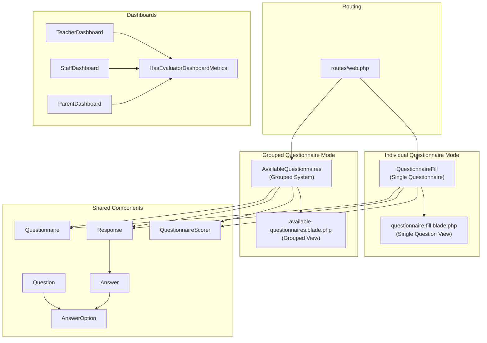
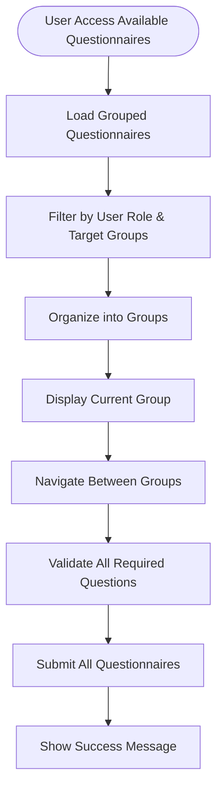
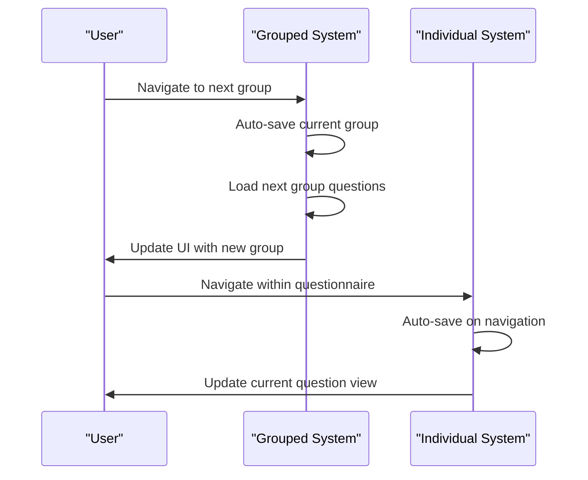
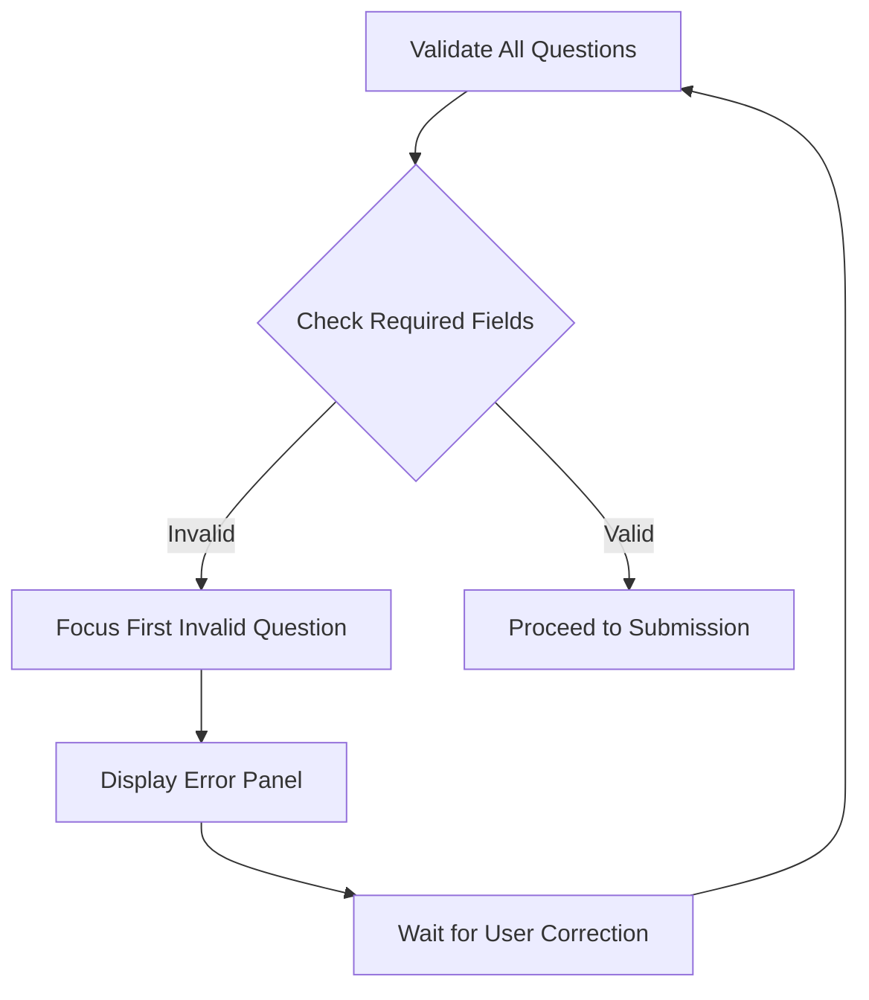
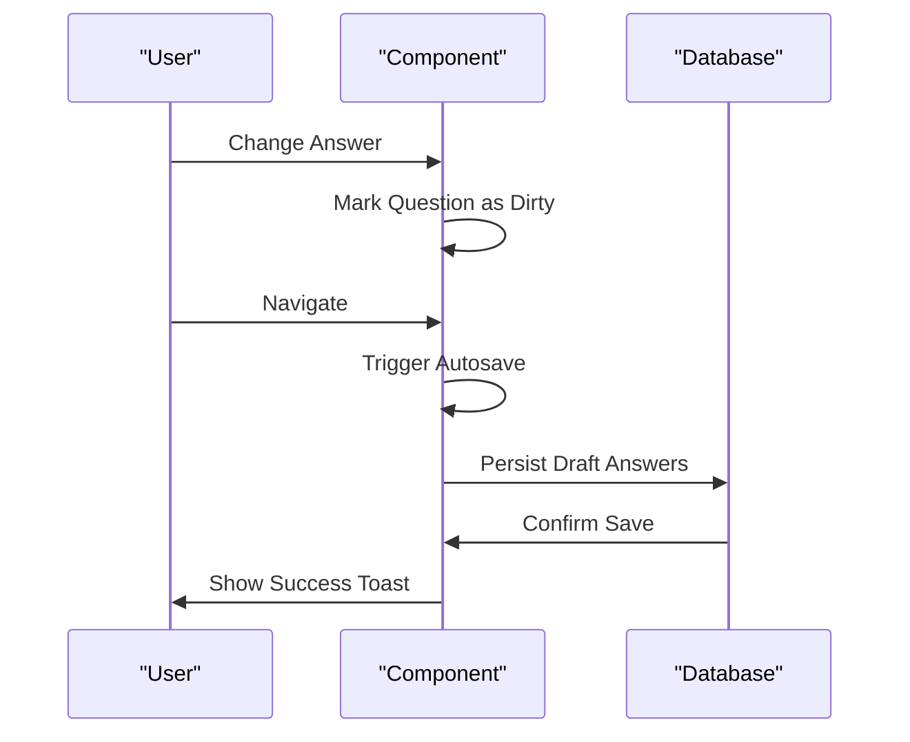
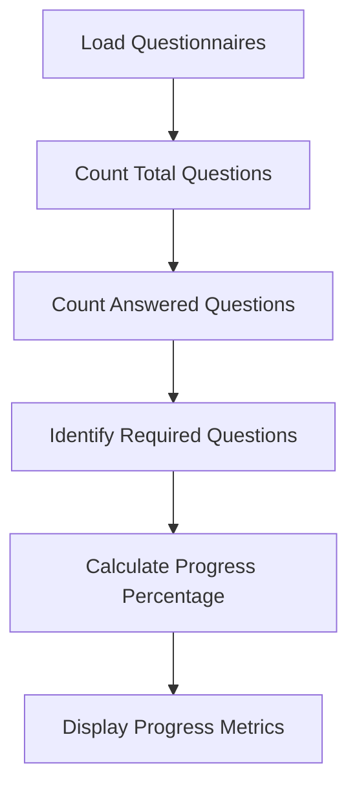
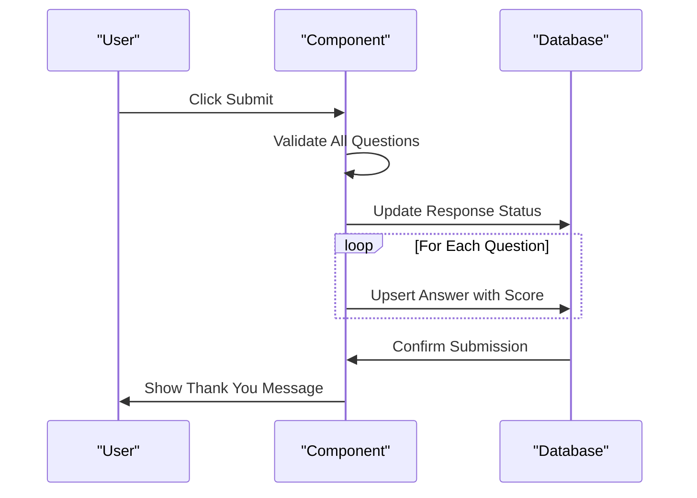

# Questionnaire Filling Interface

<cite>
**Referenced Files in This Document**
- [QuestionnaireFill.php](file://app/Livewire/Fill/QuestionnaireFill.php)
- [questionnaire-fill.blade.php](file://resources/views/livewire/fill/questionnaire-fill.blade.php)
- [AvailableQuestionnaires.php](file://app/Livewire/Fill/AvailableQuestionnaires.php)
- [available-questionnaires.blade.php](file://resources/views/livewire/fill/available-questionnaires.blade.php)
- [Questionnaire.php](file://app/Models/Questionnaire.php)
- [Question.php](file://app/Models/Question.php)
- [AnswerOption.php](file://app/Models/AnswerOption.php)
- [Response.php](file://app/Models/Response.php)
- [Answer.php](file://app/Models/Answer.php)
- [QuestionnaireScorer.php](file://app/Services/QuestionnaireScorer.php)
- [evaluator.blade.php](file://resources/views/layouts/evaluator.blade.php)
- [features.php](file://config/features.php)
- [web.php](file://routes/web.php)
- [HasEvaluatorDashboardMetrics.php](file://app/Livewire/Fill/Concerns/HasEvaluatorDashboardMetrics.php)
</cite>

## Update Summary
**Changes Made**
- Added comprehensive documentation for the new grouped questionnaire system
- Enhanced autosave and draft management documentation with improved persistence logic
- Updated navigation system documentation to cover both single questionnaire and grouped modes
- Expanded progress tracking documentation to include cross-group metrics
- Added new dashboard components documentation for teacher, staff, and parent roles
- Enhanced validation mechanisms documentation with global validation for grouped systems
- Updated autosave functionality documentation with heartbeat and manual trigger methods

## Table of Contents
1. [Introduction](#introduction)
2. [System Architecture](#system-architecture)
3. [Core Components](#core-components)
4. [Grouped Questionnaire System](#grouped-questionnaire-system)
5. [Single Questionnaire Mode](#single-questionnaire-mode)
6. [Navigation and User Experience](#navigation-and-user-experience)
7. [Question Types and Input Handling](#question-types-and-input-handling)
8. [Validation and Error Handling](#validation-and-error-handling)
9. [Autosave and Draft Management](#autosave-and-draft-management)
10. [Progress Tracking and Analytics](#progress-tracking-and-analytics)
11. [Submission and Finalization](#submission-and-finalization)
12. [Dashboard Components](#dashboard-components)
13. [Accessibility and Mobile Responsiveness](#accessibility-and-mobile-responsiveness)
14. [Performance Considerations](#performance-considerations)
15. [Troubleshooting Guide](#troubleshooting-guide)
16. [Conclusion](#conclusion)

## Introduction
This document describes the enhanced interactive questionnaire filling interface used by evaluators to complete assessment forms. The system now features a dual-mode approach supporting both individual questionnaire filling and grouped questionnaire management. It covers step-by-step navigation, question types (single choice, essay, combined), validation mechanisms, autosave and draft management, progress tracking, UI components, keyboard shortcuts, accessibility, and mobile responsiveness. The interface is built with Laravel Livewire and Blade, styled with Tailwind CSS and Flux UI components.

## System Architecture
The questionnaire filling system operates through two primary modes: individual questionnaire mode and grouped questionnaire mode. The architecture integrates Livewire state management with Blade rendering and backend persistence:



**Diagram sources**
- [QuestionnaireFill.php:19-515](file://app/Livewire/Fill/QuestionnaireFill.php#L19-L515)
- [questionnaire-fill.blade.php:1-402](file://resources/views/livewire/fill/questionnaire-fill.blade.php#L1-L402)
- [AvailableQuestionnaires.php:17-568](file://app/Livewire/Fill/AvailableQuestionnaires.php#L17-L568)
- [available-questionnaires.blade.php:1-461](file://resources/views/livewire/fill/available-questionnaires.blade.php#L1-L461)
- [TeacherDashboard.php:10-23](file://app/Livewire/Fill/TeacherDashboard.php#L10-L23)
- [StaffDashboard.php:10-23](file://app/Livewire/Fill/StaffDashboard.php#L10-L23)
- [ParentDashboard.php:10-23](file://app/Livewire/Fill/ParentDashboard.php#L10-L23)
- [HasEvaluatorDashboardMetrics.php:9-73](file://app/Livewire/Fill/Concerns/HasEvaluatorDashboardMetrics.php#L9-L73)

**Section sources**
- [QuestionnaireFill.php:44-122](file://app/Livewire/Fill/QuestionnaireFill.php#L44-L122)
- [AvailableQuestionnaires.php:44-132](file://app/Livewire/Fill/AvailableQuestionnaires.php#L44-L132)
- [web.php:149-160](file://routes/web.php#L149-L160)

## Core Components
The system consists of three main components:

### Individual Questionnaire Component
- **QuestionnaireFill**: Manages single questionnaire state, navigation, autosave triggers, validation, and submission
- **questionnaire-fill.blade.php**: Renders individual questionnaire UI with single-question mode support
- **Features**: Supports single-question mode toggle, individual progress tracking, and standalone submission

### Grouped Questionnaire Component
- **AvailableQuestionnaires**: Manages multiple questionnaires across groups, cross-questionnaire navigation, and bulk operations
- **available-questionnaires.blade.php**: Renders grouped questionnaire UI with step navigation and global validation
- **Features**: Group-based organization, cross-questionnaire progress tracking, and bulk submission capabilities

### Dashboard Components
- **TeacherDashboard**, **StaffDashboard**, **ParentDashboard**: Role-specific dashboards with metrics and navigation
- **HasEvaluatorDashboardMetrics**: Shared trait for dashboard metric calculation

**Section sources**
- [QuestionnaireFill.php:19-515](file://app/Livewire/Fill/QuestionnaireFill.php#L19-L515)
- [AvailableQuestionnaires.php:17-568](file://app/Livewire/Fill/AvailableQuestionnaires.php#L17-L568)
- [TeacherDashboard.php:10-23](file://app/Livewire/Fill/TeacherDashboard.php#L10-L23)
- [StaffDashboard.php:10-23](file://app/Livewire/Fill/StaffDashboard.php#L10-L23)
- [ParentDashboard.php:10-23](file://app/Livewire/Fill/ParentDashboard.php#L10-L23)
- [HasEvaluatorDashboardMetrics.php:9-73](file://app/Livewire/Fill/Concerns/HasEvaluatorDashboardMetrics.php#L9-L73)

## Grouped Questionnaire System
The grouped questionnaire system organizes multiple questionnaires into logical groups based on user roles and target groups:

### Group Organization Logic
- **Automatic Grouping**: Questionnaires are grouped by matched target groups from RBAC configuration
- **Role-Based Filtering**: Uses role aliases and target group mappings to determine questionnaire eligibility
- **Dynamic Loading**: Loads only fillable questionnaires for the current user's role

### Cross-Questionnaire Features
- **Group Navigation**: Step-by-step navigation across different questionnaire groups
- **Global Progress Tracking**: Overall progress across all groups and questionnaires
- **Bulk Operations**: Save drafts and submit all questionnaires at once
- **Unified Validation**: Validates all required questions across all groups before submission



**Diagram sources**
- [AvailableQuestionnaires.php:294-360](file://app/Livewire/Fill/AvailableQuestionnaires.php#L294-L360)
- [AvailableQuestionnaires.php:134-165](file://app/Livewire/Fill/AvailableQuestionnaires.php#L134-L165)
- [AvailableQuestionnaires.php:178-269](file://app/Livewire/Fill/AvailableQuestionnaires.php#L178-L269)

**Section sources**
- [AvailableQuestionnaires.php:19-568](file://app/Livewire/Fill/AvailableQuestionnaires.php#L19-L568)
- [available-questionnaires.blade.php:104-150](file://resources/views/livewire/fill/available-questionnaires.blade.php#L104-L150)

## Single Questionnaire Mode
The single questionnaire mode provides focused, distraction-free question answering:

### Single-Question Display
- **Focused Interface**: Shows only the current question with minimal surrounding context
- **Simplified Navigation**: Previous/Next buttons for sequential navigation
- **Quick Access**: Direct navigation to any question within the questionnaire

### State Management
- **Individual Response Tracking**: Each questionnaire maintains its own response state
- **Standalone Autosave**: Independent autosave functionality per questionnaire
- **Separate Progress**: Progress tracked independently for each questionnaire

**Section sources**
- [QuestionnaireFill.php:500-513](file://app/Livewire/Fill/QuestionnaireFill.php#L500-L513)
- [questionnaire-fill.blade.php:289-345](file://resources/views/livewire/fill/questionnaire-fill.blade.php#L289-L345)
- [features.php:4](file://config/features.php#L4)

## Navigation and User Experience
The system provides intuitive navigation across both modes:

### Individual Questionnaire Navigation
- **Sequential Navigation**: Previous/Next buttons with boundary checking
- **Direct Access**: Quick navigation buttons for direct question jumps
- **Context Preservation**: Maintains current question context during navigation

### Grouped Questionnaire Navigation
- **Group-Level Navigation**: Previous/Next group buttons with automatic draft saving
- **Step Indicators**: Visual step markers showing current position in group sequence
- **Cross-Group Progress**: Overall progress displayed across all groups

### Enhanced User Experience Features
- **Auto-save Triggers**: Automatic save on navigation with manual save option
- **Validation Feedback**: Real-time validation with error highlighting
- **Responsive Design**: Adapts to different screen sizes and orientations



**Diagram sources**
- [AvailableQuestionnaires.php:134-165](file://app/Livewire/Fill/AvailableQuestionnaires.php#L134-L165)
- [QuestionnaireFill.php:124-170](file://app/Livewire/Fill/QuestionnaireFill.php#L124-L170)

**Section sources**
- [AvailableQuestionnaires.php:134-165](file://app/Livewire/Fill/AvailableQuestionnaires.php#L134-L165)
- [QuestionnaireFill.php:124-170](file://app/Livewire/Fill/QuestionnaireFill.php#L124-L170)
- [questionnaire-fill.blade.php:118-135](file://resources/views/livewire/fill/questionnaire-fill.blade.php#L118-L135)

## Question Types and Input Handling
The system supports three question types with specialized input handling:

### Single Choice Questions
- **Radio Button Interface**: Exclusive selection with immediate validation
- **Required Field Handling**: Enforced selection for required questions
- **Option Scoring**: Automatic score calculation based on selected option

### Essay Questions
- **Textarea Input**: Multi-line text input with character limits
- **Live Validation**: Real-time validation with character counter
- **Debounced Updates**: Input debouncing to optimize performance

### Combined Questions
- **Dual Input System**: Radio button selection followed by essay explanation
- **Conditional Display**: Essay field appears only after option selection
- **Comprehensive Validation**: Both selection and explanation required

```mermaid
classDiagram
class Question {
+int id
+string question_text
+string type
+bool is_required
+int order
}
class AnswerOption {
+int id
+int question_id
+string option_text
+int score
+int order
}
class Answer {
+int id
+int response_id
+int question_id
+int answer_option_id
+string essay_answer
+int calculated_score
}
Question "1" o-- "many" AnswerOption : "has many"
Answer "belongs to" Question : "question_id"
Answer "belongs to" AnswerOption : "answer_option_id"
```

**Diagram sources**
- [Question.php:16-26](file://app/Models/Question.php#L16-L26)
- [AnswerOption.php:15-21](file://app/Models/AnswerOption.php#L15-L21)
- [Answer.php:15-22](file://app/Models/Answer.php#L15-L22)

**Section sources**
- [questionnaire-fill.blade.php:196-283](file://resources/views/livewire/fill/questionnaire-fill.blade.php#L196-L283)
- [QuestionnaireFill.php:301-335](file://app/Livewire/Fill/QuestionnaireFill.php#L301-L335)
- [available-questionnaires.blade.php:257-347](file://resources/views/livewire/fill/available-questionnaires.blade.php#L257-347)

## Validation and Error Handling
The system implements comprehensive validation at multiple levels:

### Per-Question Validation
- **Individual Question Validation**: Validates current question immediately on change
- **Real-time Feedback**: Visual highlighting and error messages for invalid inputs
- **Type-Specific Rules**: Different validation rules based on question type

### Global Validation
- **Cross-Questionnaire Validation**: Validates all required questions across groups
- **Group-Level Validation**: Ensures all groups have valid responses before submission
- **Error Aggregation**: Collects and displays all validation errors in a unified panel

### Error Handling Mechanisms
- **Automatic Focus**: Automatically focuses on first invalid question
- **Scroll Positioning**: Scrolls to invalid questions for better user experience
- **Persistent Error States**: Maintains error states until corrections are made



**Diagram sources**
- [QuestionnaireFill.php:342-388](file://app/Livewire/Fill/QuestionnaireFill.php#L342-L388)
- [AvailableQuestionnaires.php:514-554](file://app/Livewire/Fill/AvailableQuestionnaires.php#L514-L554)

**Section sources**
- [QuestionnaireFill.php:301-388](file://app/Livewire/Fill/QuestionnaireFill.php#L301-L388)
- [available-questionnaires.blade.php:15-68](file://resources/views/livewire/fill/available-questionnaires.blade.php#L15-L68)
- [questionnaire-fill.blade.php:102-115](file://resources/views/livewire/fill/questionnaire-fill.blade.php#L102-L115)

## Autosave and Draft Management
The enhanced autosave system provides robust draft persistence across both modes:

### Individual Questionnaire Autosave
- **Navigation-Based Autosave**: Primary autosave triggered on navigation actions
- **Manual Save Option**: Users can manually trigger autosave at any time
- **Dirty State Tracking**: Tracks which questions have unsaved changes

### Grouped Questionnaire Autosave
- **Group-Level Autosave**: Automatically saves when navigating between groups
- **Cross-Questionnaire Persistence**: Maintains separate responses for each questionnaire
- **Batch Processing**: Efficiently processes multiple questionnaires during autosave

### Draft Persistence Logic
- **Selective Persistence**: Only persists questions with actual answers
- **Empty Answer Cleanup**: Removes entries when both answer option and essay are empty
- **Status Management**: Maintains draft status with timestamps for audit trails



**Diagram sources**
- [QuestionnaireFill.php:146-154](file://app/Livewire/Fill/QuestionnaireFill.php#L146-L154)
- [AvailableQuestionnaires.php:403-431](file://app/Livewire/Fill/AvailableQuestionnaires.php#L403-L431)

**Section sources**
- [QuestionnaireFill.php:146-154](file://app/Livewire/Fill/QuestionnaireFill.php#L146-L154)
- [QuestionnaireFill.php:408-470](file://app/Livewire/Fill/QuestionnaireFill.php#L408-L470)
- [AvailableQuestionnaires.php:403-512](file://app/Livewire/Fill/AvailableQuestionnaires.php#L403-L512)

## Progress Tracking and Analytics
The system provides comprehensive progress tracking across multiple dimensions:

### Individual Questionnaire Metrics
- **Question-Level Progress**: Tracks answered vs total questions
- **Required Question Tracking**: Separates required from optional questions
- **Percentage Calculation**: Real-time progress percentage computation

### Grouped Questionnaire Metrics
- **Cross-Group Progress**: Overall progress across all groups and questionnaires
- **Aggregate Statistics**: Total questions, answered questions, and required completions
- **Visual Progress Indicators**: Combined progress bars and statistics displays

### Dashboard Integration
- **Role-Based Metrics**: Different metrics for teachers, staff, and parents
- **Submission Status**: Tracks completed vs pending questionnaire submissions
- **Time-Based Analytics**: Completion timing and response patterns



**Diagram sources**
- [QuestionnaireFill.php:252-299](file://app/Livewire/Fill/QuestionnaireFill.php#L252-L299)
- [AvailableQuestionnaires.php:56-95](file://app/Livewire/Fill/AvailableQuestionnaires.php#L56-L95)

**Section sources**
- [QuestionnaireFill.php:252-299](file://app/Livewire/Fill/QuestionnaireFill.php#L252-L299)
- [AvailableQuestionnaires.php:56-131](file://app/Livewire/Fill/AvailableQuestionnaires.php#L56-L131)

## Submission and Finalization
The submission process varies based on the mode:

### Individual Questionnaire Submission
- **Single Questionnaire Finalization**: Direct submission of one questionnaire
- **Immediate Validation**: Validates all required questions before submission
- **Score Calculation**: Calculates scores for all answered questions

### Grouped Questionnaire Submission
- **Bulk Submission**: Submits all fillable questionnaires simultaneously
- **Cross-Questionnaire Validation**: Validates all required questions across groups
- **Individual Response Creation**: Creates separate responses for each questionnaire

### Finalization Process
- **Confirmation Dialog**: Shows summary of all responses before final submission
- **Transaction Processing**: Uses database transactions for data integrity
- **Success Feedback**: Provides clear success messages and navigation options



**Diagram sources**
- [QuestionnaireFill.php:193-245](file://app/Livewire/Fill/QuestionnaireFill.php#L193-L245)
- [AvailableQuestionnaires.php:190-269](file://app/Livewire/Fill/AvailableQuestionnaires.php#L190-L269)

**Section sources**
- [QuestionnaireFill.php:172-245](file://app/Livewire/Fill/QuestionnaireFill.php#L172-L245)
- [AvailableQuestionnaires.php:178-269](file://app/Livewire/Fill/AvailableQuestionnaires.php#L178-L269)

## Dashboard Components
The system includes role-specific dashboards with comprehensive metrics:

### Dashboard Architecture
- **Trait-Based Implementation**: Uses HasEvaluatorDashboardMetrics trait for common functionality
- **Role-Based Filtering**: Filters questionnaires based on user roles and aliases
- **Metric Aggregation**: Provides statistics for available, completed, and active questionnaires

### Dashboard Features
- **Available Questionnaires List**: Shows questionnaires eligible for the current user
- **Completed Questionnaires**: Lists previously submitted questionnaires
- **Statistics Display**: Shows counts for active questionnaires, available to fill, and completed total
- **Navigation Integration**: Direct links to questionnaire filling interfaces

### Role-Specific Dashboards
- **Teacher Dashboard**: Metrics tailored for educational staff
- **Staff Dashboard**: Administrative staff questionnaire management
- **Parent Dashboard**: Parent portal for student-related questionnaires

**Section sources**
- [TeacherDashboard.php:10-23](file://app/Livewire/Fill/TeacherDashboard.php#L10-L23)
- [StaffDashboard.php:10-23](file://app/Livewire/Fill/StaffDashboard.php#L10-L23)
- [ParentDashboard.php:10-23](file://app/Livewire/Fill/ParentDashboard.php#L10-L23)
- [HasEvaluatorDashboardMetrics.php:9-73](file://app/Livewire/Fill/Concerns/HasEvaluatorDashboardMetrics.php#L9-L73)

## Accessibility and Mobile Responsiveness
The interface is designed with accessibility and mobile usability in mind:

### Accessibility Features
- **Keyboard Navigation**: Full keyboard support for all interactive elements
- **Screen Reader Support**: Proper ARIA attributes and semantic HTML
- **Focus Management**: Logical tab order and focus indication
- **Color Contrast**: High contrast ratios for text and interactive elements

### Mobile Responsiveness
- **Adaptive Layouts**: Responsive grid systems adapt to different screen sizes
- **Touch-Friendly Controls**: Appropriately sized touch targets for mobile devices
- **Horizontal Scrolling**: Group navigation adapts to narrow screens
- **Performance Optimization**: Optimized rendering for mobile browsers

### User Experience Enhancements
- **Toast Notifications**: Non-intrusive status updates with appropriate timing
- **Loading States**: Visual feedback during autosave and submission operations
- **Error Communication**: Clear error messages with actionable guidance
- **Progress Visualization**: Intuitive progress indicators and completion tracking

**Section sources**
- [questionnaire-fill.blade.php:387-401](file://resources/views/livewire/fill/questionnaire-fill.blade.php#L387-L401)
- [available-questionnaires.blade.php:445-460](file://resources/views/livewire/fill/available-questionnaires.blade.php#L445-L460)
- [evaluator.blade.php:26-76](file://resources/views/layouts/evaluator.blade.php#L26-L76)

## Performance Considerations
The system is optimized for efficient operation across multiple scenarios:

### Rendering Optimization
- **Component-Level Rendering**: Only renders visible components and groups
- **Lazy Loading**: Questionnaires are loaded as needed based on user navigation
- **Efficient Data Structures**: Optimized data structures for question and answer management

### Database Performance
- **Batch Operations**: Efficient batch processing for autosave and submission operations
- **Query Optimization**: Optimized queries for loading questionnaires and responses
- **Connection Pooling**: Proper database connection management for concurrent users

### Memory Management
- **State Cleanup**: Automatic cleanup of unused state data
- **Event Management**: Efficient event handling for autosave and validation
- **Resource Optimization**: Minimized memory footprint for large questionnaire sets

## Troubleshooting Guide
Common issues and their solutions:

### Access and Authentication Issues
- **Cannot Access Questionnaires**: Verify user role matches questionnaire target groups
- **Permission Denied**: Check RBAC configuration and role aliases for proper access
- **Session Timeout**: Ensure user authentication is maintained throughout the session

### Navigation Problems
- **Group Navigation Not Working**: Verify autosave completes successfully before group changes
- **Question Jump Issues**: Check that question IDs are properly mapped in grouped systems
- **Progress Tracking Errors**: Validate that progress calculations account for all question types

### Autosave and Draft Issues
- **Autosave Not Triggering**: Ensure navigation events are firing correctly
- **Draft Not Saved**: Verify that answers meet validation criteria before autosave
- **Data Loss**: Check that database transactions are completing successfully

### Validation and Submission Problems
- **Validation Errors**: Review validation error messages and fix required fields
- **Submission Failures**: Check database connectivity and transaction status
- **Score Calculation Issues**: Verify that scoring logic matches expected outcomes

**Section sources**
- [QuestionnaireFill.php:49-79](file://app/Livewire/Fill/QuestionnaireFill.php#L49-L79)
- [AvailableQuestionnaires.php:134-165](file://app/Livewire/Fill/AvailableQuestionnaires.php#L134-L165)
- [questionnaire-fill.blade.php:102-115](file://resources/views/livewire/fill/questionnaire-fill.blade.php#L102-L115)

## Conclusion
The enhanced questionnaire filling interface provides a comprehensive, accessible, and responsive solution for evaluator assessment. The dual-mode architecture supports both focused individual questionnaire completion and efficient grouped questionnaire management. With robust autosave functionality, comprehensive validation, and rich progress tracking, the system delivers an excellent user experience across all device types and user roles. The modular design ensures maintainability and extensibility for future enhancements.