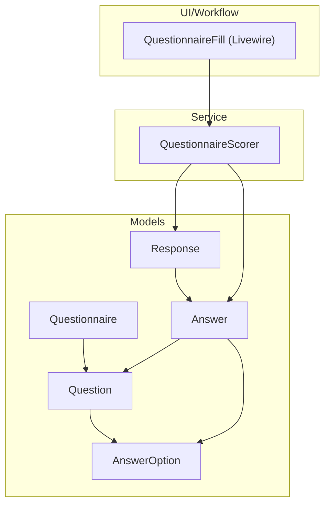
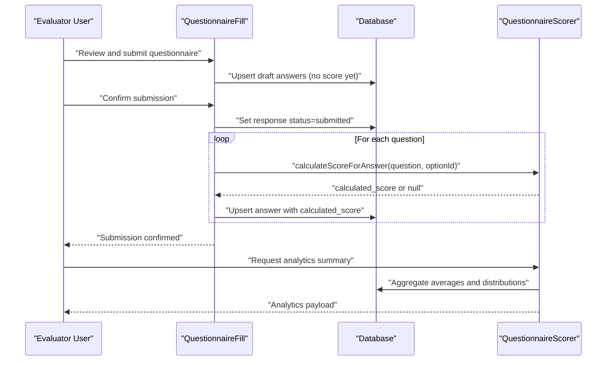
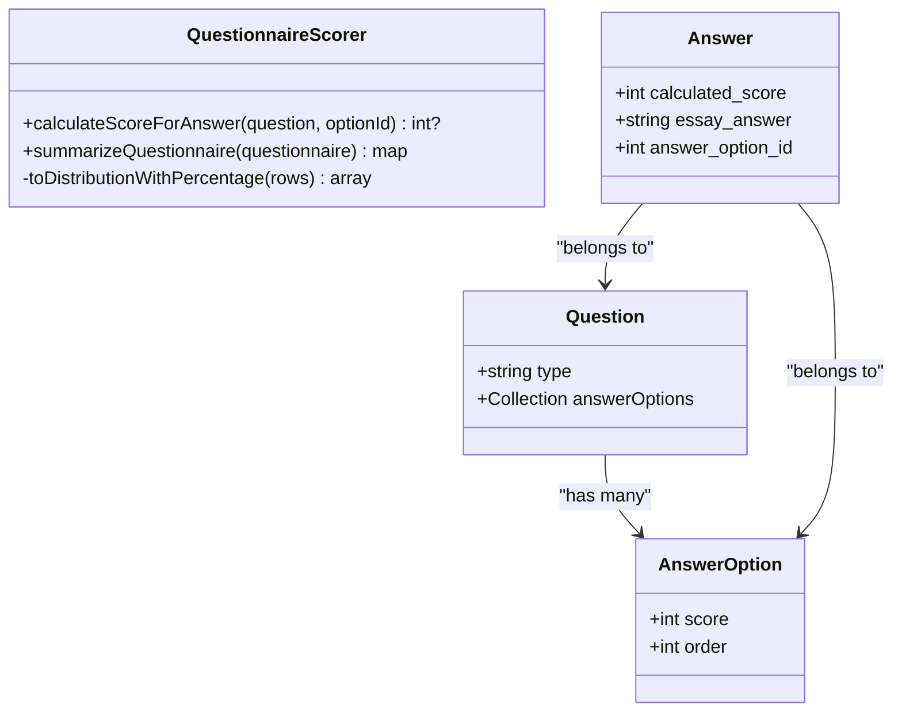
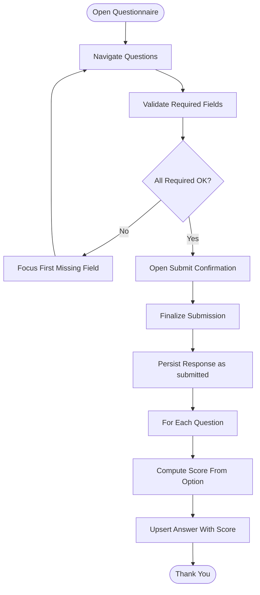
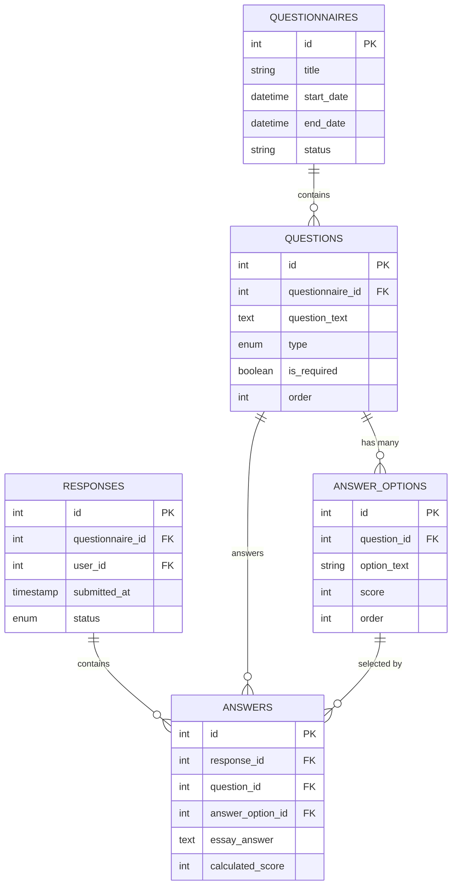
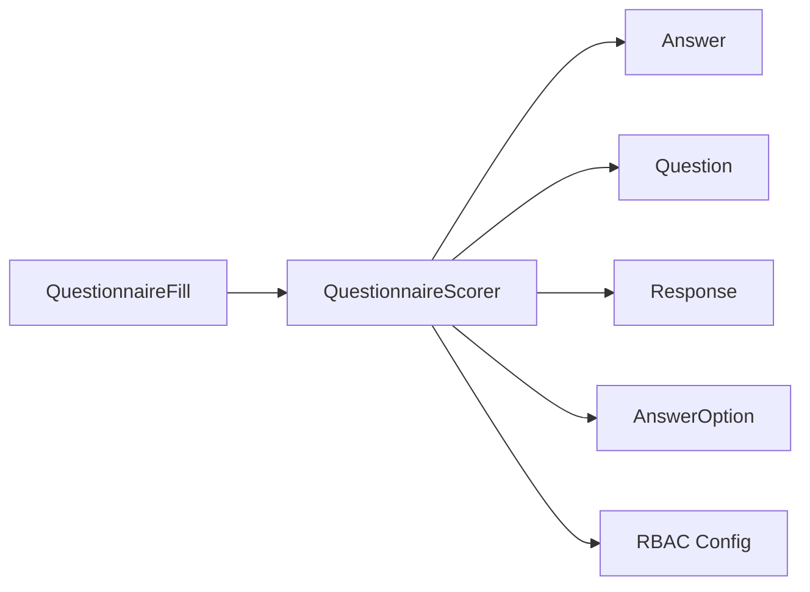

# Scoring Algorithm

<cite>
**Referenced Files in This Document**
- [QuestionnaireScorer.php](file://app/Services/QuestionnaireScorer.php)
- [QuestionnaireFill.php](file://app/Livewire/Fill/QuestionnaireFill.php)
- [Answer.php](file://app/Models/Answer.php)
- [AnswerOption.php](file://app/Models/AnswerOption.php)
- [Question.php](file://app/Models/Question.php)
- [Response.php](file://app/Models/Response.php)
- [Questionnaire.php](file://app/Models/Questionnaire.php)
- [2026_04_16_010241_create_questions_table.php](file://database/migrations/2026_04_16_010241_create_questions_table.php)
- [2026_04_16_010242_create_answer_options_table.php](file://database/migrations/2026_04_16_010242_create_answer_options_table.php)
- [2026_04_16_020000_create_responses_table.php](file://database/migrations/2026_04_16_020000_create_responses_table.php)
- [2026_04_16_020100_create_answers_table.php](file://database/migrations/2026_04_16_020100_create_answers_table.php)
- [rbac.php](file://config/rbac.php)
- [07-scoring.md](file://.clinerules/07-scoring.md)
</cite>

## Table of Contents
1. [Introduction](#introduction)
2. [Project Structure](#project-structure)
3. [Core Components](#core-components)
4. [Architecture Overview](#architecture-overview)
5. [Detailed Component Analysis](#detailed-component-analysis)
6. [Dependency Analysis](#dependency-analysis)
7. [Performance Considerations](#performance-considerations)
8. [Troubleshooting Guide](#troubleshooting-guide)
9. [Conclusion](#conclusion)
10. [Appendices](#appendices)

## Introduction
This document explains the automated scoring algorithm used in questionnaire evaluation. It covers how scores are calculated for single-choice, essay, and combined question types, how weighted scoring is applied via answer options, and how aggregated analytics are produced. It also documents the scoring service architecture, calculation precision, performance optimization techniques, and integration with the overall evaluation workflow. Finally, it outlines the scoring data models, calculation triggers, and result storage mechanisms.

## Project Structure
The scoring system spans several model and service layers:
- Data models define the persisted structures for questions, answer options, responses, and answers.
- The scoring service encapsulates scoring logic and analytics computation.
- The questionnaire fill Livewire component orchestrates submission and triggers scoring during finalization.

**Diagram sources**
- [QuestionnaireScorer.php:12-139](file://app/Services/QuestionnaireScorer.php#L12-L139)
- [QuestionnaireFill.php:19-515](file://app/Livewire/Fill/QuestionnaireFill.php#L19-L515)
- [Answer.php:10-44](file://app/Models/Answer.php#L10-L44)
- [AnswerOption.php:10-38](file://app/Models/AnswerOption.php#L10-L38)
- [Question.php:11-43](file://app/Models/Question.php#L11-L43)
- [Response.php:11-42](file://app/Models/Response.php#L11-L42)
- [Questionnaire.php:13-131](file://app/Models/Questionnaire.php#L13-L131)

**Section sources**
- [QuestionnaireScorer.php:12-139](file://app/Services/QuestionnaireScorer.php#L12-L139)
- [QuestionnaireFill.php:19-515](file://app/Livewire/Fill/QuestionnaireFill.php#L19-L515)
- [Answer.php:10-44](file://app/Models/Answer.php#L10-L44)
- [AnswerOption.php:10-38](file://app/Models/AnswerOption.php#L10-L38)
- [Question.php:11-43](file://app/Models/Question.php#L11-L43)
- [Response.php:11-42](file://app/Models/Response.php#L11-L42)
- [Questionnaire.php:13-131](file://app/Models/Questionnaire.php#L13-L131)

## Core Components
- QuestionnaireScorer: Central scoring service that computes per-answer scores and produces analytics summaries.
- QuestionnaireFill: Submission workflow that persists answers and triggers scoring at finalization.
- Models: Question, AnswerOption, Response, Answer, Questionnaire define the data schema and relationships.

Key responsibilities:
- Single-choice scoring: Selects the score value associated with the chosen answer option.
- Essay scoring: Not currently computed by the scoring service; stored as free-text and excluded from numerical averages.
- Combined scoring: Requires both a selected answer option and an essay; the numeric score comes from the option while the essay is stored separately.
- Analytics: Computes overall averages, per-group averages, question-level averages, and distribution percentages.

Precision and rounding:
- Averages are rounded to two decimal places.
- Distribution percentages are rounded to two decimal places.

**Section sources**
- [QuestionnaireScorer.php:14-137](file://app/Services/QuestionnaireScorer.php#L14-L137)
- [QuestionnaireFill.php:193-245](file://app/Livewire/Fill/QuestionnaireFill.php#L193-L245)
- [Answer.php:15-22](file://app/Models/Answer.php#L15-L22)
- [AnswerOption.php:15-21](file://app/Models/AnswerOption.php#L15-L21)
- [Question.php:16-26](file://app/Models/Question.php#L16-L26)

## Architecture Overview
The scoring pipeline integrates UI submission, persistence, and analytics computation.

**Diagram sources**
- [QuestionnaireFill.php:193-245](file://app/Livewire/Fill/QuestionnaireFill.php#L193-L245)
- [QuestionnaireScorer.php:33-112](file://app/Services/QuestionnaireScorer.php#L33-L112)
- [Answer.php:15-22](file://app/Models/Answer.php#L15-L22)
- [AnswerOption.php:15-21](file://app/Models/AnswerOption.php#L15-L21)

## Detailed Component Analysis

### QuestionnaireScorer
Responsibilities:
- compute per-answer score from selected answer option.
- produce analytics summary including:
  - Respondent breakdown by role.
  - Overall average and per-group averages.
  - Question-level averages.
  - Distribution counts and percentages per option.

Scoring method:
- For single-choice: returns the score attached to the selected answer option; returns null if no option is selected.
- For essay and combined: essay text is stored but not numerically scored by this service.

Analytics computation:
- Filters submissions by status "submitted".
- Uses configured target role slugs to segment averages.
- Rounds averages and percentages to two decimals.

**Diagram sources**
- [QuestionnaireScorer.php:12-139](file://app/Services/QuestionnaireScorer.php#L12-L139)
- [Answer.php:10-44](file://app/Models/Answer.php#L10-L44)
- [AnswerOption.php:10-38](file://app/Models/AnswerOption.php#L10-L38)
- [Question.php:11-43](file://app/Models/Question.php#L11-L43)

**Section sources**
- [QuestionnaireScorer.php:14-137](file://app/Services/QuestionnaireScorer.php#L14-L137)
- [rbac.php:6-11](file://config/rbac.php#L6-L11)

### QuestionnaireFill (Submission Workflow)
Submission lifecycle:
- Draft answers are upserted without a calculated score.
- On final submission:
  - Response status transitions to submitted.
  - For each question, the service normalizes the selected option ID against available options.
  - Calls the scoring service to compute the score from the selected answer option.
  - Upserts the answer record with the computed score.

Validation and required fields:
- Enforces required single-choice, essay, and combined question rules.
- Progress and requirement counters help guide completion.

**Diagram sources**
- [QuestionnaireFill.php:193-245](file://app/Livewire/Fill/QuestionnaireFill.php#L193-L245)
- [QuestionnaireFill.php:342-388](file://app/Livewire/Fill/QuestionnaireFill.php#L342-L388)

**Section sources**
- [QuestionnaireFill.php:193-245](file://app/Livewire/Fill/QuestionnaireFill.php#L193-L245)
- [QuestionnaireFill.php:342-388](file://app/Livewire/Fill/QuestionnaireFill.php#L342-L388)

### Data Models and Relationships
The scoring system relies on the following schema:

**Diagram sources**
- [2026_04_16_010241_create_questions_table.php:11-22](file://database/migrations/2026_04_16_010241_create_questions_table.php#L11-L22)
- [2026_04_16_010242_create_answer_options_table.php:11-20](file://database/migrations/2026_04_16_010242_create_answer_options_table.php#L11-L20)
- [2026_04_16_020000_create_responses_table.php:10-22](file://database/migrations/2026_04_16_020000_create_responses_table.php#L10-L22)
- [2026_04_16_020100_create_answers_table.php:10-22](file://database/migrations/2026_04_16_020100_create_answers_table.php#L10-L22)

**Section sources**
- [Questionnaire.php:42-50](file://app/Models/Questionnaire.php#L42-L50)
- [Question.php:33-41](file://app/Models/Question.php#L33-L41)
- [AnswerOption.php:33-36](file://app/Models/AnswerOption.php#L33-L36)
- [Response.php:37-40](file://app/Models/Response.php#L37-L40)
- [Answer.php:24-42](file://app/Models/Answer.php#L24-L42)

## Dependency Analysis
- QuestionnaireScorer depends on:
  - Answer, Question, Response models for data access.
  - Database queries to compute averages and distributions.
  - RBAC configuration for target role slugs.
- QuestionnaireFill depends on:
  - QuestionnaireScorer for computing scores.
  - Eloquent models for persistence.
  - Request validation rules for required fields.

**Diagram sources**
- [QuestionnaireScorer.php:5-10](file://app/Services/QuestionnaireScorer.php#L5-L10)
- [QuestionnaireFill.php:8-14](file://app/Livewire/Fill/QuestionnaireFill.php#L8-L14)
- [rbac.php:6-11](file://config/rbac.php#L6-L11)

**Section sources**
- [QuestionnaireScorer.php:5-10](file://app/Services/QuestionnaireScorer.php#L5-L10)
- [QuestionnaireFill.php:8-14](file://app/Livewire/Fill/QuestionnaireFill.php#L8-L14)
- [rbac.php:6-11](file://config/rbac.php#L6-L11)

## Performance Considerations
- Calculation precision:
  - Averages and percentages are rounded to two decimals for display consistency.
- Query efficiency:
  - Aggregations filter by questionnaire and submission status to limit dataset size.
  - Indexes exist on foreign keys and composite unique constraints to optimize joins and upserts.
- Caching:
  - The scoring rules recommend caching analytics while the questionnaire is active and recalculating on new submissions. This is a recommended enhancement for production workloads.
- Batch operations:
  - Draft and final submissions use bulk upserts to minimize round-trips.

[No sources needed since this section provides general guidance]

## Troubleshooting Guide
Common issues and resolutions:
- Missing or invalid option ID:
  - The scoring service returns null when no option is selected; ensure normalization occurs before scoring.
- Essay-only answers:
  - Essay answers are stored but not scored; they do not contribute to numerical averages.
- Inconsistent role slugs:
  - Ensure target role slugs in configuration match questionnaire target groups.
- Analytics gaps:
  - Verify that only "submitted" responses are included in averages and distributions.

**Section sources**
- [QuestionnaireScorer.php:14-23](file://app/Services/QuestionnaireScorer.php#L14-L23)
- [QuestionnaireFill.php:483-493](file://app/Livewire/Fill/QuestionnaireFill.php#L483-L493)
- [rbac.php:6-11](file://config/rbac.php#L6-L11)

## Conclusion
The scoring system cleanly separates concerns between submission, persistence, and analytics. Scores are derived from answer options for single-choice questions, while essay and combined responses are stored for qualitative insights. The scoring service provides robust aggregation with precise rounding and distribution reporting. Extending caching and precomputing summaries can further improve performance for large-scale evaluations.

[No sources needed since this section summarizes without analyzing specific files]

## Appendices

### Scoring Methodology and Examples
- Single choice:
  - Choose an answer option; the associated score is recorded.
  - Example scenario: A five-option scale yields scores 5, 4, 3, 2, 0 for “Very Agree”, “Agree”, “Neutral”, “Disagree”, and “Abstain” respectively.
- Essay:
  - No numeric score is computed; stored as free text.
  - Example scenario: A teacher’s narrative feedback does not affect quantitative averages.
- Combined:
  - Requires both a selected answer option and an essay; the numeric score is taken from the option.
  - Example scenario: A rating plus justification contributes to averages while the justification remains un-scored.

**Section sources**
- [07-scoring.md:3-12](file://.clinerules/07-scoring.md#L3-L12)
- [07-scoring.md:14-22](file://.clinerules/07-scoring.md#L14-L22)
- [QuestionnaireFill.php:209-240](file://app/Livewire/Fill/QuestionnaireFill.php#L209-L240)

### Calculation Triggers and Result Storage
- Calculation trigger:
  - Final submission of a response triggers per-question scoring.
- Result storage:
  - Answers store the computed score and optional essay text.
  - Analytics summaries are computed on-demand from persisted data.

**Section sources**
- [QuestionnaireFill.php:203-245](file://app/Livewire/Fill/QuestionnaireFill.php#L203-L245)
- [Answer.php:15-22](file://app/Models/Answer.php#L15-L22)
- [QuestionnaireScorer.php:33-112](file://app/Services/QuestionnaireScorer.php#L33-L112)