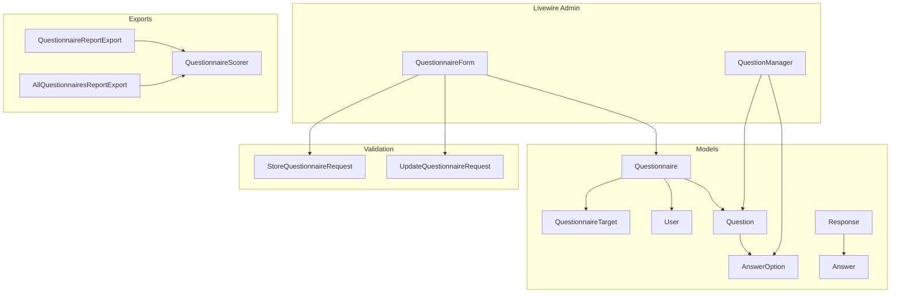
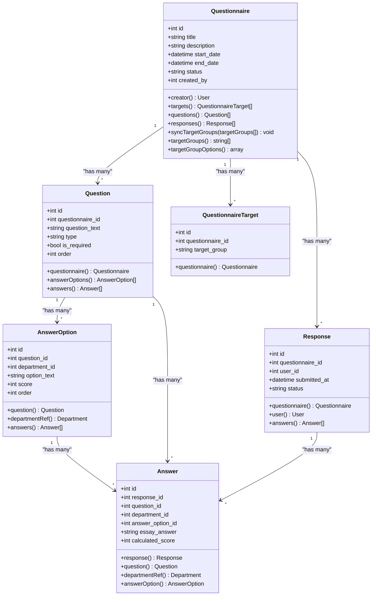
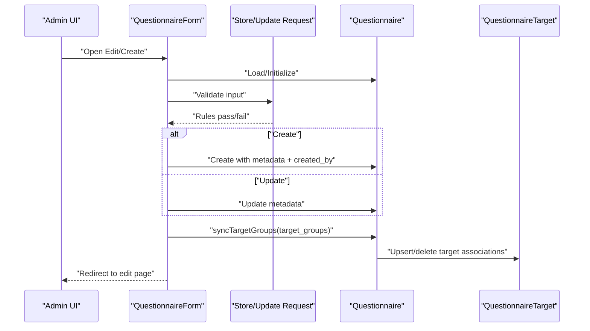
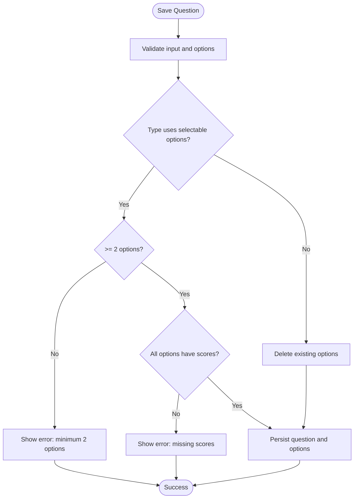
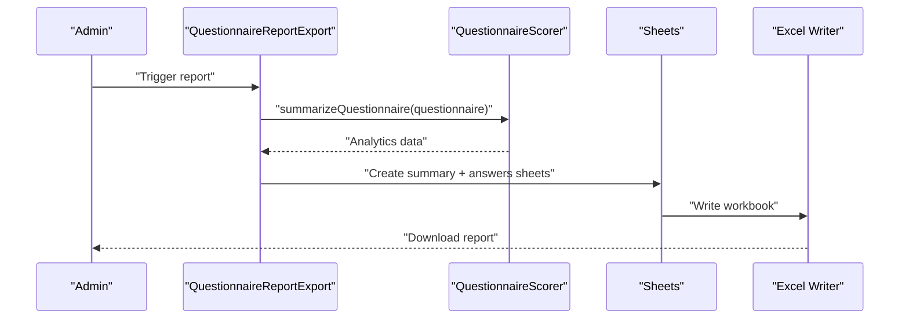
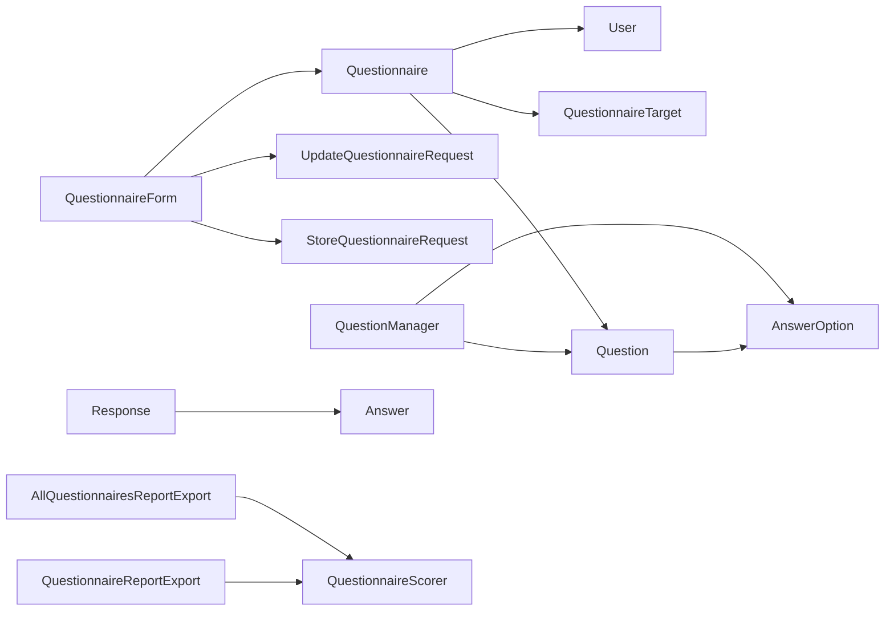

# Questionnaire Management

<cite>
**Referenced Files in This Document**
- [Questionnaire.php](file://app/Models/Questionnaire.php)
- [Question.php](file://app/Models/Question.php)
- [AnswerOption.php](file://app/Models/AnswerOption.php)
- [QuestionnaireTarget.php](file://app/Models/QuestionnaireTarget.php)
- [Response.php](file://app/Models/Response.php)
- [Answer.php](file://app/Models/Answer.php)
- [QuestionnaireForm.php](file://app/Livewire/Admin/QuestionnaireForm.php)
- [QuestionManager.php](file://app/Livewire/Admin/QuestionManager.php)
- [StoreQuestionnaireRequest.php](file://app/Http/Requests/StoreQuestionnaireRequest.php)
- [UpdateQuestionnaireRequest.php](file://app/Http/Requests/UpdateQuestionnaireRequest.php)
- [QuestionnaireReportExport.php](file://app/Exports/QuestionnaireReportExport.php)
- [AllQuestionnairesReportExport.php](file://app/Exports/AllQuestionnairesReportExport.php)
- [QuestionnaireScorer.php](file://app/Services/QuestionnaireScorer.php)
- [questionnaire-form.blade.php](file://resources/views/livewire/admin/questionnaire-form.blade.php)
</cite>

## Table of Contents
1. [Introduction](#introduction)
2. [Project Structure](#project-structure)
3. [Core Components](#core-components)
4. [Architecture Overview](#architecture-overview)
5. [Detailed Component Analysis](#detailed-component-analysis)
6. [Dependency Analysis](#dependency-analysis)
7. [Performance Considerations](#performance-considerations)
8. [Troubleshooting Guide](#troubleshooting-guide)
9. [Conclusion](#conclusion)
10. [Appendices](#appendices)

## Introduction
This document describes the questionnaire management system, covering the end-to-end lifecycle of creating, editing, validating, assigning target groups, building forms, and exporting analytics. It explains the data model relationships among questionnaires, questions, answer options, responses, and answers, and documents the form builder interface, validation rules, publishing workflows, and reporting capabilities.

## Project Structure
The system is organized around Eloquent models, Livewire components for administration, form requests for validation, and Excel export services for analytics.

**Diagram sources**
- [Questionnaire.php:13-131](file://app/Models/Questionnaire.php#L13-L131)
- [QuestionnaireTarget.php:9-24](file://app/Models/QuestionnaireTarget.php#L9-L24)
- [Question.php:11-43](file://app/Models/Question.php#L11-L43)
- [AnswerOption.php:10-38](file://app/Models/AnswerOption.php#L10-L38)
- [Response.php:11-42](file://app/Models/Response.php#L11-L42)
- [Answer.php:10-44](file://app/Models/Answer.php#L10-L44)
- [QuestionnaireForm.php:15-133](file://app/Livewire/Admin/QuestionnaireForm.php#L15-L133)
- [QuestionManager.php:16-282](file://app/Livewire/Admin/QuestionManager.php#L16-L282)
- [StoreQuestionnaireRequest.php:10-41](file://app/Http/Requests/StoreQuestionnaireRequest.php#L10-L41)
- [UpdateQuestionnaireRequest.php:9-30](file://app/Http/Requests/UpdateQuestionnaireRequest.php#L9-L30)
- [QuestionnaireReportExport.php:11-29](file://app/Exports/QuestionnaireReportExport.php#L11-L29)
- [AllQuestionnairesReportExport.php:10-25](file://app/Exports/AllQuestionnairesReportExport.php#L10-L25)
- [QuestionnaireScorer.php:12-139](file://app/Services/QuestionnaireScorer.php#L12-L139)

**Section sources**
- [Questionnaire.php:13-131](file://app/Models/Questionnaire.php#L13-L131)
- [QuestionnaireForm.php:15-133](file://app/Livewire/Admin/QuestionnaireForm.php#L15-L133)
- [QuestionManager.php:16-282](file://app/Livewire/Admin/QuestionManager.php#L16-L282)
- [StoreQuestionnaireRequest.php:10-41](file://app/Http/Requests/StoreQuestionnaireRequest.php#L10-L41)
- [UpdateQuestionnaireRequest.php:9-30](file://app/Http/Requests/UpdateQuestionnaireRequest.php#L9-L30)
- [QuestionnaireReportExport.php:11-29](file://app/Exports/QuestionnaireReportExport.php#L11-L29)
- [AllQuestionnairesReportExport.php:10-25](file://app/Exports/AllQuestionnairesReportExport.php#L10-L25)
- [QuestionnaireScorer.php:12-139](file://app/Services/QuestionnaireScorer.php#L12-L139)

## Core Components
- Questionnaire: central entity with metadata, lifecycle status, creator, target groups, ordered questions, and responses.
- Question: belongs to a questionnaire, supports multiple types, required flag, ordering, and answer options.
- AnswerOption: defines selectable choices with scores for specific question types.
- QuestionnaireTarget: links a questionnaire to target role slugs.
- Response: captures a submission by a user for a questionnaire.
- Answer: stores selected option or essay answer linked to a response and question.
- QuestionnaireForm: creates/edit questionnaire with validation, target group sync, and persistence.
- QuestionManager: manages questions and answer options per questionnaire, including reordering and validation.
- Validation Requests: enforce field constraints and target group eligibility.
- Export and Scoring: aggregates analytics and produces Excel reports.

**Section sources**
- [Questionnaire.php:13-131](file://app/Models/Questionnaire.php#L13-L131)
- [Question.php:11-43](file://app/Models/Question.php#L11-L43)
- [AnswerOption.php:10-38](file://app/Models/AnswerOption.php#L10-L38)
- [QuestionnaireTarget.php:9-24](file://app/Models/QuestionnaireTarget.php#L9-L24)
- [Response.php:11-42](file://app/Models/Response.php#L11-L42)
- [Answer.php:10-44](file://app/Models/Answer.php#L10-L44)
- [QuestionnaireForm.php:15-133](file://app/Livewire/Admin/QuestionnaireForm.php#L15-L133)
- [QuestionManager.php:16-282](file://app/Livewire/Admin/QuestionManager.php#L16-L282)
- [StoreQuestionnaireRequest.php:10-41](file://app/Http/Requests/StoreQuestionnaireRequest.php#L10-L41)
- [UpdateQuestionnaireRequest.php:9-30](file://app/Http/Requests/UpdateQuestionnaireRequest.php#L9-L30)
- [QuestionnaireReportExport.php:11-29](file://app/Exports/QuestionnaireReportExport.php#L11-L29)
- [AllQuestionnairesReportExport.php:10-25](file://app/Exports/AllQuestionnairesReportExport.php#L10-L25)
- [QuestionnaireScorer.php:12-139](file://app/Services/QuestionnaireScorer.php#L12-L139)

## Architecture Overview
The system follows a layered architecture:
- Presentation: Livewire components for admin UI (form builder and question manager).
- Application: Controllers and services orchestrate workflows (validation, persistence, analytics).
- Domain: Eloquent models define domain entities and relationships.
- Persistence: Laravel Eloquent ORM with soft deletes and explicit casts.

**Diagram sources**
- [Questionnaire.php:13-131](file://app/Models/Questionnaire.php#L13-L131)
- [QuestionnaireTarget.php:9-24](file://app/Models/QuestionnaireTarget.php#L9-L24)
- [Question.php:11-43](file://app/Models/Question.php#L11-L43)
- [AnswerOption.php:10-38](file://app/Models/AnswerOption.php#L10-L38)
- [Response.php:11-42](file://app/Models/Response.php#L11-L42)
- [Answer.php:10-44](file://app/Models/Answer.php#L10-L44)

## Detailed Component Analysis

### Questionnaire Form Builder
The form builder enables administrators to create or update a questionnaire, set dates and status, and manage target groups. It validates inputs and persists changes, then redirects to the edit page for further actions.

Key behaviors:
- Loads available target groups and labels for selection.
- On edit, ensures at least one target group remains selected.
- Validates using dedicated form requests.
- Persists questionnaire metadata and synchronizes target groups atomically.

**Diagram sources**
- [QuestionnaireForm.php:40-107](file://app/Livewire/Admin/QuestionnaireForm.php#L40-L107)
- [StoreQuestionnaireRequest.php:20-39](file://app/Http/Requests/StoreQuestionnaireRequest.php#L20-L39)
- [UpdateQuestionnaireRequest.php:25-28](file://app/Http/Requests/UpdateQuestionnaireRequest.php#L25-L28)
- [Questionnaire.php:55-83](file://app/Models/Questionnaire.php#L55-L83)

Practical example: Creating a new questionnaire
- Navigate to the form, fill title, description, start/end dates, and select at least one target group.
- Choose status draft/active/closed.
- Submit to persist and redirect to edit page.

Practical example: Editing an existing questionnaire
- Open the edit page, adjust dates/status, and confirm changes.
- Target groups can be reassigned via the “Target Group Assignment” panel.

**Section sources**
- [QuestionnaireForm.php:40-107](file://app/Livewire/Admin/QuestionnaireForm.php#L40-L107)
- [questionnaire-form.blade.php:1-149](file://resources/views/livewire/admin/questionnaire-form.blade.php#L1-L149)
- [StoreQuestionnaireRequest.php:20-39](file://app/Http/Requests/StoreQuestionnaireRequest.php#L20-L39)
- [UpdateQuestionnaireRequest.php:25-28](file://app/Http/Requests/UpdateQuestionnaireRequest.php#L25-L28)
- [Questionnaire.php:55-83](file://app/Models/Questionnaire.php#L55-L83)

### Question Manager and Answer Options
The question manager supports adding, editing, deleting, and reordering questions within a questionnaire. It enforces type-specific constraints for answer options and maintains ordering.

Key behaviors:
- Supports question types that require selectable options (e.g., single_choice, combined).
- Enforces minimum two options and requires numeric scores for selectable types.
- Automatically manages option ordering and updates or creates options per question.
- Provides move up/down reordering with atomic swaps.

**Diagram sources**
- [QuestionManager.php:104-173](file://app/Livewire/Admin/QuestionManager.php#L104-L173)
- [QuestionManager.php:226-229](file://app/Livewire/Admin/QuestionManager.php#L226-L229)
- [QuestionManager.php:235-250](file://app/Livewire/Admin/QuestionManager.php#L235-L250)

Practical example: Adding a new question with options
- Select type single_choice or combined.
- Enter question text and add at least two options with scores.
- Save; the system persists and orders options.

Practical example: Reordering questions
- Use move up/down actions; the system swaps order values atomically.

**Section sources**
- [QuestionManager.php:16-282](file://app/Livewire/Admin/QuestionManager.php#L16-L282)
- [Question.php:11-43](file://app/Models/Question.php#L11-L43)
- [AnswerOption.php:10-38](file://app/Models/AnswerOption.php#L10-L38)

### Validation Rules and Publishing Workflows
Validation ensures data integrity and policy compliance:
- Title, description, dates, status, and target groups are validated.
- End date must be after or equal to start date.
- Status must be one of draft, active, closed.
- Target groups must be a non-empty array of valid role slugs.

Publishing workflow:
- Set status to active to enable submissions.
- Close status to finalize and prevent further submissions.

**Section sources**
- [StoreQuestionnaireRequest.php:20-39](file://app/Http/Requests/StoreQuestionnaireRequest.php#L20-L39)
- [UpdateQuestionnaireRequest.php:25-28](file://app/Http/Requests/UpdateQuestionnaireRequest.php#L25-L28)
- [Questionnaire.php:88-108](file://app/Models/Questionnaire.php#L88-L108)

### Export Functionality for Reports and Analytics
Two export strategies are supported:
- Per-questionnaire export: summary and answers sheets.
- All-questionnaires export: summary and answers sheets.

Analytics computation:
- Aggregates respondent breakdown by target role.
- Computes overall and per-group averages.
- Calculates question-level averages and response counts.
- Builds distribution of answers with percentages.

**Diagram sources**
- [QuestionnaireReportExport.php:19-27](file://app/Exports/QuestionnaireReportExport.php#L19-L27)
- [AllQuestionnairesReportExport.php:17-23](file://app/Exports/AllQuestionnairesReportExport.php#L17-L23)
- [QuestionnaireScorer.php:33-112](file://app/Services/QuestionnaireScorer.php#L33-L112)

Practical example: Generating a questionnaire report
- Navigate to the questionnaire’s analytics page and export.
- Download an Excel workbook containing summary and answers sheets.

Practical example: Bulk operations
- Use the all-questionnaires export to compile cross-questionnaire analytics.

**Section sources**
- [QuestionnaireReportExport.php:11-29](file://app/Exports/QuestionnaireReportExport.php#L11-L29)
- [AllQuestionnairesReportExport.php:10-25](file://app/Exports/AllQuestionnairesReportExport.php#L10-L25)
- [QuestionnaireScorer.php:12-139](file://app/Services/QuestionnaireScorer.php#L12-L139)

### Administrative Controls and Target Groups
Administrators can:
- Assign target groups to questionnaires using role slugs.
- Sync target groups atomically, ensuring at least one remains selected.
- View and manage target assignments via the assignment panel.

Target group resolution:
- Derives allowed slugs from roles excluding special IDs.
- Falls back to configured slugs if no roles are available.

**Section sources**
- [Questionnaire.php:55-83](file://app/Models/Questionnaire.php#L55-L83)
- [Questionnaire.php:88-108](file://app/Models/Questionnaire.php#L88-L108)
- [Questionnaire.php:113-129](file://app/Models/Questionnaire.php#L113-L129)
- [QuestionnaireForm.php:40-72](file://app/Livewire/Admin/QuestionnaireForm.php#L40-L72)

## Dependency Analysis
The following diagram highlights key dependencies among components:

**Diagram sources**
- [QuestionnaireForm.php:15-133](file://app/Livewire/Admin/QuestionnaireForm.php#L15-L133)
- [QuestionManager.php:16-282](file://app/Livewire/Admin/QuestionManager.php#L16-L282)
- [StoreQuestionnaireRequest.php:10-41](file://app/Http/Requests/StoreQuestionnaireRequest.php#L10-L41)
- [UpdateQuestionnaireRequest.php:9-30](file://app/Http/Requests/UpdateQuestionnaireRequest.php#L9-L30)
- [Questionnaire.php:13-131](file://app/Models/Questionnaire.php#L13-L131)
- [QuestionnaireTarget.php:9-24](file://app/Models/QuestionnaireTarget.php#L9-L24)
- [Question.php:11-43](file://app/Models/Question.php#L11-L43)
- [AnswerOption.php:10-38](file://app/Models/AnswerOption.php#L10-L38)
- [Response.php:11-42](file://app/Models/Response.php#L11-L42)
- [Answer.php:10-44](file://app/Models/Answer.php#L10-L44)
- [QuestionnaireReportExport.php:11-29](file://app/Exports/QuestionnaireReportExport.php#L11-L29)
- [AllQuestionnairesReportExport.php:10-25](file://app/Exports/AllQuestionnairesReportExport.php#L10-L25)
- [QuestionnaireScorer.php:12-139](file://app/Services/QuestionnaireScorer.php#L12-L139)

**Section sources**
- [QuestionnaireForm.php:15-133](file://app/Livewire/Admin/QuestionnaireForm.php#L15-L133)
- [QuestionManager.php:16-282](file://app/Livewire/Admin/QuestionManager.php#L16-L282)
- [StoreQuestionnaireRequest.php:10-41](file://app/Http/Requests/StoreQuestionnaireRequest.php#L10-L41)
- [UpdateQuestionnaireRequest.php:9-30](file://app/Http/Requests/UpdateQuestionnaireRequest.php#L9-L30)
- [Questionnaire.php:13-131](file://app/Models/Questionnaire.php#L13-L131)
- [QuestionnaireTarget.php:9-24](file://app/Models/QuestionnaireTarget.php#L9-L24)
- [Question.php:11-43](file://app/Models/Question.php#L11-L43)
- [AnswerOption.php:10-38](file://app/Models/AnswerOption.php#L10-L38)
- [Response.php:11-42](file://app/Models/Response.php#L11-L42)
- [Answer.php:10-44](file://app/Models/Answer.php#L10-L44)
- [QuestionnaireReportExport.php:11-29](file://app/Exports/QuestionnaireReportExport.php#L11-L29)
- [AllQuestionnairesReportExport.php:10-25](file://app/Exports/AllQuestionnairesReportExport.php#L10-L25)
- [QuestionnaireScorer.php:12-139](file://app/Services/QuestionnaireScorer.php#L12-L139)

## Performance Considerations
- Use database-level ordering and indexing on order fields to optimize reordering operations.
- Batch updates and deletions for answer options during question saves to minimize queries.
- Leverage eager loading (with relations) in Livewire components to avoid N+1 queries.
- Consider pagination for large lists of responses and answers in exports.

## Troubleshooting Guide
Common issues and resolutions:
- Target group validation errors: ensure at least one target group is selected; the system prevents removing the last remaining group.
- Option validation errors: for single_choice and combined types, provide at least two options with numeric scores.
- Date validation errors: end date must be after or equal to start date.
- Reordering anomalies: use move up/down actions; the system performs atomic swaps to maintain order integrity.

**Section sources**
- [QuestionnaireForm.php:64-68](file://app/Livewire/Admin/QuestionnaireForm.php#L64-L68)
- [QuestionManager.php:113-127](file://app/Livewire/Admin/QuestionManager.php#L113-L127)
- [StoreQuestionnaireRequest.php:33-34](file://app/Http/Requests/StoreQuestionnaireRequest.php#L33-L34)

## Conclusion
The questionnaire management system provides a robust, validated, and extensible foundation for designing assessments, managing questions and options, assigning target groups, and generating analytics. Its modular architecture supports efficient administration, strong data integrity, and scalable reporting.

## Appendices
- Data model relationships and cardinalities are defined in the class diagram and model files.
- Validation rules and publishing workflows are enforced by form requests and status transitions.
- Reporting leverages a scorer service and Excel export infrastructure for comprehensive analytics.