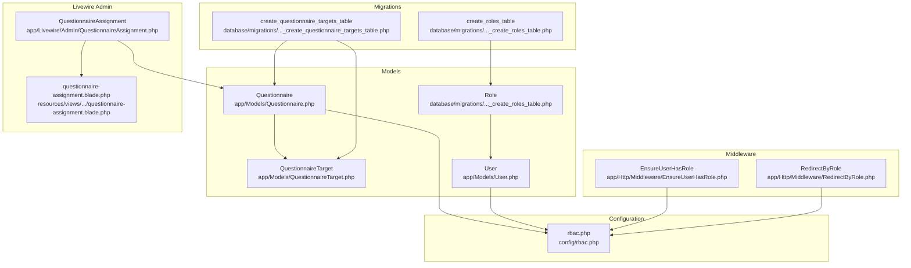
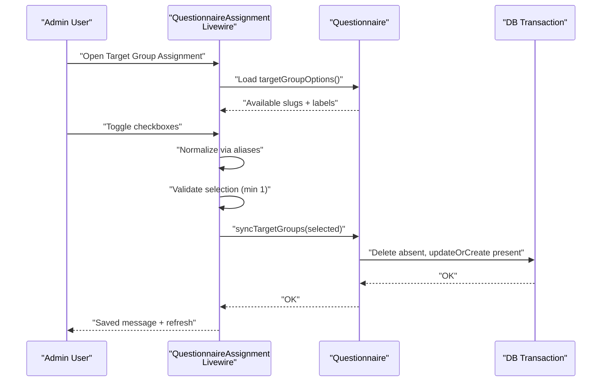
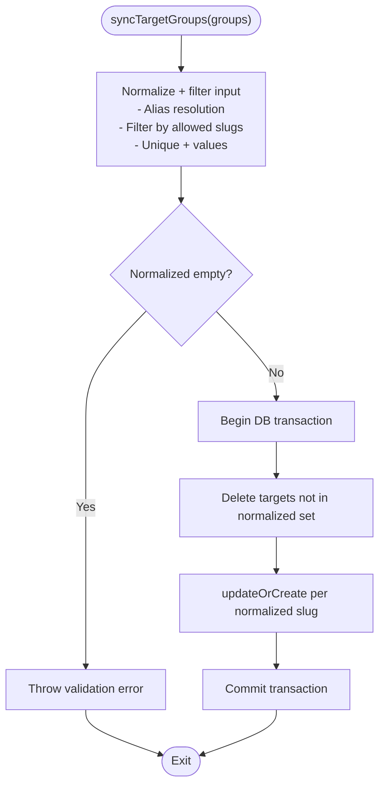
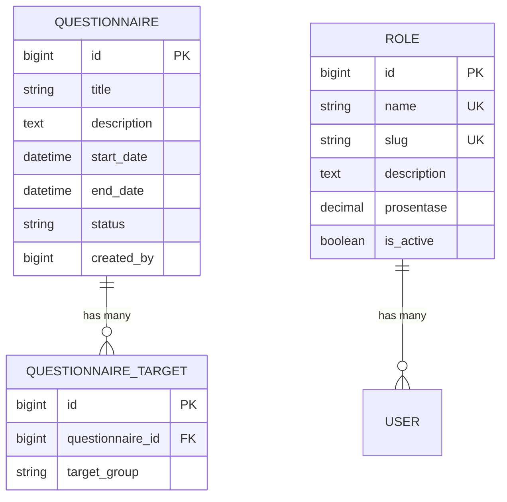
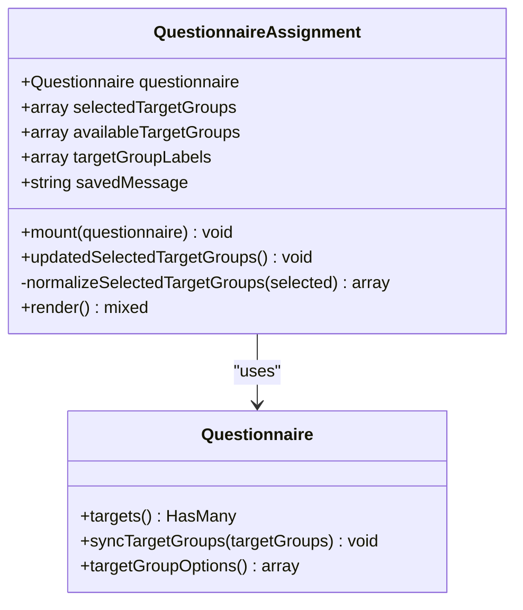
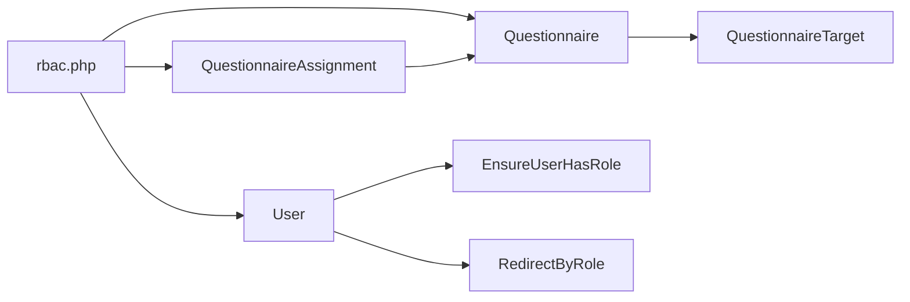

# Target Group Assignment

<cite>
**Referenced Files in This Document**
- [Questionnaire.php](file://app/Models/Questionnaire.php)
- [QuestionnaireTarget.php](file://app/Models/QuestionnaireTarget.php)
- [QuestionnaireAssignment.php](file://app/Livewire/Admin/QuestionnaireAssignment.php)
- [questionnaire-assignment.blade.php](file://resources/views/livewire/admin/questionnaire-assignment.blade.php)
- [2026_04_16_010240_create_questionnaire_targets_table.php](file://database/migrations/2026_04_16_010240_create_questionnaire_targets_table.php)
- [2026_04_17_093035_create_roles_table.php](file://database/migrations/2026_04_17_093035_create_roles_table.php)
- [rbac.php](file://config/rbac.php)
- [User.php](file://app/Models/User.php)
- [EnsureUserHasRole.php](file://app/Http/Middleware/EnsureUserHasRole.php)
- [RedirectByRole.php](file://app/Http/Middleware/RedirectByRole.php)
- [QuestionnaireTargetFactory.php](file://database/factories/QuestionnaireTargetFactory.php)
- [RoleSeeder.php](file://database/seeders/RoleSeeder.php)
</cite>

## Table of Contents
1. [Introduction](#introduction)
2. [Project Structure](#project-structure)
3. [Core Components](#core-components)
4. [Architecture Overview](#architecture-overview)
5. [Detailed Component Analysis](#detailed-component-analysis)
6. [Dependency Analysis](#dependency-analysis)
7. [Performance Considerations](#performance-considerations)
8. [Troubleshooting Guide](#troubleshooting-guide)
9. [Conclusion](#conclusion)
10. [Appendices](#appendices)

## Introduction
This document explains the Target Group Assignment system that controls which user roles can view and fill a given questionnaire. It covers how questionnaire targets are defined, validated, synchronized, and surfaced in the dynamic target group selection interface. It also documents the relationship between roles and target groups, role-based questionnaire targeting, configuration options, and common troubleshooting steps.

## Project Structure
The target group assignment spans models, Livewire components, Blade views, configuration, migrations, and middleware. The following diagram shows how these pieces fit together.

**Diagram sources**
- [Questionnaire.php:1-131](file://app/Models/Questionnaire.php#L1-L131)
- [QuestionnaireTarget.php:1-24](file://app/Models/QuestionnaireTarget.php#L1-L24)
- [QuestionnaireAssignment.php:1-91](file://app/Livewire/Admin/QuestionnaireAssignment.php#L1-L91)
- [questionnaire-assignment.blade.php:1-37](file://resources/views/livewire/admin/questionnaire-assignment.blade.php#L1-L37)
- [rbac.php:1-64](file://config/rbac.php#L1-L64)
- [User.php:1-94](file://app/Models/User.php#L1-L94)
- [EnsureUserHasRole.php:1-28](file://app/Http/Middleware/EnsureUserHasRole.php#L1-L28)
- [RedirectByRole.php:1-31](file://app/Http/Middleware/RedirectByRole.php#L1-L31)
- [2026_04_16_010240_create_questionnaire_targets_table.php:1-26](file://database/migrations/2026_04_16_010240_create_questionnaire_targets_table.php#L1-L26)
- [2026_04_17_093035_create_roles_table.php:1-33](file://database/migrations/2026_04_17_093035_create_roles_table.php#L1-L33)

**Section sources**
- [Questionnaire.php:1-131](file://app/Models/Questionnaire.php#L1-L131)
- [QuestionnaireTarget.php:1-24](file://app/Models/QuestionnaireTarget.php#L1-L24)
- [QuestionnaireAssignment.php:1-91](file://app/Livewire/Admin/QuestionnaireAssignment.php#L1-L91)
- [questionnaire-assignment.blade.php:1-37](file://resources/views/livewire/admin/questionnaire-assignment.blade.php#L1-L37)
- [rbac.php:1-64](file://config/rbac.php#L1-L64)
- [User.php:1-94](file://app/Models/User.php#L1-L94)
- [EnsureUserHasRole.php:1-28](file://app/Http/Middleware/EnsureUserHasRole.php#L1-L28)
- [RedirectByRole.php:1-31](file://app/Http/Middleware/RedirectByRole.php#L1-L31)
- [2026_04_16_010240_create_questionnaire_targets_table.php:1-26](file://database/migrations/2026_04_16_010240_create_questionnaire_targets_table.php#L1-L26)
- [2026_04_17_093035_create_roles_table.php:1-33](file://database/migrations/2026_04_17_093035_create_roles_table.php#L1-L33)

## Core Components
- Questionnaire: Defines questionnaire metadata and manages target group synchronization against allowed slugs and aliases.
- QuestionnaireTarget: Associates a questionnaire with a target group slug.
- QuestionnaireAssignment (Livewire): Provides the dynamic UI for selecting target groups and persists selections via validation and synchronization.
- Blade View: Renders the checkbox grid for target group selection with validation feedback.
- rbac.php: Central configuration for role slugs, target slugs, aliases, and dashboard routing.
- User: Supplies role slug resolution used by middleware and dashboards.
- Middleware: Enforces role-based access and redirects based on role.

Key responsibilities:
- Validation: Ensures at least one target group remains selected and filters invalid entries.
- Synchronization: Deletes removed target groups and creates/updates existing ones atomically.
- Dynamic UI: Presents available target groups derived from roles and labels, with alias normalization.

**Section sources**
- [Questionnaire.php:52-129](file://app/Models/Questionnaire.php#L52-L129)
- [QuestionnaireTarget.php:14-22](file://app/Models/QuestionnaireTarget.php#L14-L22)
- [QuestionnaireAssignment.php:27-91](file://app/Livewire/Admin/QuestionnaireAssignment.php#L27-L91)
- [questionnaire-assignment.blade.php:13-36](file://resources/views/livewire/admin/questionnaire-assignment.blade.php#L13-L36)
- [rbac.php:3-36](file://config/rbac.php#L3-L36)
- [User.php:59-87](file://app/Models/User.php#L59-L87)
- [EnsureUserHasRole.php:11-25](file://app/Http/Middleware/EnsureUserHasRole.php#L11-L25)
- [RedirectByRole.php:26-29](file://app/Http/Middleware/RedirectByRole.php#L26-L29)

## Architecture Overview
The assignment system is centered around a many-to-many-like association between questionnaires and target groups, represented by QuestionnaireTarget records keyed by role slugs. The UI component fetches available target groups from configuration-derived role slugs, normalizes user input via aliases, validates selections, and synchronizes the database atomically.

**Diagram sources**
- [QuestionnaireAssignment.php:27-68](file://app/Livewire/Admin/QuestionnaireAssignment.php#L27-L68)
- [Questionnaire.php:55-83](file://app/Models/Questionnaire.php#L55-L83)
- [questionnaire-assignment.blade.php:13-36](file://resources/views/livewire/admin/questionnaire-assignment.blade.php#L13-L36)

## Detailed Component Analysis

### Questionnaire Model: Target Groups and Synchronization
- Allowed target groups are derived from role slugs, excluding administrative roles and ensuring non-empty, trimmed, unique values. If none are found, configuration fallback slugs are used.
- Options for UI rendering include both slug and human-readable name.
- Synchronization logic:
  - Validates input to ensure at least one target group exists.
  - Runs within a transaction to delete absent target groups and upsert present ones.
  - Prevents empty sets by throwing a validation error when none remain after filtering.

**Diagram sources**
- [Questionnaire.php:55-83](file://app/Models/Questionnaire.php#L55-L83)

**Section sources**
- [Questionnaire.php:52-129](file://app/Models/Questionnaire.php#L52-L129)

### QuestionnaireTarget Model and Database Schema
- Represents the association between a questionnaire and a target group slug.
- Database enforces uniqueness on the pair (questionnaire_id, target_group).
- Cascading deletes ensure cleanup when a questionnaire is removed.

**Diagram sources**
- [QuestionnaireTarget.php:14-22](file://app/Models/QuestionnaireTarget.php#L14-L22)
- [2026_04_16_010240_create_questionnaire_targets_table.php:11-18](file://database/migrations/2026_04_16_010240_create_questionnaire_targets_table.php#L11-L18)
- [2026_04_17_093035_create_roles_table.php:14-22](file://database/migrations/2026_04_17_093035_create_roles_table.php#L14-L22)

**Section sources**
- [QuestionnaireTarget.php:14-22](file://app/Models/QuestionnaireTarget.php#L14-L22)
- [2026_04_16_010240_create_questionnaire_targets_table.php:11-18](file://database/migrations/2026_04_16_010240_create_questionnaire_targets_table.php#L11-L18)
- [2026_04_17_093035_create_roles_table.php:14-22](file://database/migrations/2026_04_17_093035_create_roles_table.php#L14-L22)

### QuestionnaireAssignment Livewire Component: Dynamic Selection UI
- Loads available target groups from configuration-derived role slugs and maps them to labels.
- Normalizes user selections via aliases and filters out disallowed values.
- Validates that at least one target group remains selected.
- Persists changes by calling the model’s synchronization method and dispatches a Livewire event upon success.

**Diagram sources**
- [QuestionnaireAssignment.php:10-91](file://app/Livewire/Admin/QuestionnaireAssignment.php#L10-L91)
- [Questionnaire.php:37-129](file://app/Models/Questionnaire.php#L37-L129)

**Section sources**
- [QuestionnaireAssignment.php:27-91](file://app/Livewire/Admin/QuestionnaireAssignment.php#L27-L91)
- [questionnaire-assignment.blade.php:13-36](file://resources/views/livewire/admin/questionnaire-assignment.blade.php#L13-L36)

### Blade View: Checkbox Grid and Validation Feedback
- Renders a grid of checkboxes for each available target group.
- Disables the last selected group to prevent accidental deselection.
- Displays validation messages for missing selections and invalid entries.
- Shows a success message after saving.

**Section sources**
- [questionnaire-assignment.blade.php:13-36](file://resources/views/livewire/admin/questionnaire-assignment.blade.php#L13-L36)

### Configuration: Role Slugs, Aliases, and Dashboard Paths
- Defines allowed questionnaire target slugs and aliases for normalization.
- Provides labels for UI display and dashboard routing per role.
- Supports fallbacks when roles are not yet defined.

**Section sources**
- [rbac.php:3-36](file://config/rbac.php#L3-L36)

### Role-Based Access Control and Dashboards
- Middleware ensures requests match configured role slugs for protected routes.
- Redirect middleware routes users to role-specific dashboards based on configuration.

**Section sources**
- [EnsureUserHasRole.php:11-25](file://app/Http/Middleware/EnsureUserHasRole.php#L11-L25)
- [RedirectByRole.php:26-29](file://app/Http/Middleware/RedirectByRole.php#L26-L29)
- [User.php:59-87](file://app/Models/User.php#L59-L87)

## Dependency Analysis
- Questionnaire depends on Role slugs for allowed targets and on configuration for aliases and fallback slugs.
- QuestionnaireAssignment depends on Questionnaire for options and synchronization, and on configuration for aliases.
- Database schema enforces referential integrity and uniqueness for target-group associations.
- Middleware and User model depend on configuration for role slugs and dashboard routing.

**Diagram sources**
- [rbac.php:3-36](file://config/rbac.php#L3-L36)
- [Questionnaire.php:88-108](file://app/Models/Questionnaire.php#L88-L108)
- [QuestionnaireAssignment.php:79-89](file://app/Livewire/Admin/QuestionnaireAssignment.php#L79-L89)
- [User.php:59-87](file://app/Models/User.php#L59-L87)
- [EnsureUserHasRole.php:11-25](file://app/Http/Middleware/EnsureUserHasRole.php#L11-L25)
- [RedirectByRole.php:26-29](file://app/Http/Middleware/RedirectByRole.php#L26-L29)

**Section sources**
- [Questionnaire.php:88-108](file://app/Models/Questionnaire.php#L88-L108)
- [QuestionnaireAssignment.php:79-89](file://app/Livewire/Admin/QuestionnaireAssignment.php#L79-L89)
- [rbac.php:3-36](file://config/rbac.php#L3-L36)
- [User.php:59-87](file://app/Models/User.php#L59-L87)
- [EnsureUserHasRole.php:11-25](file://app/Http/Middleware/EnsureUserHasRole.php#L11-L25)
- [RedirectByRole.php:26-29](file://app/Http/Middleware/RedirectByRole.php#L26-L29)

## Performance Considerations
- Synchronization runs inside a single transaction to minimize partial updates and maintain consistency.
- Filtering and deduplication occur in memory before database writes, keeping queries efficient.
- Unique constraint on (questionnaire_id, target_group) prevents duplicates and supports fast lookups.

## Troubleshooting Guide
Common issues and resolutions:
- No target groups available:
  - Ensure roles exist and have non-empty slugs. Seed roles if needed.
  - Verify configuration fallback slugs are set when roles are not yet defined.
- Selected target group disappears after save:
  - Confirm the slug exists in available target groups and is not filtered out by aliases.
  - Check that the slug is included in configuration slugs or role slugs.
- Validation error “minimal 1 target group wajib dipilih”:
  - At least one target group must remain selected; the UI disables removing the last item.
  - Re-select a valid target group from the list.
- Alias mismatch:
  - Some slugs are normalized via aliases; ensure the alias resolves to a known slug.
- Dashboard redirect unexpected:
  - Confirm the user’s role slug matches a configured dashboard path.

**Section sources**
- [Questionnaire.php:55-83](file://app/Models/Questionnaire.php#L55-L83)
- [QuestionnaireAssignment.php:56-68](file://app/Livewire/Admin/QuestionnaireAssignment.php#L56-L68)
- [rbac.php:7-11](file://config/rbac.php#L7-L11)
- [RoleSeeder.php:14-24](file://database/seeders/RoleSeeder.php#L14-L24)

## Conclusion
The Target Group Assignment system cleanly separates concerns: configuration defines allowed slugs and aliases, models enforce validation and atomic synchronization, Livewire provides a responsive UI with real-time validation, and middleware/dashboards integrate role-aware navigation. This design ensures robust, maintainable role-based questionnaire targeting with strong defaults and clear fallbacks.

## Appendices

### Role-Based Questionnaire Targeting Examples
- Example 1: A questionnaire targets educators and staff via slugs mapped to roles.
- Example 2: An alias normalizes “guru_staf” to “guru” so both inputs resolve to the same target.
- Example 3: If no roles exist, configuration fallback slugs are used to populate available targets.

**Section sources**
- [rbac.php:6-11](file://config/rbac.php#L6-L11)
- [Questionnaire.php:88-108](file://app/Models/Questionnaire.php#L88-L108)
- [QuestionnaireAssignment.php:79-89](file://app/Livewire/Admin/QuestionnaireAssignment.php#L79-L89)

### Target Group Configuration Checklist
- Define role slugs and ensure uniqueness.
- Set configuration fallback slugs for questionnaire targets.
- Configure aliases for normalization.
- Provide labels for UI display.
- Seed roles if necessary.

**Section sources**
- [rbac.php:3-36](file://config/rbac.php#L3-L36)
- [RoleSeeder.php:14-24](file://database/seeders/RoleSeeder.php#L14-L24)