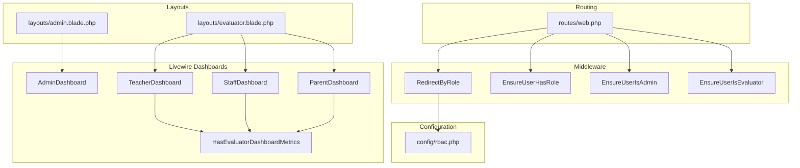
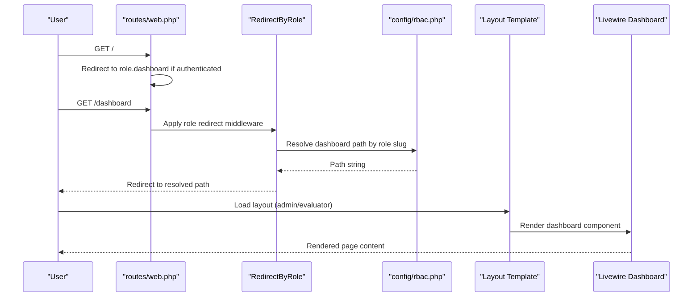
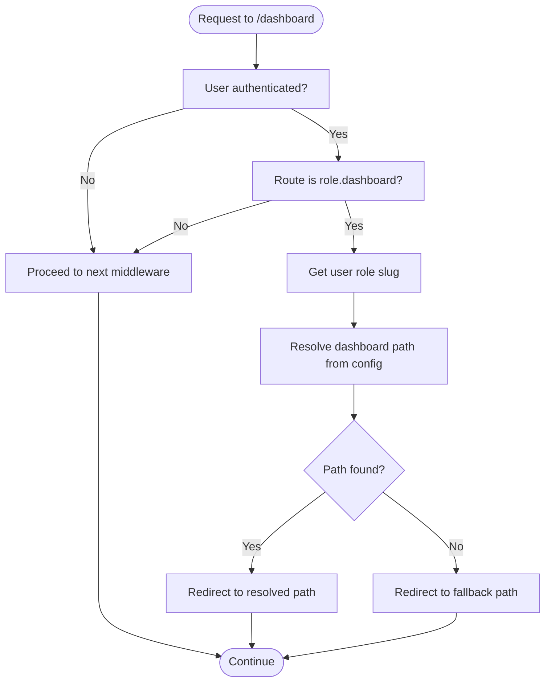
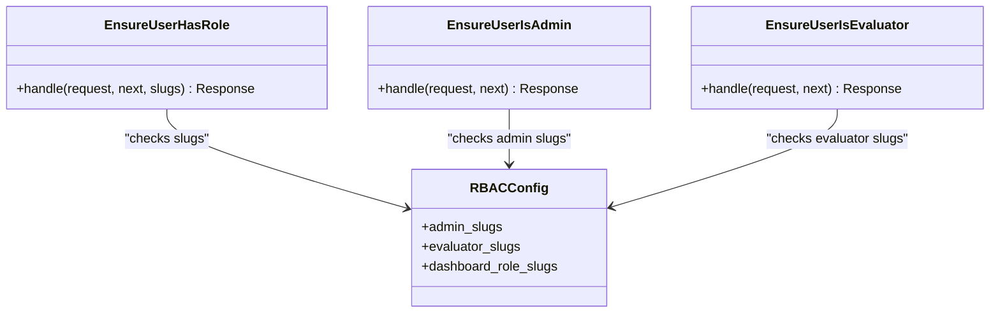
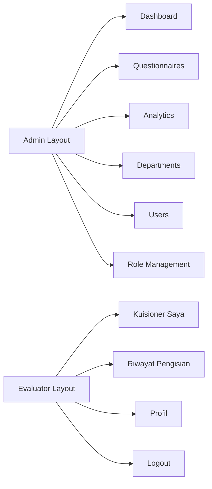
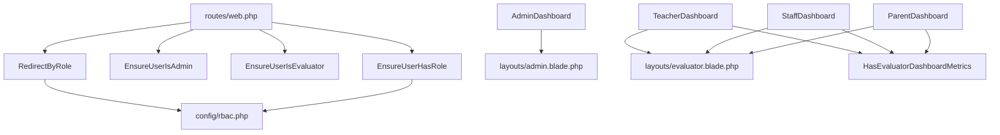

# Dashboard Navigation & Layout

<cite>
**Referenced Files in This Document**
- [routes/web.php](file://routes/web.php)
- [app/Http/Middleware/RedirectByRole.php](file://app/Http/Middleware/RedirectByRole.php)
- [app/Http/Middleware/EnsureUserHasRole.php](file://app/Http/Middleware/EnsureUserHasRole.php)
- [app/Http/Middleware/EnsureUserIsAdmin.php](file://app/Http/Middleware/EnsureUserIsAdmin.php)
- [app/Http/Middleware/EnsureUserIsEvaluator.php](file://app/Http/Middleware/EnsureUserIsEvaluator.php)
- [config/rbac.php](file://config/rbac.php)
- [resources/views/layouts/admin.blade.php](file://resources/views/layouts/admin.blade.php)
- [resources/views/layouts/evaluator.blade.php](file://resources/views/layouts/evaluator.blade.php)
- [app/Livewire/Admin/AdminDashboard.php](file://app/Livewire/Admin/AdminDashboard.php)
- [app/Livewire/Fill/TeacherDashboard.php](file://app/Livewire/Fill/TeacherDashboard.php)
- [app/Livewire/Fill/StaffDashboard.php](file://app/Livewire/Fill/StaffDashboard.php)
- [app/Livewire/Fill/ParentDashboard.php](file://app/Livewire/Fill/ParentDashboard.php)
- [app/Livewire/Fill/Concerns/HasEvaluatorDashboardMetrics.php](file://app/Livewire/Fill/Concerns/HasEvaluatorDashboardMetrics.php)
- [resources/views/components/session-toast.blade.php](file://resources/views/components/session-toast.blade.php)
</cite>

## Table of Contents
1. [Introduction](#introduction)
2. [Project Structure](#project-structure)
3. [Core Components](#core-components)
4. [Architecture Overview](#architecture-overview)
5. [Detailed Component Analysis](#detailed-component-analysis)
6. [Dependency Analysis](#dependency-analysis)
7. [Performance Considerations](#performance-considerations)
8. [Troubleshooting Guide](#troubleshooting-guide)
9. [Conclusion](#conclusion)
10. [Appendices](#appendices)

## Introduction
This document explains the dashboard navigation system and layout architecture across the application. It covers role-based navigation patterns, menu structures, and layout templates used by administrators and evaluators. It also documents the middleware-driven redirection system, navigation state management, and responsive design patterns. Finally, it outlines customization options for menu items, navigation permissions, and layout modifications tailored to different user roles.

## Project Structure
The navigation and layout system spans routing, middleware, configuration, Blade layouts, and Livewire components:
- Routes define role-specific areas and the central role redirection endpoint.
- Middleware enforces role-based access and redirects users to appropriate dashboards.
- Configuration defines roles, aliases, and dashboard paths.
- Blade layouts provide admin and evaluator shells with menus and responsive UI.
- Livewire components render dashboards and share metrics logic.



**Diagram sources**
- [routes/web.php:35-161](file://routes/web.php#L35-L161)
- [app/Http/Middleware/RedirectByRole.php:9-31](file://app/Http/Middleware/RedirectByRole.php#L9-L31)
- [app/Http/Middleware/EnsureUserHasRole.php:9-28](file://app/Http/Middleware/EnsureUserHasRole.php#L9-L28)
- [app/Http/Middleware/EnsureUserIsAdmin.php:10-23](file://app/Http/Middleware/EnsureUserIsAdmin.php#L10-L23)
- [app/Http/Middleware/EnsureUserIsEvaluator.php:10-23](file://app/Http/Middleware/EnsureUserIsEvaluator.php#L10-L23)
- [config/rbac.php:1-64](file://config/rbac.php#L1-L64)
- [resources/views/layouts/admin.blade.php:1-105](file://resources/views/layouts/admin.blade.php#L1-L105)
- [resources/views/layouts/evaluator.blade.php:1-82](file://resources/views/layouts/evaluator.blade.php#L1-L82)
- [app/Livewire/Admin/AdminDashboard.php:15-137](file://app/Livewire/Admin/AdminDashboard.php#L15-L137)
- [app/Livewire/Fill/TeacherDashboard.php:9-23](file://app/Livewire/Fill/TeacherDashboard.php#L9-L23)
- [app/Livewire/Fill/StaffDashboard.php:9-23](file://app/Livewire/Fill/StaffDashboard.php#L9-L23)
- [app/Livewire/Fill/ParentDashboard.php:9-23](file://app/Livewire/Fill/ParentDashboard.php#L9-L23)
- [app/Livewire/Fill/Concerns/HasEvaluatorDashboardMetrics.php:9-73](file://app/Livewire/Fill/Concerns/HasEvaluatorDashboardMetrics.php#L9-L73)

**Section sources**
- [routes/web.php:35-161](file://routes/web.php#L35-L161)
- [config/rbac.php:1-64](file://config/rbac.php#L1-L64)

## Core Components
- Role redirection middleware: Redirects authenticated users to a role-specific dashboard path derived from configuration.
- Gate middleware: Ensures users have required role slugs for accessing admin or evaluator sections.
- Layout templates: Admin and evaluator Blade layouts provide consistent navigation, dark mode, and responsive structure.
- Livewire dashboards: Admin and evaluator dashboards render role-specific content and metrics.
- Shared metrics trait: Provides evaluator dashboards with questionnaire availability and completion statistics.

**Section sources**
- [app/Http/Middleware/RedirectByRole.php:9-31](file://app/Http/Middleware/RedirectByRole.php#L9-L31)
- [app/Http/Middleware/EnsureUserHasRole.php:9-28](file://app/Http/Middleware/EnsureUserHasRole.php#L9-L28)
- [resources/views/layouts/admin.blade.php:1-105](file://resources/views/layouts/admin.blade.php#L1-L105)
- [resources/views/layouts/evaluator.blade.php:1-82](file://resources/views/layouts/evaluator.blade.php#L1-L82)
- [app/Livewire/Admin/AdminDashboard.php:15-137](file://app/Livewire/Admin/AdminDashboard.php#L15-L137)
- [app/Livewire/Fill/Concerns/HasEvaluatorDashboardMetrics.php:9-73](file://app/Livewire/Fill/Concerns/HasEvaluatorDashboardMetrics.php#L9-L73)

## Architecture Overview
The navigation and layout architecture follows a centralized role-aware flow:
- Root route checks authentication and redirects to a role-aware dashboard endpoint.
- The role redirection middleware resolves the user’s role slug and redirects to the configured dashboard path.
- Admin and evaluator routes are gated by dedicated middleware ensuring access based on role slugs.
- Layouts encapsulate navigation menus and UI shell; Livewire components render page content within these shells.



**Diagram sources**
- [routes/web.php:35-59](file://routes/web.php#L35-L59)
- [app/Http/Middleware/RedirectByRole.php:11-29](file://app/Http/Middleware/RedirectByRole.php#L11-L29)
- [config/rbac.php:49-62](file://config/rbac.php#L49-L62)
- [resources/views/layouts/admin.blade.php:1-105](file://resources/views/layouts/admin.blade.php#L1-L105)
- [resources/views/layouts/evaluator.blade.php:1-82](file://resources/views/layouts/evaluator.blade.php#L1-L82)

## Detailed Component Analysis

### Role-Based Redirection System
- Central endpoint: A dedicated route named for role-aware dashboard resolution.
- Middleware logic: Extracts current user, checks if the current route matches the role dashboard route, and redirects to a path determined by the user’s role slug.
- Fallback path: Defaults to a questionnaire listing route if no role-specific path exists.



**Diagram sources**
- [routes/web.php:57-59](file://routes/web.php#L57-L59)
- [app/Http/Middleware/RedirectByRole.php:11-29](file://app/Http/Middleware/RedirectByRole.php#L11-L29)
- [config/rbac.php:49-62](file://config/rbac.php#L49-L62)

**Section sources**
- [routes/web.php:57-59](file://routes/web.php#L57-L59)
- [app/Http/Middleware/RedirectByRole.php:11-29](file://app/Http/Middleware/RedirectByRole.php#L11-L29)
- [config/rbac.php:49-62](file://config/rbac.php#L49-L62)

### Middleware-Driven Access Control
- EnsureUserHasRole: Enforces that the authenticated user possesses any of the specified role slugs; otherwise aborts with unauthorized or forbidden responses depending on conditions.
- EnsureUserIsAdmin: Restricts access to administrative sections to users with admin roles.
- EnsureUserIsEvaluator: Restricts access to evaluator sections to users with evaluator roles.



**Diagram sources**
- [app/Http/Middleware/EnsureUserHasRole.php:9-28](file://app/Http/Middleware/EnsureUserHasRole.php#L9-L28)
- [app/Http/Middleware/EnsureUserIsAdmin.php:10-23](file://app/Http/Middleware/EnsureUserIsAdmin.php#L10-L23)
- [app/Http/Middleware/EnsureUserIsEvaluator.php:10-23](file://app/Http/Middleware/EnsureUserIsEvaluator.php#L10-L23)
- [config/rbac.php:4-62](file://config/rbac.php#L4-L62)

**Section sources**
- [app/Http/Middleware/EnsureUserHasRole.php:9-28](file://app/Http/Middleware/EnsureUserHasRole.php#L9-L28)
- [app/Http/Middleware/EnsureUserIsAdmin.php:10-23](file://app/Http/Middleware/EnsureUserIsAdmin.php#L10-L23)
- [app/Http/Middleware/EnsureUserIsEvaluator.php:10-23](file://app/Http/Middleware/EnsureUserIsEvaluator.php#L10-L23)
- [config/rbac.php:4-62](file://config/rbac.php#L4-L62)

### Layout Templates and Navigation Menus
- Admin layout:
  - Fixed sidebar with primary navigation items for dashboard, questionnaires, analytics, departments, users, and role management (conditional).
  - Dark mode toggle persisted via local storage.
  - Logout form submission.
- Evaluator layout:
  - Top header with role-aware dashboard links, profile, and logout.
  - Dark mode toggle with persistence.
  - Responsive container sizing.



**Diagram sources**
- [resources/views/layouts/admin.blade.php:31-88](file://resources/views/layouts/admin.blade.php#L31-L88)
- [resources/views/layouts/evaluator.blade.php:41-67](file://resources/views/layouts/evaluator.blade.php#L41-L67)

**Section sources**
- [resources/views/layouts/admin.blade.php:1-105](file://resources/views/layouts/admin.blade.php#L1-L105)
- [resources/views/layouts/evaluator.blade.php:1-82](file://resources/views/layouts/evaluator.blade.php#L1-L82)

### Livewire Dashboards and Navigation State
- Admin dashboard:
  - Uses the admin layout and computes cached metrics for overview cards.
- Evaluator dashboards (Teacher, Staff, Parent):
  - Use the evaluator layout and compute role-specific questionnaire availability and completion statistics via a shared trait.
- Navigation state:
  - Buttons reflect active routes using route matching helpers.
  - Dark mode state is reactive and stored locally.

```mermaid
classDiagram
class AdminDashboard {
+render()
-authorize()
}
class TeacherDashboard
class StaffDashboard
class ParentDashboard
class HasEvaluatorDashboardMetrics {
+getDashboardMetricsByRole(role) array
}
AdminDashboard --> AdminLayout["uses admin layout"]
TeacherDashboard --> EvaluatorLayout["uses evaluator layout"]
StaffDashboard --> EvaluatorLayout
ParentDashboard --> EvaluatorLayout
TeacherDashboard ..> HasEvaluatorDashboardMetrics : "trait"
StaffDashboard ..> HasEvaluatorDashboardMetrics
ParentDashboard ..> HasEvaluatorDashboardMetrics
```

**Diagram sources**
- [app/Livewire/Admin/AdminDashboard.php:15-137](file://app/Livewire/Admin/AdminDashboard.php#L15-L137)
- [app/Livewire/Fill/TeacherDashboard.php:9-23](file://app/Livewire/Fill/TeacherDashboard.php#L9-L23)
- [app/Livewire/Fill/StaffDashboard.php:9-23](file://app/Livewire/Fill/StaffDashboard.php#L9-L23)
- [app/Livewire/Fill/ParentDashboard.php:9-23](file://app/Livewire/Fill/ParentDashboard.php#L9-L23)
- [app/Livewire/Fill/Concerns/HasEvaluatorDashboardMetrics.php:9-73](file://app/Livewire/Fill/Concerns/HasEvaluatorDashboardMetrics.php#L9-L73)

**Section sources**
- [app/Livewire/Admin/AdminDashboard.php:15-137](file://app/Livewire/Admin/AdminDashboard.php#L15-L137)
- [app/Livewire/Fill/TeacherDashboard.php:9-23](file://app/Livewire/Fill/TeacherDashboard.php#L9-L23)
- [app/Livewire/Fill/StaffDashboard.php:9-23](file://app/Livewire/Fill/StaffDashboard.php#L9-L23)
- [app/Livewire/Fill/ParentDashboard.php:9-23](file://app/Livewire/Fill/ParentDashboard.php#L9-L23)
- [app/Livewire/Fill/Concerns/HasEvaluatorDashboardMetrics.php:9-73](file://app/Livewire/Fill/Concerns/HasEvaluatorDashboardMetrics.php#L9-L73)

### Responsive Design Patterns
- Mobile-first Tailwind classes ensure compact spacing and readable typography on small screens.
- Dark mode toggles adjust the root element class and persist preferences in local storage.
- Evaluator layout constrains content width on larger screens while remaining flexible on mobile.

**Section sources**
- [resources/views/layouts/admin.blade.php:19-24](file://resources/views/layouts/admin.blade.php#L19-L24)
- [resources/views/layouts/evaluator.blade.php:6-12](file://resources/views/layouts/evaluator.blade.php#L6-L12)
- [resources/views/layouts/evaluator.blade.php:26-31](file://resources/views/layouts/evaluator.blade.php#L26-L31)

### Navigation State Management
- Active route highlighting: Buttons compare current route names to highlight the active item.
- Persistent theme preference: Local storage reads and writes maintain theme across sessions.
- Toast notifications: A reusable component renders transient feedback messages.

**Section sources**
- [resources/views/layouts/admin.blade.php:33-45](file://resources/views/layouts/admin.blade.php#L33-L45)
- [resources/views/layouts/admin.blade.php:73-78](file://resources/views/layouts/admin.blade.php#L73-L78)
- [resources/views/layouts/evaluator.blade.php:52-60](file://resources/views/layouts/evaluator.blade.php#L52-L60)
- [resources/views/components/session-toast.blade.php:1-29](file://resources/views/components/session-toast.blade.php#L1-L29)

### Customization Options
- Menu items:
  - Admin layout menu items are conditionally rendered based on role capabilities and permissions.
  - Evaluator layout buttons are generated from configuration-derived dashboard paths.
- Navigation permissions:
  - Gate middleware restricts routes to specific role slugs.
  - Role redirection ensures users land on the correct dashboard area.
- Layout modifications:
  - Switch layouts per dashboard component using attributes.
  - Adjust dark mode behavior by modifying theme toggle logic in layouts.
  - Extend evaluator header actions by adding new links and routes.

**Section sources**
- [resources/views/layouts/admin.blade.php:47-65](file://resources/views/layouts/admin.blade.php#L47-L65)
- [resources/views/layouts/evaluator.blade.php:41-67](file://resources/views/layouts/evaluator.blade.php#L41-L67)
- [app/Http/Middleware/EnsureUserHasRole.php:11-25](file://app/Http/Middleware/EnsureUserHasRole.php#L11-L25)
- [app/Livewire/Admin/AdminDashboard.php:15](file://app/Livewire/Admin/AdminDashboard.php#L15)
- [app/Livewire/Fill/TeacherDashboard.php:9](file://app/Livewire/Fill/TeacherDashboard.php#L9)

## Dependency Analysis
The navigation system exhibits clear separation of concerns:
- Routing depends on middleware aliases and RBAC configuration.
- Middleware depends on user model role slugs and RBAC configuration.
- Layouts depend on Blade components and configuration for dynamic paths.
- Livewire dashboards depend on layouts and shared traits.



**Diagram sources**
- [routes/web.php:29-34](file://routes/web.php#L29-L34)
- [app/Http/Middleware/RedirectByRole.php:11-29](file://app/Http/Middleware/RedirectByRole.php#L11-L29)
- [app/Http/Middleware/EnsureUserHasRole.php:11-25](file://app/Http/Middleware/EnsureUserHasRole.php#L11-L25)
- [app/Http/Middleware/EnsureUserIsAdmin.php:12-21](file://app/Http/Middleware/EnsureUserIsAdmin.php#L12-L21)
- [app/Http/Middleware/EnsureUserIsEvaluator.php:12-21](file://app/Http/Middleware/EnsureUserIsEvaluator.php#L12-L21)
- [config/rbac.php:49-62](file://config/rbac.php#L49-L62)
- [app/Livewire/Admin/AdminDashboard.php:15](file://app/Livewire/Admin/AdminDashboard.php#L15)
- [app/Livewire/Fill/TeacherDashboard.php:9](file://app/Livewire/Fill/TeacherDashboard.php#L9)
- [app/Livewire/Fill/StaffDashboard.php:9](file://app/Livewire/Fill/StaffDashboard.php#L9)
- [app/Livewire/Fill/ParentDashboard.php:9](file://app/Livewire/Fill/ParentDashboard.php#L9)
- [app/Livewire/Fill/Concerns/HasEvaluatorDashboardMetrics.php:9-73](file://app/Livewire/Fill/Concerns/HasEvaluatorDashboardMetrics.php#L9-L73)

**Section sources**
- [routes/web.php:29-34](file://routes/web.php#L29-L34)
- [config/rbac.php:49-62](file://config/rbac.php#L49-L62)

## Performance Considerations
- Caching: Admin dashboard metrics are cached to reduce database load and improve responsiveness.
- Conditional rendering: Admin layout menu items are conditionally included based on role capabilities, minimizing unnecessary DOM nodes.
- Theme persistence: Local storage avoids repeated computations for theme selection on page load.

**Section sources**
- [app/Livewire/Admin/AdminDashboard.php:27-130](file://app/Livewire/Admin/AdminDashboard.php#L27-L130)
- [resources/views/layouts/admin.blade.php:47-65](file://resources/views/layouts/admin.blade.php#L47-L65)
- [resources/views/layouts/admin.blade.php:6-12](file://resources/views/layouts/admin.blade.php#L6-L12)

## Troubleshooting Guide
- Users redirected to unexpected dashboards:
  - Verify role slug resolution and dashboard paths in configuration.
  - Confirm the role redirection middleware is applied to the role dashboard route.
- Access denied errors:
  - Ensure the user’s role slug is included in the required slugs for the target route.
  - Check gate middleware aliases and RBAC configuration.
- Navigation not highlighting:
  - Confirm route names match the active route checks used in layouts.
- Dark mode not persisting:
  - Verify theme toggle logic updates local storage and applies the correct root class.

**Section sources**
- [config/rbac.php:49-62](file://config/rbac.php#L49-L62)
- [routes/web.php:57-59](file://routes/web.php#L57-L59)
- [app/Http/Middleware/EnsureUserHasRole.php:11-25](file://app/Http/Middleware/EnsureUserHasRole.php#L11-L25)
- [resources/views/layouts/admin.blade.php:33-45](file://resources/views/layouts/admin.blade.php#L33-L45)
- [resources/views/layouts/admin.blade.php:73-78](file://resources/views/layouts/admin.blade.php#L73-L78)

## Conclusion
The dashboard navigation and layout system integrates routing, middleware, configuration, and Blade layouts to deliver a role-aware, accessible, and responsive experience. Administrators and evaluators navigate through clearly defined sections with permission gates and role-based redirection. The shared metrics trait and layout templates enable consistent dashboards across roles while allowing customization through configuration and conditional rendering.

## Appendices
- Configuration keys relevant to navigation:
  - Role slugs and aliases
  - Dashboard paths per role
  - Middleware aliases for gates and redirection
  - Admin route prefix and name

**Section sources**
- [config/rbac.php:4-62](file://config/rbac.php#L4-L62)