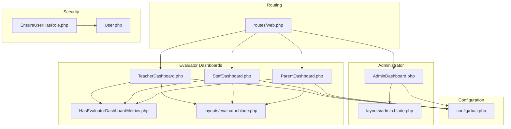
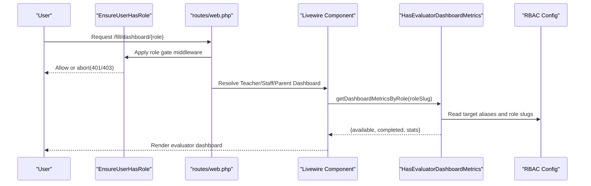
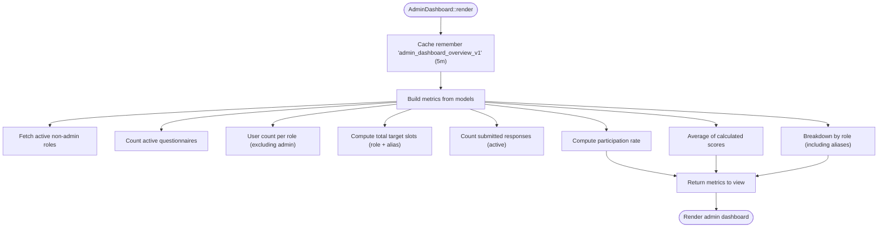
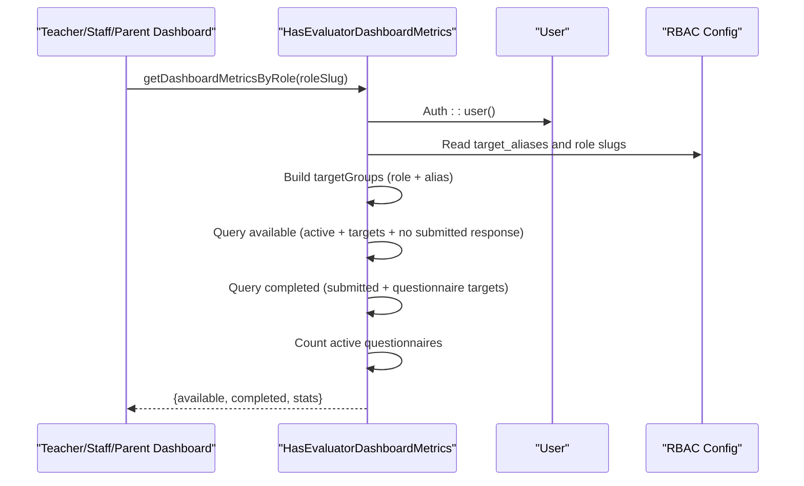
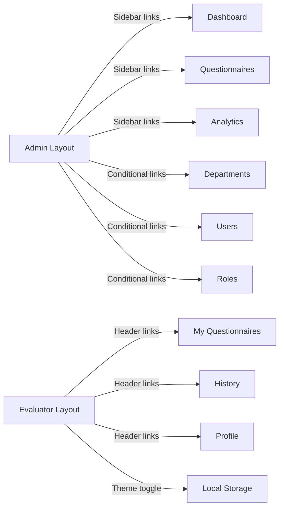
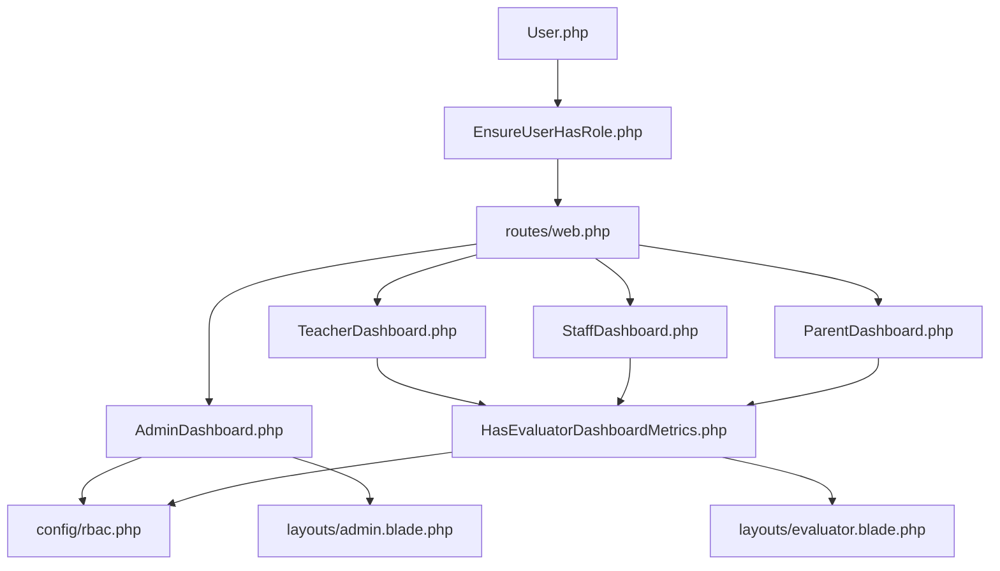

# User Dashboard Systems

<cite>
**Referenced Files in This Document**
- [AdminDashboard.php](file://app/Livewire/Admin/AdminDashboard.php)
- [TeacherDashboard.php](file://app/Livewire/Fill/TeacherDashboard.php)
- [StaffDashboard.php](file://app/Livewire/Fill/StaffDashboard.php)
- [ParentDashboard.php](file://app/Livewire/Fill/ParentDashboard.php)
- [HasEvaluatorDashboardMetrics.php](file://app/Livewire/Fill/Concerns/HasEvaluatorDashboardMetrics.php)
- [rbac.php](file://config/rbac.php)
- [admin.blade.php](file://resources/views/layouts/admin.blade.php)
- [evaluator.blade.php](file://resources/views/layouts/evaluator.blade.php)
- [web.php](file://routes/web.php)
- [User.php](file://app/Models/User.php)
- [EnsureUserHasRole.php](file://app/Http/Middleware/EnsureUserHasRole.php)
</cite>

## Table of Contents
1. [Introduction](#introduction)
2. [Project Structure](#project-structure)
3. [Core Components](#core-components)
4. [Architecture Overview](#architecture-overview)
5. [Detailed Component Analysis](#detailed-component-analysis)
6. [Dependency Analysis](#dependency-analysis)
7. [Performance Considerations](#performance-considerations)
8. [Troubleshooting Guide](#troubleshooting-guide)
9. [Conclusion](#conclusion)
10. [Appendices](#appendices)

## Introduction
This document describes the multi-role dashboard system used to power administrative analytics, instructional evaluation, staff assessment, and parent feedback dashboards. It explains how dashboards are structured, how metrics are computed and cached, how navigation and role-based access work, and how configuration drives role-specific behavior. It also outlines widget categories, data visualization components, and user preference settings.

## Project Structure
The dashboard system spans Livewire components, Blade layouts, routing, configuration, middleware, and Eloquent models:
- Administrator dashboard: server-side rendered with caching and analytics queries.
- Evaluator dashboards (teacher, staff, parent): Livewire components sharing a metrics trait.
- Layouts: dedicated admin and evaluator layouts with navigation and theme toggles.
- Routing: role-aware routes and middleware gates.
- Configuration: RBAC rules, target aliases, dashboard paths, and role labels.
- Middleware: enforce role presence and access.

**Diagram sources**
- [web.php:72-160](file://routes/web.php#L72-L160)
- [AdminDashboard.php:15-136](file://app/Livewire/Admin/AdminDashboard.php#L15-L136)
- [TeacherDashboard.php:9-22](file://app/Livewire/Fill/TeacherDashboard.php#L9-L22)
- [StaffDashboard.php:9-22](file://app/Livewire/Fill/StaffDashboard.php#L9-L22)
- [ParentDashboard.php:9-22](file://app/Livewire/Fill/ParentDashboard.php#L9-L22)
- [HasEvaluatorDashboardMetrics.php:9-72](file://app/Livewire/Fill/Concerns/HasEvaluatorDashboardMetrics.php#L9-L72)
- [rbac.php:3-63](file://config/rbac.php#L3-L63)
- [admin.blade.php:25-89](file://resources/views/layouts/admin.blade.php#L25-L89)
- [evaluator.blade.php:26-68](file://resources/views/layouts/evaluator.blade.php#L26-L68)
- [EnsureUserHasRole.php:9-26](file://app/Http/Middleware/EnsureUserHasRole.php#L9-L26)
- [User.php:59-92](file://app/Models/User.php#L59-L92)

**Section sources**
- [web.php:72-160](file://routes/web.php#L72-L160)
- [rbac.php:3-63](file://config/rbac.php#L3-L63)

## Core Components
- Administrator Dashboard: Aggregates system-wide metrics (active questionnaires, participation rate, average score, respondent counts by role) with caching and role aliasing.
- Evaluator Dashboards (Teacher, Staff, Parent): Compute role-specific available/completed questionnaires and summary stats via a shared metrics trait.
- Layouts: Admin layout with sidebar navigation and theme toggle; Evaluator layout with role-aware dashboard links and theme toggle.
- RBAC Configuration: Defines admin slugs, evaluator slugs, target aliases, dashboard role slugs, labels, and dashboard paths.
- Middleware and Model: Enforce role presence and provide role checks for access control.

Key responsibilities:
- Metrics computation and caching for admin overview.
- Role-aware filtering for evaluator dashboards.
- Centralized navigation and theme preferences.
- Role-based routing and redirection.

**Section sources**
- [AdminDashboard.php:15-136](file://app/Livewire/Admin/AdminDashboard.php#L15-L136)
- [HasEvaluatorDashboardMetrics.php:9-72](file://app/Livewire/Fill/Concerns/HasEvaluatorDashboardMetrics.php#L9-L72)
- [rbac.php:3-63](file://config/rbac.php#L3-L63)
- [admin.blade.php:25-89](file://resources/views/layouts/admin.blade.php#L25-L89)
- [evaluator.blade.php:26-68](file://resources/views/layouts/evaluator.blade.php#L26-L68)
- [EnsureUserHasRole.php:9-26](file://app/Http/Middleware/EnsureUserHasRole.php#L9-L26)
- [User.php:59-92](file://app/Models/User.php#L59-L92)

## Architecture Overview
The system separates concerns by role:
- Admin: server-rendered analytics dashboard with caching and heavy aggregation.
- Evaluators: client-rendered dashboards powered by Livewire, using shared metrics logic and role aliases.

**Diagram sources**
- [web.php:149-154](file://routes/web.php#L149-L154)
- [EnsureUserHasRole.php:9-26](file://app/Http/Middleware/EnsureUserHasRole.php#L9-L26)
- [TeacherDashboard.php:12-21](file://app/Livewire/Fill/TeacherDashboard.php#L12-L21)
- [StaffDashboard.php:12-21](file://app/Livewire/Fill/StaffDashboard.php#L12-L21)
- [ParentDashboard.php:12-21](file://app/Livewire/Fill/ParentDashboard.php#L12-L21)
- [HasEvaluatorDashboardMetrics.php:11-71](file://app/Livewire/Fill/Concerns/HasEvaluatorDashboardMetrics.php#L11-L71)
- [rbac.php:7-16](file://config/rbac.php#L7-L16)

## Detailed Component Analysis

### Administrator Dashboard
- Purpose: Provide system overview with analytics cards and breakdown by evaluator roles.
- Data sources: Questionnaires, Responses, Answers, Users, Roles.
- Caching: Uses a 5-minute cache key for the overview payload.
- Metrics:
  - Total active questionnaires.
  - Total respondents (distinct users who submitted).
  - Participation rate: submissions divided by total target slots.
  - Average overall score: average of calculated scores for submitted answers.
  - Breakdown by role slug and alias-aware totals.
- Role aliasing: Supports aliases for target groups to consolidate counts across related roles.
- Layout: Admin layout with sidebar navigation and theme toggle.

**Diagram sources**
- [AdminDashboard.php:27-130](file://app/Livewire/Admin/AdminDashboard.php#L27-L130)

**Section sources**
- [AdminDashboard.php:15-136](file://app/Livewire/Admin/AdminDashboard.php#L15-L136)
- [rbac.php:7-11](file://config/rbac.php#L7-L11)

### Evaluator Dashboards (Teacher, Staff, Parent)
- Purpose: Show available and completed questionnaires for the current evaluator role, plus summary statistics.
- Shared logic: A single trait computes available vs completed lists and counts.
- Role resolution:
  - Uses configured dashboard role slugs to resolve the target group.
  - Applies questionnaire target aliases to include related targets.
- Data retrieval:
  - Available: active questionnaires targeting the role or alias, excluding existing submitted responses for the current user.
  - Completed: submitted responses linked to questionnaires targeting the role or alias.
- Layout: Evaluator layout with role-aware dashboard path and theme toggle.

**Diagram sources**
- [TeacherDashboard.php:12-21](file://app/Livewire/Fill/TeacherDashboard.php#L12-L21)
- [StaffDashboard.php:12-21](file://app/Livewire/Fill/StaffDashboard.php#L12-L21)
- [ParentDashboard.php:12-21](file://app/Livewire/Fill/ParentDashboard.php#L12-L21)
- [HasEvaluatorDashboardMetrics.php:11-71](file://app/Livewire/Fill/Concerns/HasEvaluatorDashboardMetrics.php#L11-L71)
- [rbac.php:7-16](file://config/rbac.php#L7-L16)
- [User.php:59-67](file://app/Models/User.php#L59-L67)

**Section sources**
- [TeacherDashboard.php:9-22](file://app/Livewire/Fill/TeacherDashboard.php#L9-L22)
- [StaffDashboard.php:9-22](file://app/Livewire/Fill/StaffDashboard.php#L9-L22)
- [ParentDashboard.php:9-22](file://app/Livewire/Fill/ParentDashboard.php#L9-L22)
- [HasEvaluatorDashboardMetrics.php:9-72](file://app/Livewire/Fill/Concerns/HasEvaluatorDashboardMetrics.php#L9-L72)
- [rbac.php:7-16](file://config/rbac.php#L7-L16)
- [User.php:59-67](file://app/Models/User.php#L59-L67)

### Navigation Patterns and Layouts
- Admin layout:
  - Sidebar navigation with routes for dashboard, questionnaires, analytics, departments, users, and roles (conditional).
  - Theme toggle persisted in local storage.
- Evaluator layout:
  - Header with role label and quick links to “My Questionnaires,” history, profile, and logout.
  - Theme toggle persisted in local storage.
  - Dashboard path derived from RBAC configuration per role.

**Diagram sources**
- [admin.blade.php:31-66](file://resources/views/layouts/admin.blade.php#L31-L66)
- [evaluator.blade.php:42-67](file://resources/views/layouts/evaluator.blade.php#L42-L67)

**Section sources**
- [admin.blade.php:25-89](file://resources/views/layouts/admin.blade.php#L25-L89)
- [evaluator.blade.php:26-68](file://resources/views/layouts/evaluator.blade.php#L26-L68)

### Role-Specific Features and Widgets
- Administrator:
  - Overview cards: active questionnaires, total respondents, participation rate, average score.
  - Role breakdown cards: counts per role slug with alias consolidation.
  - Navigation to analytics, departments, users, and roles.
- Evaluator (Teacher/Staff/Parent):
  - Available questionnaires list: title, description, dates, question count.
  - Completed questionnaires list: recent submissions with questionnaire metadata.
  - Stats: active questionnaires, available to fill, completed total.
  - Widgets: cards for quick overview, lists for actionable items.

Note: The admin layout includes Chart.js for potential visualizations; evaluator dashboards rely on list and card components for metrics display.

**Section sources**
- [AdminDashboard.php:122-130](file://app/Livewire/Admin/AdminDashboard.php#L122-L130)
- [HasEvaluatorDashboardMetrics.php:62-71](file://app/Livewire/Fill/Concerns/HasEvaluatorDashboardMetrics.php#L62-L71)
- [admin.blade.php:15](file://resources/views/layouts/admin.blade.php#L15)

### Configuration Options
- RBAC:
  - Admin slugs, evaluator slugs, questionnaire target slugs, target aliases.
  - Dashboard role slugs mapping teacher/staff/parent to internal role slugs.
  - Role labels and aliases.
  - Dashboard paths per role.
- Middleware aliases for gates and redirects.
- Admin route prefix and name.

These drive:
- Which roles can access admin routes.
- How evaluator dashboards resolve their role slugs.
- How target groups are expanded via aliases.
- Where each role’s dashboard route points.

**Section sources**
- [rbac.php:3-63](file://config/rbac.php#L3-L63)

### Data Visualization Components
- Admin layout includes Chart.js CDN for rendering charts.
- No explicit chart usage is present in the analyzed evaluator dashboards; metrics are presented as cards and lists.

Recommendation:
- Use Chart.js to visualize admin participation rate trends, role breakdowns, and score distributions.
- For evaluator dashboards, consider small bar/progress indicators for completion stats.

**Section sources**
- [admin.blade.php:15](file://resources/views/layouts/admin.blade.php#L15)

### User Preference Settings
- Theme preference:
  - Admin and evaluator layouts read/write a theme value in local storage.
  - Theme toggle switches between light and dark modes.
- Persistence:
  - Theme preference persists across page reloads and navigations.

**Section sources**
- [admin.blade.php:6-11](file://resources/views/layouts/admin.blade.php#L6-L11)
- [evaluator.blade.php:6-11](file://resources/views/layouts/evaluator.blade.php#L6-L11)

## Dependency Analysis
- Routing depends on RBAC middleware aliases and admin route configuration.
- Livewire dashboards depend on the metrics trait and RBAC configuration.
- Admin dashboard depends on models and caching; evaluator dashboards depend on authenticated user and RBAC.
- Middleware enforces role presence; model helpers determine admin/evaluator roles.

**Diagram sources**
- [web.php:72-160](file://routes/web.php#L72-L160)
- [AdminDashboard.php:15-136](file://app/Livewire/Admin/AdminDashboard.php#L15-L136)
- [TeacherDashboard.php:9-22](file://app/Livewire/Fill/TeacherDashboard.php#L9-L22)
- [StaffDashboard.php:9-22](file://app/Livewire/Fill/StaffDashboard.php#L9-L22)
- [ParentDashboard.php:9-22](file://app/Livewire/Fill/ParentDashboard.php#L9-L22)
- [HasEvaluatorDashboardMetrics.php:9-72](file://app/Livewire/Fill/Concerns/HasEvaluatorDashboardMetrics.php#L9-L72)
- [rbac.php:3-63](file://config/rbac.php#L3-L63)
- [admin.blade.php:25-89](file://resources/views/layouts/admin.blade.php#L25-L89)
- [evaluator.blade.php:26-68](file://resources/views/layouts/evaluator.blade.php#L26-L68)
- [EnsureUserHasRole.php:9-26](file://app/Http/Middleware/EnsureUserHasRole.php#L9-L26)
- [User.php:59-92](file://app/Models/User.php#L59-L92)

**Section sources**
- [web.php:72-160](file://routes/web.php#L72-L160)
- [rbac.php:3-63](file://config/rbac.php#L3-L63)
- [EnsureUserHasRole.php:9-26](file://app/Http/Middleware/EnsureUserHasRole.php#L9-L26)
- [User.php:59-92](file://app/Models/User.php#L59-L92)

## Performance Considerations
- Admin dashboard caches the overview payload for five minutes to reduce database load during analytics queries.
- Evaluator dashboards compute available/completed lists per request; consider adding pagination or client-side virtualization for large datasets.
- Target alias expansion avoids redundant queries by precomputing target groups.
- Theme preference reads/writes are lightweight and localized.

Recommendations:
- Add caching for evaluator dashboards if datasets grow large.
- Use lazy loading for long lists and consider debounced search/filter controls.
- Monitor query counts and add indexes on frequently filtered columns (e.g., questionnaire status, target group, user_id).

**Section sources**
- [AdminDashboard.php:27-130](file://app/Livewire/Admin/AdminDashboard.php#L27-L130)
- [HasEvaluatorDashboardMetrics.php:28-34](file://app/Livewire/Fill/Concerns/HasEvaluatorDashboardMetrics.php#L28-L34)

## Troubleshooting Guide
- Access denied:
  - Ensure the user has the required role slug; middleware aborts requests without proper roles.
- Empty evaluator dashboard:
  - Verify the user’s role slug matches configured dashboard role slugs and that questionnaire targets include the role or alias.
- Incorrect metrics:
  - Confirm target aliases in configuration align with actual questionnaire target groups.
- Theme not persisting:
  - Check browser local storage permissions and that theme toggle JavaScript runs after DOM load.

**Section sources**
- [EnsureUserHasRole.php:9-26](file://app/Http/Middleware/EnsureUserHasRole.php#L9-L26)
- [rbac.php:7-16](file://config/rbac.php#L7-L16)
- [User.php:59-67](file://app/Models/User.php#L59-L67)
- [admin.blade.php:6-11](file://resources/views/layouts/admin.blade.php#L6-L11)
- [evaluator.blade.php:6-11](file://resources/views/layouts/evaluator.blade.php#L6-L11)

## Conclusion
The multi-role dashboard system cleanly separates administrative analytics from evaluator dashboards, leveraging RBAC configuration, shared metrics logic, and role-aware layouts. Administrators gain a comprehensive overview with caching, while evaluators receive role-specific insights and actions. With optional visualizations and persistent theme preferences, the system balances usability and performance.

## Appendices
- Role mapping reference:
  - Teacher → guru
  - Staff → tata_usaha
  - Parent → orang_tua
- Target aliases:
  - guru → guru_staf
  - tata_usaha → guru_staf
  - orang_tua → komite

**Section sources**
- [rbac.php:7-16](file://config/rbac.php#L7-L16)
- [rbac.php:49-62](file://config/rbac.php#L49-L62)