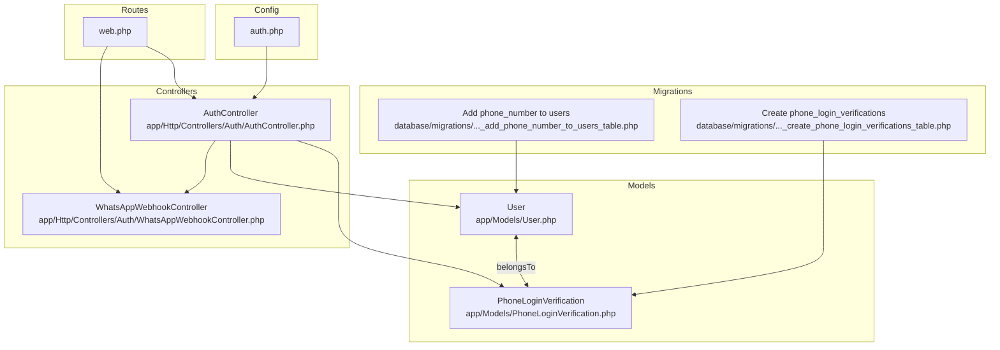
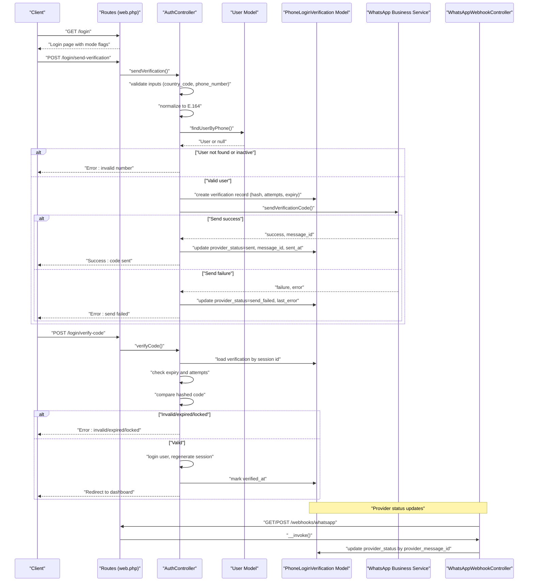
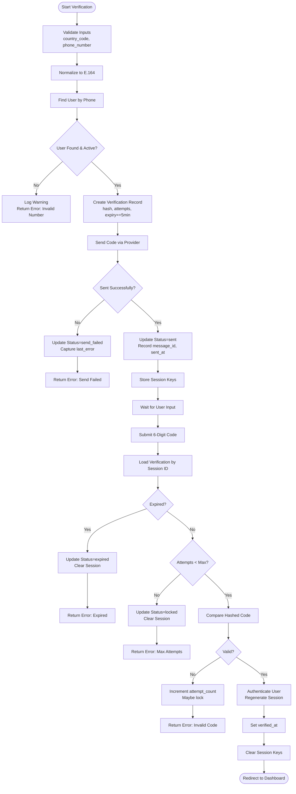
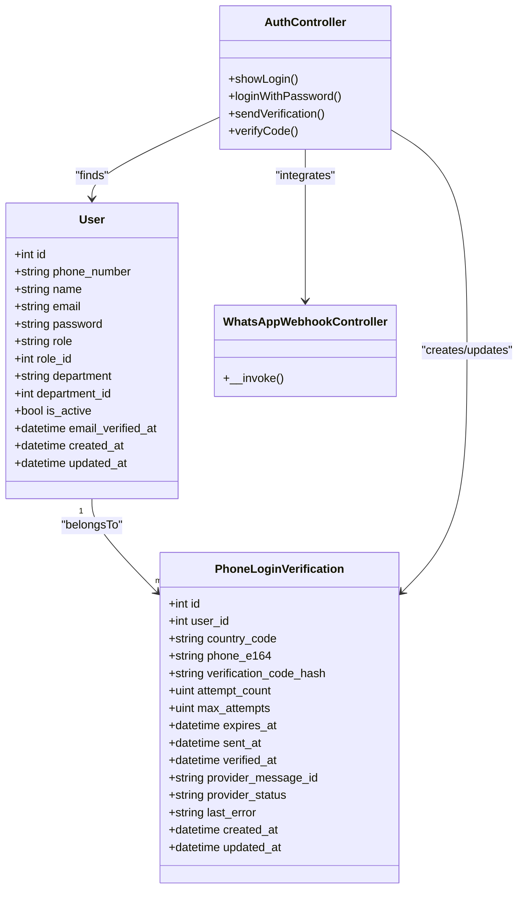

# Authentication Entities

<cite>
**Referenced Files in This Document**
- [PhoneLoginVerification.php](file://app/Models/PhoneLoginVerification.php)
- [User.php](file://app/Models/User.php)
- [2026_04_17_045745_create_phone_login_verifications_table.php](file://database/migrations/2026_04_17_045745_create_phone_login_verifications_table.php)
- [2026_04_17_043615_add_phone_number_to_users_table.php](file://database/migrations/2026_04_17_043615_add_phone_number_to_users_table.php)
- [AuthController.php](file://app/Http/Controllers/Auth/AuthController.php)
- [WhatsAppWebhookController.php](file://app/Http/Controllers/Auth/WhatsAppWebhookController.php)
- [web.php](file://routes/web.php)
- [auth.php](file://config/auth.php)
</cite>

## Table of Contents
1. [Introduction](#introduction)
2. [Project Structure](#project-structure)
3. [Core Components](#core-components)
4. [Architecture Overview](#architecture-overview)
5. [Detailed Component Analysis](#detailed-component-analysis)
6. [Dependency Analysis](#dependency-analysis)
7. [Performance Considerations](#performance-considerations)
8. [Troubleshooting Guide](#troubleshooting-guide)
9. [Conclusion](#conclusion)

## Introduction
This document provides comprehensive data model documentation for the authentication entities focused on the phone-based login system. It details the PhoneLoginVerification model, its relationship with the User model, the phone number verification workflow, token generation and expiration mechanisms, security measures, validation rules, and integration with the main User model and authentication flow.

## Project Structure
The phone-based authentication spans several components:
- Models: PhoneLoginVerification and User
- Migrations: database schema for users and phone login verifications
- Controllers: AuthController orchestrating the phone login flow and WhatsAppWebhookController handling provider status updates
- Routes: endpoints for sending verification, verifying the code, and webhook handling
- Configuration: authentication guard and provider configuration

**Diagram sources**
- [User.php:12-94](file://app/Models/User.php#L12-L94)
- [PhoneLoginVerification.php:8-36](file://app/Models/PhoneLoginVerification.php#L8-L36)
- [2026_04_17_043615_add_phone_number_to_users_table.php:14-17](file://database/migrations/2026_04_17_043615_add_phone_number_to_users_table.php#L14-L17)
- [2026_04_17_045745_create_phone_login_verifications_table.php:14-29](file://database/migrations/2026_04_17_045745_create_phone_login_verifications_table.php#L14-L29)
- [AuthController.php:17-258](file://app/Http/Controllers/Auth/AuthController.php#L17-L258)
- [WhatsAppWebhookController.php:11-55](file://app/Http/Controllers/Auth/WhatsAppWebhookController.php#L11-L55)
- [web.php:41-55](file://routes/web.php#L41-L55)
- [auth.php:40-74](file://config/auth.php#L40-L74)

**Section sources**
- [web.php:41-55](file://routes/web.php#L41-L55)
- [auth.php:40-74](file://config/auth.php#L40-L74)

## Core Components
This section documents the two primary models involved in phone-based authentication and their relationships.

- User model
  - Purpose: Represents authenticated users with standard attributes including phone_number.
  - Key attributes: id, name, email, phone_number, password, role, role_id, department, department_id, is_active, timestamps.
  - Relationships: Has many responses, created questionnaires; belongs to department and role; supports role-based access checks.
  - Security: Passwords are hashed; sensitive fields hidden from serialization; soft deletes enabled.

- PhoneLoginVerification model
  - Purpose: Stores phone verification records for phone-based login, including provider metadata and attempt tracking.
  - Key attributes: id, user_id, country_code, phone_e164, verification_code_hash, attempt_count, max_attempts, expires_at, sent_at, verified_at, provider_message_id, provider_status, last_error, timestamps.
  - Relationships: Belongs to User.
  - Security: Verification code stored as a hash; attempt limits enforced; expiration enforced; provider status tracked.

**Section sources**
- [User.php:12-94](file://app/Models/User.php#L12-L94)
- [PhoneLoginVerification.php:8-36](file://app/Models/PhoneLoginVerification.php#L8-L36)

## Architecture Overview
The phone-based login flow integrates route endpoints, controller logic, model persistence, and external provider callbacks. The sequence below maps the actual code paths.

**Diagram sources**
- [web.php:41-55](file://routes/web.php#L41-L55)
- [AuthController.php:55-203](file://app/Http/Controllers/Auth/AuthController.php#L55-L203)
- [PhoneLoginVerification.php:31-34](file://app/Models/PhoneLoginVerification.php#L31-L34)
- [WhatsAppWebhookController.php:13-40](file://app/Http/Controllers/Auth/WhatsAppWebhookController.php#L13-L40)

## Detailed Component Analysis

### PhoneLoginVerification Model
- Fields and constraints
  - user_id: foreign key to users.id with cascade delete.
  - country_code: string, length constraint applied.
  - phone_e164: string, length constraint, indexed for fast lookup.
  - verification_code_hash: string storing the hashed verification code.
  - attempt_count: unsigned tiny integer, default 0.
  - max_attempts: unsigned tiny integer, default 3.
  - expires_at: timestamp, indexed; controls validity window.
  - sent_at: nullable timestamp; tracks when the code was sent.
  - verified_at: nullable timestamp; marks successful verification.
  - provider_message_id: nullable string, indexed; links to provider message ID.
  - provider_status: string with default value; reflects delivery status.
  - last_error: nullable text; captures provider errors.
  - timestamps: created_at and updated_at managed automatically.

- Relationships
  - Belongs to User via user_id.

- Security and validation
  - Verification code is stored as a hash; plaintext code is never persisted.
  - Attempt limits enforced per record; exceeding max_attempts locks the record.
  - Expiration enforced against expires_at; expired records are rejected.
  - Provider status and last_error capture delivery outcomes and failures.

- Persistence and indexing
  - Indexes on phone_e164 and provider_message_id improve lookup performance.
  - Cascading deletion ensures cleanup when a user is removed.

**Section sources**
- [PhoneLoginVerification.php:8-36](file://app/Models/PhoneLoginVerification.php#L8-L36)
- [2026_04_17_045745_create_phone_login_verifications_table.php:14-29](file://database/migrations/2026_04_17_045745_create_phone_login_verifications_table.php#L14-L29)

### User Model
- Fields and constraints
  - phone_number: string, nullable, indexed after email.
  - Additional standard fields include name, email, password, role, role_id, department, department_id, is_active.
  - Hidden fields exclude password and remember_token from serialization.
  - Casts include email_verified_at, password (hashed), and is_active (boolean).

- Relationships
  - Has many responses and created questionnaires.
  - Belongs to department and role.
  - Role slug resolution and role-based access helpers included.

- Integration with phone login
  - Used to locate users by phone number during verification initiation.
  - Logged in upon successful verification.

**Section sources**
- [User.php:12-94](file://app/Models/User.php#L12-L94)
- [2026_04_17_043615_add_phone_number_to_users_table.php:14-17](file://database/migrations/2026_04_17_043615_add_phone_number_to_users_table.php#L14-L17)

### Phone Number Verification Workflow
- Validation rules
  - Country code must match a strict regex pattern for international format.
  - Phone number must match a strict regex pattern for digits within a bounded length.
  - Login mode is resolved from configuration to enable/disable phone-based login.

- Normalization and lookup
  - Phone numbers are normalized to E.164 format.
  - Multiple candidate formats are checked against the phone_number column to find a user.

- Token generation and persistence
  - A six-digit code is generated and stored as a hash.
  - A verification record is created with attempt_count=0, max_attempts=3, and expires_at set to five minutes from creation.
  - Provider status is initialized to pending.

- Provider delivery and status tracking
  - The service sends the verification code via the configured provider.
  - On success, provider_status is updated to sent, provider_message_id and sent_at are recorded.
  - On failure, provider_status is updated to send_failed with last_error captured.

- Session management
  - Verification identifiers and masked phone are stored in the session to support the verification step.
  - Session keys are cleared upon completion or error.

- Verification step
  - Validates the incoming six-digit code.
  - Loads the verification record by session id.
  - Checks expiration and attempt limits.
  - Compares the submitted code against the stored hash.
  - On success, marks verified_at, authenticates the user, regenerates the session, clears session data, and redirects to the dashboard.
  - On failure, increments attempt_count and returns appropriate error messages.

**Diagram sources**
- [AuthController.php:55-203](file://app/Http/Controllers/Auth/AuthController.php#L55-L203)

**Section sources**
- [AuthController.php:55-203](file://app/Http/Controllers/Auth/AuthController.php#L55-L203)

### Provider Webhook Integration
- Endpoint
  - GET/POST /webhooks/whatsapp handles provider callbacks.
  - GET verifies the webhook subscription using a verify token from configuration.
  - POST processes status updates for sent messages.

- Processing
  - Iterates through status items and updates provider_status for matching provider_message_id.
  - Logs received events for observability.

**Section sources**
- [web.php:54-55](file://routes/web.php#L54-L55)
- [WhatsAppWebhookController.php:13-40](file://app/Http/Controllers/Auth/WhatsAppWebhookController.php#L13-L40)

### Authentication Guard and Provider Configuration
- Guard
  - Authentication uses the session-based web guard with the Eloquent user provider.
- Provider
  - The users provider references the User model for authentication.

**Section sources**
- [auth.php:40-74](file://config/auth.php#L40-L74)

## Dependency Analysis
The following diagram shows the dependencies among the core components involved in phone-based authentication.

**Diagram sources**
- [User.php:12-94](file://app/Models/User.php#L12-L94)
- [PhoneLoginVerification.php:8-36](file://app/Models/PhoneLoginVerification.php#L8-L36)
- [AuthController.php:17-258](file://app/Http/Controllers/Auth/AuthController.php#L17-L258)
- [WhatsAppWebhookController.php:11-55](file://app/Http/Controllers/Auth/WhatsAppWebhookController.php#L11-L55)

**Section sources**
- [User.php:12-94](file://app/Models/User.php#L12-L94)
- [PhoneLoginVerification.php:8-36](file://app/Models/PhoneLoginVerification.php#L8-L36)
- [AuthController.php:17-258](file://app/Http/Controllers/Auth/AuthController.php#L17-L258)
- [WhatsAppWebhookController.php:11-55](file://app/Http/Controllers/Auth/WhatsAppWebhookController.php#L11-L55)

## Performance Considerations
- Indexing
  - phone_e164 and provider_message_id are indexed to accelerate lookups during verification and provider status updates.
- Attempt and expiration checks
  - Enforcing attempt limits and expiration reduces unnecessary hashing comparisons and prevents brute-force attempts.
- Session usage
  - Using session to carry verification identifiers avoids repeated database queries for the same verification flow.
- Provider throttling
  - Routes apply throttling middleware to limit the rate of verification and code attempts.

[No sources needed since this section provides general guidance]

## Troubleshooting Guide
- Common errors and causes
  - Invalid phone number or inactive user: occurs when the phone number does not match any active user.
  - Send failure: provider send_failed status recorded with last_error captured.
  - Expired code: verification expired (default 5 minutes) triggers an expired status.
  - Max attempts exceeded: repeated invalid codes lock the verification record.
  - Invalid code: mismatch between submitted code and stored hash; attempt_count incremented.
  - Missing session: attempting verification without a valid session triggers a session error.

- Mitigation steps
  - Verify login mode configuration enables phone-based login.
  - Confirm provider credentials and webhook configuration.
  - Ensure phone number normalization matches the stored format.
  - Monitor provider_status and last_error for delivery issues.
  - Clear session data and restart the verification process if needed.

**Section sources**
- [AuthController.php:72-78](file://app/Http/Controllers/Auth/AuthController.php#L72-L78)
- [AuthController.php:93-108](file://app/Http/Controllers/Auth/AuthController.php#L93-L108)
- [AuthController.php:156-162](file://app/Http/Controllers/Auth/AuthController.php#L156-L162)
- [AuthController.php:164-170](file://app/Http/Controllers/Auth/AuthController.php#L164-L170)
- [AuthController.php:172-185](file://app/Http/Controllers/Auth/AuthController.php#L172-L185)
- [AuthController.php:143-154](file://app/Http/Controllers/Auth/AuthController.php#L143-L154)

## Conclusion
The phone-based login system leverages a dedicated verification model integrated with the User model and a provider webhook for status updates. Robust validation, hashing, attempt limits, and expiration ensure secure authentication. The documented workflow, fields, constraints, and security measures provide a clear blueprint for maintaining and extending the phone login functionality.