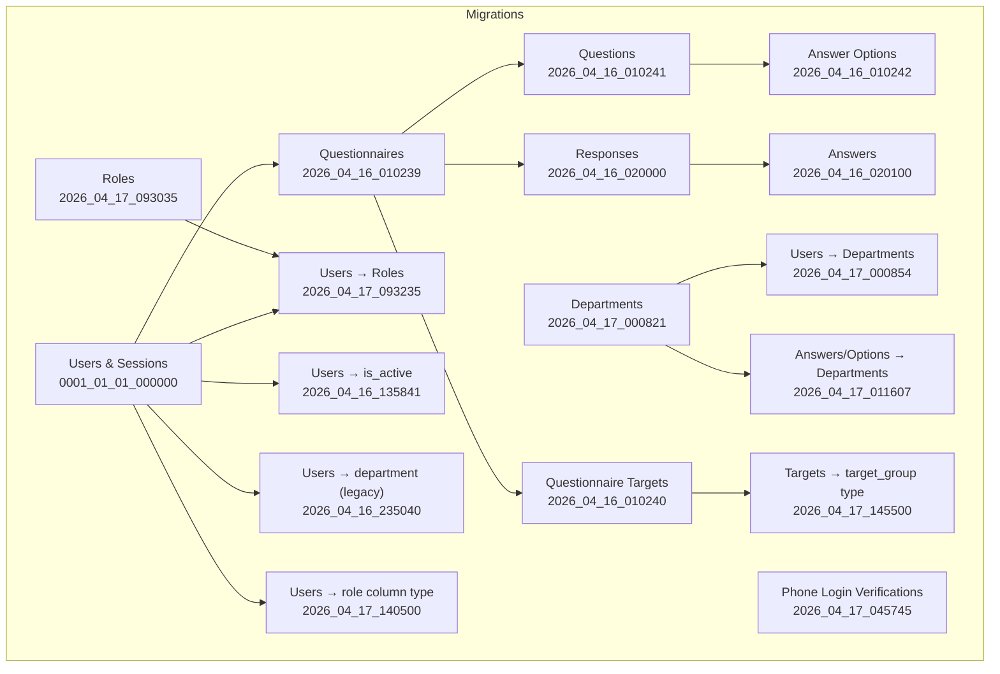
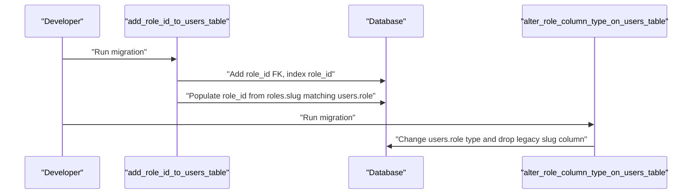
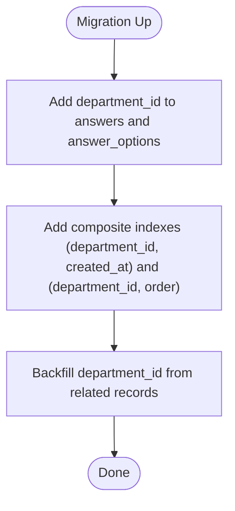
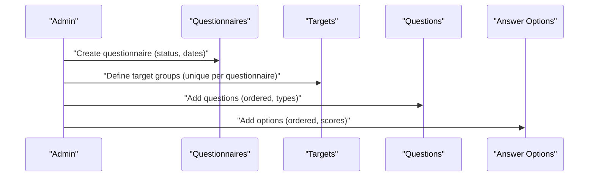
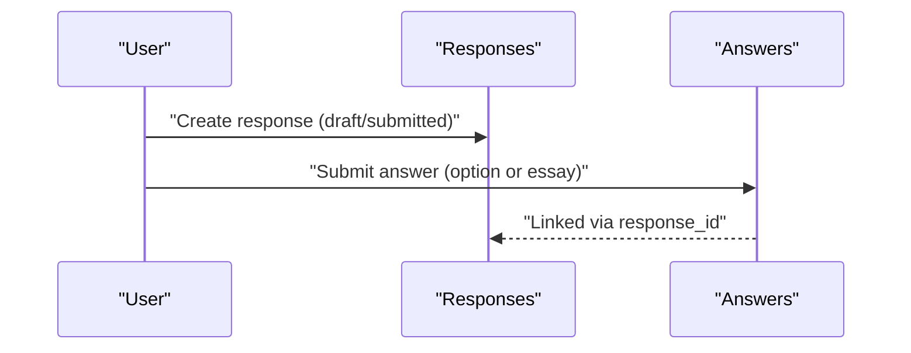
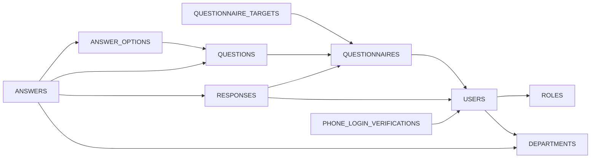

# Database Schema

<cite>
**Referenced Files in This Document**
- [0001_01_01_000000_create_users_table.php](file://database/migrations/0001_01_01_000000_create_users_table.php)
- [2026_04_16_010239_create_questionnaires_table.php](file://database/migrations/2026_04_16_010239_create_questionnaires_table.php)
- [2026_04_16_010240_create_questionnaire_targets_table.php](file://database/migrations/2026_04_16_010240_create_questionnaire_targets_table.php)
- [2026_04_16_010241_create_questions_table.php](file://database/migrations/2026_04_16_010241_create_questions_table.php)
- [2026_04_16_010242_create_answer_options_table.php](file://database/migrations/2026_04_16_010242_create_answer_options_table.php)
- [2026_04_16_020000_create_responses_table.php](file://database/migrations/2026_04_16_020000_create_responses_table.php)
- [2026_04_16_020100_create_answers_table.php](file://database/migrations/2026_04_16_020100_create_answers_table.php)
- [2026_04_17_000821_create_departements_table.php](file://database/migrations/2026_04_17_000821_create_departements_table.php)
- [2026_04_17_000854_add_department_id_to_users_table.php](file://database/migrations/2026_04_17_000854_add_department_id_to_users_table.php)
- [2026_04_17_011607_add_department_id_to_answers_and_answer_options_tables.php](file://database/migrations/2026_04_17_011607_add_department_id_to_answers_and_answer_options_tables.php)
- [2026_04_17_043615_add_phone_number_to_users_table.php](file://database/migrations/2026_04_17_043615_add_phone_number_to_users_table.php)
- [2026_04_17_045745_create_phone_login_verifications_table.php](file://database/migrations/2026_04_17_045745_create_phone_login_verifications_table.php)
- [2026_04_17_093035_create_roles_table.php](file://database/migrations/2026_04_17_093035_create_roles_table.php)
- [2026_04_17_093235_add_role_id_to_users_table.php](file://database/migrations/2026_04_17_093235_add_role_id_to_users_table.php)
- [2026_04_16_135841_add_is_active_to_users_table.php](file://database/migrations/2026_04_16_135841_add_is_active_to_users_table.php)
- [2026_04_16_235040_add_department_to_users_table.php](file://database/migrations/2026_04_16_235040_add_department_to_users_table.php)
- [2026_04_17_140500_alter_role_column_type_on_users_table.php](file://database/migrations/2026_04_17_140500_alter_role_column_type_on_users_table.php)
- [2026_04_17_145500_alter_target_group_column_type_on_questionnaire_targets_table.php](file://database/migrations/2026_04_17_145500_alter_target_group_column_type_on_questionnaire_targets_table.php)
</cite>

## Table of Contents
1. [Introduction](#introduction)
2. [Project Structure](#project-structure)
3. [Core Components](#core-components)
4. [Architecture Overview](#architecture-overview)
5. [Detailed Component Analysis](#detailed-component-analysis)
6. [Dependency Analysis](#dependency-analysis)
7. [Performance Considerations](#performance-considerations)
8. [Troubleshooting Guide](#troubleshooting-guide)
9. [Conclusion](#conclusion)
10. [Appendices](#appendices)

## Introduction
This document provides comprehensive database schema documentation for the assessment system. It covers all migration files, table definitions, foreign key constraints, indexes, and the evolution of the schema over time. It also explains the relationships between core entities (users, departments, roles) and assessment entities (questionnaires, targets, questions, answer options, responses, answers). Finally, it documents indexing strategies, performance considerations, data integrity constraints, and schema versioning/migration management.

## Project Structure
The database schema is defined via Laravel migrations under the database/migrations directory. Migrations are grouped into logical batches that introduce core entities and progressively add features such as departments, roles, phone login verification, and department scoping for answers and answer options.



**Diagram sources**
- [0001_01_01_000000_create_users_table.php:11-38](file://database/migrations/0001_01_01_000000_create_users_table.php#L11-L38)
- [2026_04_16_010239_create_questionnaires_table.php:11-21](file://database/migrations/2026_04_16_010239_create_questionnaires_table.php#L11-L21)
- [2026_04_16_010240_create_questionnaire_targets_table.php:11-18](file://database/migrations/2026_04_16_010240_create_questionnaire_targets_table.php#L11-L18)
- [2026_04_16_010241_create_questions_table.php:11-22](file://database/migrations/2026_04_16_010241_create_questions_table.php#L11-L22)
- [2026_04_16_010242_create_answer_options_table.php:11-20](file://database/migrations/2026_04_16_010242_create_answer_options_table.php#L11-L20)
- [2026_04_16_020000_create_responses_table.php:10-22](file://database/migrations/2026_04_16_020000_create_responses_table.php#L10-L22)
- [2026_04_16_020100_create_answers_table.php:10-22](file://database/migrations/2026_04_16_020100_create_answers_table.php#L10-L22)
- [2026_04_17_000821_create_departements_table.php:14-20](file://database/migrations/2026_04_17_000821_create_departements_table.php#L14-L20)
- [2026_04_17_000854_add_department_id_to_users_table.php:14-20](file://database/migrations/2026_04_17_000854_add_department_id_to_users_table.php#L14-L20)
- [2026_04_17_011607_add_department_id_to_answers_and_answer_options_tables.php:15-31](file://database/migrations/2026_04_17_011607_add_department_id_to_answers_and_answer_options_tables.php#L15-L31)
- [2026_04_17_045745_create_phone_login_verifications_table.php:14-29](file://database/migrations/2026_04_17_045745_create_phone_login_verifications_table.php#L14-L29)
- [2026_04_17_093035_create_roles_table.php:14-22](file://database/migrations/2026_04_17_093035_create_roles_table.php#L14-L22)
- [2026_04_17_093235_add_role_id_to_users_table.php:15-22](file://database/migrations/2026_04_17_093235_add_role_id_to_users_table.php#L15-L22)
- [2026_04_16_135841_add_is_active_to_users_table.php:14-16](file://database/migrations/2026_04_16_135841_add_is_active_to_users_table.php#L14-L16)
- [2026_04_16_235040_add_department_to_users_table.php:13-15](file://database/migrations/2026_04_16_235040_add_department_to_users_table.php#L13-L15)
- [2026_04_17_140500_alter_role_column_type_on_users_table.php](file://database/migrations/2026_04_17_140500_alter_role_column_type_on_users_table.php)
- [2026_04_17_145500_alter_target_group_column_type_on_questionnaire_targets_table.php](file://database/migrations/2026_04_17_145500_alter_target_group_column_type_on_questionnaire_targets_table.php)

**Section sources**
- [0001_01_01_000000_create_users_table.php:11-38](file://database/migrations/0001_01_01_000000_create_users_table.php#L11-L38)
- [2026_04_16_010239_create_questionnaires_table.php:11-21](file://database/migrations/2026_04_16_010239_create_questionnaires_table.php#L11-L21)
- [2026_04_16_010240_create_questionnaire_targets_table.php:11-18](file://database/migrations/2026_04_16_010240_create_questionnaire_targets_table.php#L11-L18)
- [2026_04_16_010241_create_questions_table.php:11-22](file://database/migrations/2026_04_16_010241_create_questions_table.php#L11-L22)
- [2026_04_16_010242_create_answer_options_table.php:11-20](file://database/migrations/2026_04_16_010242_create_answer_options_table.php#L11-L20)
- [2026_04_16_020000_create_responses_table.php:10-22](file://database/migrations/2026_04_16_020000_create_responses_table.php#L10-L22)
- [2026_04_16_020100_create_answers_table.php:10-22](file://database/migrations/2026_04_16_020100_create_answers_table.php#L10-L22)
- [2026_04_17_000821_create_departements_table.php:14-20](file://database/migrations/2026_04_17_000821_create_departements_table.php#L14-L20)
- [2026_04_17_000854_add_department_id_to_users_table.php:14-20](file://database/migrations/2026_04_17_000854_add_department_id_to_users_table.php#L14-L20)
- [2026_04_17_011607_add_department_id_to_answers_and_answer_options_tables.php:15-31](file://database/migrations/2026_04_17_011607_add_department_id_to_answers_and_answer_options_tables.php#L15-L31)
- [2026_04_17_045745_create_phone_login_verifications_table.php:14-29](file://database/migrations/2026_04_17_045745_create_phone_login_verifications_table.php#L14-L29)
- [2026_04_17_093035_create_roles_table.php:14-22](file://database/migrations/2026_04_17_093035_create_roles_table.php#L14-L22)
- [2026_04_17_093235_add_role_id_to_users_table.php:15-22](file://database/migrations/2026_04_17_093235_add_role_id_to_users_table.php#L15-L22)
- [2026_04_16_135841_add_is_active_to_users_table.php:14-16](file://database/migrations/2026_04_16_135841_add_is_active_to_users_table.php#L14-L16)
- [2026_04_16_235040_add_department_to_users_table.php:13-15](file://database/migrations/2026_04_16_235040_add_department_to_users_table.php#L13-L15)
- [2026_04_17_140500_alter_role_column_type_on_users_table.php](file://database/migrations/2026_04_17_140500_alter_role_column_type_on_users_table.php)
- [2026_04_17_145500_alter_target_group_column_type_on_questionnaire_targets_table.php](file://database/migrations/2026_04_17_145500_alter_target_group_column_type_on_questionnaire_targets_table.php)

## Core Components
This section summarizes each table’s purpose, primary keys, and key constraints.

- Users
  - Purpose: Stores user accounts, authentication, sessions, and soft deletes.
  - Key constraints: Unique email; timestamps, soft deletes.
  - Additional columns introduced later: is_active, department (legacy), department_id (FK), phone_number (indexed), role (legacy), role_id (FK).
  - Indexes: role_id, phone_number.

- Password reset tokens
  - Purpose: Manages password reset tokens with expiry.
  - Key constraints: Primary key on email.

- Sessions
  - Purpose: Manages user sessions with IP, agent, payload, and last activity.
  - Key constraints: Primary key on id; indexed user_id; indexed last_activity.

- Roles
  - Purpose: Defines roles with slug-based lookup and percentage weight.
  - Key constraints: Unique name and slug; timestamps.

- Departments
  - Purpose: Organizational units with ordering and description.
  - Key constraints: Unique name; urut indexed; timestamps.

- Questionnaires
  - Purpose: Assessment campaigns with status, dates, and creator.
  - Key constraints: Created by references users; soft deletes; timestamps.

- Questionnaire Targets
  - Purpose: Target groups per questionnaire; enforces unique target per questionnaire.
  - Key constraints: Composite unique index on questionnaire_id and target_group; cascade delete on questionnaire.

- Questions
  - Purpose: Individual questions within a questionnaire; order enforced per questionnaire.
  - Key constraints: Cascade delete on questionnaire; unique order per questionnaire; soft deletes.

- Answer Options
  - Purpose: Options for single-choice questions with optional scores; order enforced per question.
  - Key constraints: Cascade delete on question; unique order per question; soft deletes.

- Responses
  - Purpose: Submissions by users for a questionnaire; draft/submitted lifecycle.
  - Key constraints: Composite unique index on questionnaire_id and user_id; cascade deletes; soft deletes; indexes on questionnaire_id and user_id.

- Answers
  - Purpose: Per-question answers within a response; supports essay and option-based answers; calculated score.
  - Key constraints: Cascade deletes on response, question, and answer_option; unique per response-question; soft deletes; indexes on question_id; department_id composite index.

- Phone Login Verifications
  - Purpose: OTP and provider tracking for phone-based login.
  - Key constraints: Indexed phone_e164 and expires_at; provider_message_id indexed; cascade delete on user.

**Section sources**
- [0001_01_01_000000_create_users_table.php:13-38](file://database/migrations/0001_01_01_000000_create_users_table.php#L13-L38)
- [2026_04_17_093035_create_roles_table.php:14-22](file://database/migrations/2026_04_17_093035_create_roles_table.php#L14-L22)
- [2026_04_17_000821_create_departements_table.php:14-20](file://database/migrations/2026_04_17_000821_create_departements_table.php#L14-L20)
- [2026_04_16_010239_create_questionnaires_table.php:11-21](file://database/migrations/2026_04_16_010239_create_questionnaires_table.php#L11-L21)
- [2026_04_16_010240_create_questionnaire_targets_table.php:11-18](file://database/migrations/2026_04_16_010240_create_questionnaire_targets_table.php#L11-L18)
- [2026_04_16_010241_create_questions_table.php:11-22](file://database/migrations/2026_04_16_010241_create_questions_table.php#L11-L22)
- [2026_04_16_010242_create_answer_options_table.php:11-20](file://database/migrations/2026_04_16_010242_create_answer_options_table.php#L11-L20)
- [2026_04_16_020000_create_responses_table.php:10-22](file://database/migrations/2026_04_16_020000_create_responses_table.php#L10-L22)
- [2026_04_16_020100_create_answers_table.php:10-22](file://database/migrations/2026_04_16_020100_create_answers_table.php#L10-L22)
- [2026_04_17_045745_create_phone_login_verifications_table.php:14-29](file://database/migrations/2026_04_17_045745_create_phone_login_verifications_table.php#L14-L29)

## Architecture Overview
The assessment schema centers around Users, Roles, and Departments, with Questionnaires driving the assessment lifecycle. Responses capture submissions, and Answers store per-question results. Targets define who can fill a questionnaire.

```mermaid
erDiagram
USERS {
bigint id PK
string name
string email UK
string role
string phone_number
boolean is_active
bigint role_id FK
bigint department_id FK
timestamp email_verified_at
string password
remember_token
timestamps
soft_delete
}
ROLES {
bigint id PK
string name UK
string slug UK
text description
decimal prosentase
boolean is_active
timestamps
}
DEPARTMENTS {
bigint id PK
string name UK
uint urut
text description
timestamps
}
QUESTIONNAIRES {
bigint id PK
string title
text description
datetime start_date
datetime end_date
enum status
bigint created_by FK
timestamps
soft_delete
}
QUESTIONNAIRE_TARGETS {
bigint id PK
bigint questionnaire_id FK
string target_group
timestamps
}
QUESTIONS {
bigint id PK
bigint questionnaire_id FK
text question_text
enum type
boolean is_required
int order
timestamps
soft_delete
}
ANSWER_OPTIONS {
bigint id PK
bigint question_id FK
string option_text
int score
int order
timestamps
}
RESPONSES {
bigint id PK
bigint questionnaire_id FK
bigint user_id FK
datetime submitted_at
enum status
timestamps
soft_delete
}
ANSWERS {
bigint id PK
bigint response_id FK
bigint question_id FK
bigint answer_option_id FK
text essay_answer
int calculated_score
bigint department_id FK
timestamps
soft_delete
}
PHONE_LOGIN_VERIFICATIONS {
bigint id PK
bigint user_id FK
string country_code
string phone_e164
string verification_code_hash
tinyint attempt_count
tinyint max_attempts
datetime expires_at
datetime sent_at
datetime verified_at
string provider_message_id
string provider_status
text last_error
timestamps
}
USERS }o--|| ROLES : "has role"
USERS }o--|| DEPARTMENTS : "belongs to"
QUESTIONNAIRES }o--|| USERS : "created by"
QUESTIONNAIRE_TARGETS }o--|| QUESTIONNAIRES : "targets"
QUESTIONS }o--|| QUESTIONNAIRES : "contains"
ANSWER_OPTIONS }o--|| QUESTIONS : "options for"
RESPONSES }o--|| QUESTIONNAIRES : "submits"
RESPONSES }o--|| USERS : "by"
ANSWERS }o--|| RESPONSES : "part of"
ANSWERS }o--|| QUESTIONS : "answers"
ANSWERS }o--|| ANSWER_OPTIONS : "selects"
PHONE_LOGIN_VERIFICATIONS }o--|| USERS : "for"
```

**Diagram sources**
- [0001_01_01_000000_create_users_table.php:13-38](file://database/migrations/0001_01_01_000000_create_users_table.php#L13-L38)
- [2026_04_17_093035_create_roles_table.php:14-22](file://database/migrations/2026_04_17_093035_create_roles_table.php#L14-L22)
- [2026_04_17_000821_create_departements_table.php:14-20](file://database/migrations/2026_04_17_000821_create_departements_table.php#L14-L20)
- [2026_04_16_010239_create_questionnaires_table.php:11-21](file://database/migrations/2026_04_16_010239_create_questionnaires_table.php#L11-L21)
- [2026_04_16_010240_create_questionnaire_targets_table.php:11-18](file://database/migrations/2026_04_16_010240_create_questionnaire_targets_table.php#L11-L18)
- [2026_04_16_010241_create_questions_table.php:11-22](file://database/migrations/2026_04_16_010241_create_questions_table.php#L11-L22)
- [2026_04_16_010242_create_answer_options_table.php:11-20](file://database/migrations/2026_04_16_010242_create_answer_options_table.php#L11-L20)
- [2026_04_16_020000_create_responses_table.php:10-22](file://database/migrations/2026_04_16_020000_create_responses_table.php#L10-L22)
- [2026_04_16_020100_create_answers_table.php:10-22](file://database/migrations/2026_04_16_020100_create_answers_table.php#L10-L22)
- [2026_04_17_045745_create_phone_login_verifications_table.php:14-29](file://database/migrations/2026_04_17_045745_create_phone_login_verifications_table.php#L14-L29)

## Detailed Component Analysis

### Users and Authentication
- Initial schema introduces users, password reset tokens, and sessions.
- Later migrations add is_active, department (legacy), department_id (FK), phone_number (indexed), and role_id (FK).
- Role column type is altered to accommodate slug-based roles; existing role values are migrated to roles table and linked via role_id.



**Diagram sources**
- [2026_04_17_093235_add_role_id_to_users_table.php:15-29](file://database/migrations/2026_04_17_093235_add_role_id_to_users_table.php#L15-L29)
- [2026_04_17_140500_alter_role_column_type_on_users_table.php](file://database/migrations/2026_04_17_140500_alter_role_column_type_on_users_table.php)

**Section sources**
- [0001_01_01_000000_create_users_table.php:13-38](file://database/migrations/0001_01_01_000000_create_users_table.php#L13-L38)
- [2026_04_16_135841_add_is_active_to_users_table.php:14-16](file://database/migrations/2026_04_16_135841_add_is_active_to_users_table.php#L14-L16)
- [2026_04_16_235040_add_department_to_users_table.php:13-15](file://database/migrations/2026_04_16_235040_add_department_to_users_table.php#L13-L15)
- [2026_04_17_000854_add_department_id_to_users_table.php:14-20](file://database/migrations/2026_04_17_000854_add_department_id_to_users_table.php#L14-L20)
- [2026_04_17_093235_add_role_id_to_users_table.php:15-29](file://database/migrations/2026_04_17_093235_add_role_id_to_users_table.php#L15-L29)
- [2026_04_17_140500_alter_role_column_type_on_users_table.php](file://database/migrations/2026_04_17_140500_alter_role_column_type_on_users_table.php)

### Departments and Scoping
- Departments table stores organizational units with unique names and ordering.
- Users gain department_id (nullable) to associate with departments.
- Answers and Answer Options gain department_id to scope content to departments; composite indexes support analytics queries.



**Diagram sources**
- [2026_04_17_011607_add_department_id_to_answers_and_answer_options_tables.php:15-48](file://database/migrations/2026_04_17_011607_add_department_id_to_answers_and_answer_options_tables.php#L15-L48)

**Section sources**
- [2026_04_17_000821_create_departements_table.php:14-20](file://database/migrations/2026_04_17_000821_create_departements_table.php#L14-L20)
- [2026_04_17_000854_add_department_id_to_users_table.php:14-20](file://database/migrations/2026_04_17_000854_add_department_id_to_users_table.php#L14-L20)
- [2026_04_17_011607_add_department_id_to_answers_and_answer_options_tables.php:15-48](file://database/migrations/2026_04_17_011607_add_department_id_to_answers_and_answer_options_tables.php#L15-L48)

### Questionnaires, Targets, Questions, and Options
- Questionnaires define assessment campaigns with status and date ranges; created_by links to users.
- Questionnaire Targets define target groups per questionnaire; uniqueness constraint prevents duplicates.
- Questions belong to questionnaires; order is unique per questionnaire; soft deletes supported.
- Answer Options belong to questions; order is unique per question; optional scores for single-choice.



**Diagram sources**
- [2026_04_16_010239_create_questionnaires_table.php:11-21](file://database/migrations/2026_04_16_010239_create_questionnaires_table.php#L11-L21)
- [2026_04_16_010240_create_questionnaire_targets_table.php:11-18](file://database/migrations/2026_04_16_010240_create_questionnaire_targets_table.php#L11-L18)
- [2026_04_16_010241_create_questions_table.php:11-22](file://database/migrations/2026_04_16_010241_create_questions_table.php#L11-L22)
- [2026_04_16_010242_create_answer_options_table.php:11-20](file://database/migrations/2026_04_16_010242_create_answer_options_table.php#L11-L20)

**Section sources**
- [2026_04_16_010239_create_questionnaires_table.php:11-21](file://database/migrations/2026_04_16_010239_create_questionnaires_table.php#L11-L21)
- [2026_04_16_010240_create_questionnaire_targets_table.php:11-18](file://database/migrations/2026_04_16_010240_create_questionnaire_targets_table.php#L11-L18)
- [2026_04_16_010241_create_questions_table.php:11-22](file://database/migrations/2026_04_16_010241_create_questions_table.php#L11-L22)
- [2026_04_16_010242_create_answer_options_table.php:11-20](file://database/migrations/2026_04_16_010242_create_answer_options_table.php#L11-L20)

### Responses and Answers
- Responses link a user to a questionnaire submission; composite unique index ensures one submission per user-questionnaire pair.
- Answers link a response to a question; supports either selected answer_option_id or essay_answer; calculated_score stored; soft deletes supported.
- Answers also scoped by department_id for analytics.



**Diagram sources**
- [2026_04_16_020000_create_responses_table.php:10-22](file://database/migrations/2026_04_16_020000_create_responses_table.php#L10-L22)
- [2026_04_16_020100_create_answers_table.php:10-22](file://database/migrations/2026_04_16_020100_create_answers_table.php#L10-L22)

**Section sources**
- [2026_04_16_020000_create_responses_table.php:10-22](file://database/migrations/2026_04_16_020000_create_responses_table.php#L10-L22)
- [2026_04_16_020100_create_answers_table.php:10-22](file://database/migrations/2026_04_16_020100_create_answers_table.php#L10-L22)

### Phone Login Verification
- Supports phone-based login with OTP hashing, attempt limits, expiry, and provider tracking.
- Indexed fields optimize lookups by phone number and expiration.

**Section sources**
- [2026_04_17_045745_create_phone_login_verifications_table.php:14-29](file://database/migrations/2026_04_17_045745_create_phone_login_verifications_table.php#L14-L29)

## Dependency Analysis
The schema exhibits clear dependency chains:
- Users → Roles (via role_id)
- Users → Departments (via department_id)
- Questionnaires → Users (created_by)
- Questionnaire Targets → Questionnaires (cascade delete)
- Questions → Questionnaires (cascade delete)
- Answer Options → Questions (cascade delete)
- Responses → Questionnaires and Users (cascade delete)
- Answers → Responses, Questions, Answer Options (cascade delete); Answers also depend on Departments



**Diagram sources**
- [2026_04_17_093235_add_role_id_to_users_table.php:15-22](file://database/migrations/2026_04_17_093235_add_role_id_to_users_table.php#L15-L22)
- [2026_04_17_000854_add_department_id_to_users_table.php:14-20](file://database/migrations/2026_04_17_000854_add_department_id_to_users_table.php#L14-L20)
- [2026_04_16_010239_create_questionnaires_table.php](file://database/migrations/2026_04_16_010239_create_questionnaires_table.php#L18)
- [2026_04_16_010240_create_questionnaire_targets_table.php](file://database/migrations/2026_04_16_010240_create_questionnaire_targets_table.php#L13)
- [2026_04_16_010241_create_questions_table.php](file://database/migrations/2026_04_16_010241_create_questions_table.php#L13)
- [2026_04_16_010242_create_answer_options_table.php](file://database/migrations/2026_04_16_010242_create_answer_options_table.php#L13)
- [2026_04_16_020000_create_responses_table.php:12-13](file://database/migrations/2026_04_16_020000_create_responses_table.php#L12-L13)
- [2026_04_16_020100_create_answers_table.php:12-14](file://database/migrations/2026_04_16_020100_create_answers_table.php#L12-L14)
- [2026_04_17_045745_create_phone_login_verifications_table.php](file://database/migrations/2026_04_17_045745_create_phone_login_verifications_table.php#L16)

**Section sources**
- [2026_04_17_093235_add_role_id_to_users_table.php:15-22](file://database/migrations/2026_04_17_093235_add_role_id_to_users_table.php#L15-L22)
- [2026_04_17_000854_add_department_id_to_users_table.php:14-20](file://database/migrations/2026_04_17_000854_add_department_id_to_users_table.php#L14-L20)
- [2026_04_16_010239_create_questionnaires_table.php](file://database/migrations/2026_04_16_010239_create_questionnaires_table.php#L18)
- [2026_04_16_010240_create_questionnaire_targets_table.php](file://database/migrations/2026_04_16_010240_create_questionnaire_targets_table.php#L13)
- [2026_04_16_010241_create_questions_table.php](file://database/migrations/2026_04_16_010241_create_questions_table.php#L13)
- [2026_04_16_010242_create_answer_options_table.php](file://database/migrations/2026_04_16_010242_create_answer_options_table.php#L13)
- [2026_04_16_020000_create_responses_table.php:12-13](file://database/migrations/2026_04_16_020000_create_responses_table.php#L12-L13)
- [2026_04_16_020100_create_answers_table.php:12-14](file://database/migrations/2026_04_16_020100_create_answers_table.php#L12-L14)
- [2026_04_17_045745_create_phone_login_verifications_table.php](file://database/migrations/2026_04_17_045745_create_phone_login_verifications_table.php#L16)

## Performance Considerations
- Indexes
  - Responses: indexes on questionnaire_id and user_id; composite unique on (questionnaire_id, user_id).
  - Answers: index on question_id; unique on (response_id, question_id).
  - Users: index on role_id; index on phone_number.
  - Answers and Answer Options: composite indexes on (department_id, created_at) and (department_id, order) to support analytics and ordering.
  - Phone Login Verifications: indexes on phone_e164, expires_at, provider_message_id.
- Soft Deletes
  - Soft deletes are used across questionnaires, questions, answer options, responses, and answers to enable recovery and audit trails.
- Cascading Deletes
  - Cascade deletes propagate from questionnaires to dependent entities (targets, questions, responses) and from responses to answers, ensuring referential integrity and simplifying cleanup.
- Data Types and Constraints
  - Enumerations (status, type) constrain values and simplify validation.
  - Unique constraints enforce business rules (e.g., target group uniqueness per questionnaire, order uniqueness per question/questionnaire).

[No sources needed since this section provides general guidance]

## Troubleshooting Guide
- Duplicate Target Group
  - Symptom: Failure to insert a target group for a questionnaire.
  - Cause: Unique constraint on (questionnaire_id, target_group).
  - Resolution: Ensure target_group is unique per questionnaire.
- Duplicate Question Order
  - Symptom: Failure to insert a question with an existing order.
  - Cause: Unique constraint on (questionnaire_id, order).
  - Resolution: Adjust order values to be unique per questionnaire.
- Missing Department Scope
  - Symptom: Analytics queries return unexpected rows.
  - Cause: department_id not set on answers/options.
  - Resolution: Ensure department_id is populated during backfills or inserts.
- Role Migration Issues
  - Symptom: role_id remains null after adding role_id to users.
  - Cause: roles table missing or slug mismatch.
  - Resolution: Verify roles exist with matching slugs and re-run migration.

**Section sources**
- [2026_04_16_010240_create_questionnaire_targets_table.php](file://database/migrations/2026_04_16_010240_create_questionnaire_targets_table.php#L17)
- [2026_04_16_010241_create_questions_table.php](file://database/migrations/2026_04_16_010241_create_questions_table.php#L21)
- [2026_04_17_011607_add_department_id_to_answers_and_answer_options_tables.php:33-48](file://database/migrations/2026_04_17_011607_add_department_id_to_answers_and_answer_options_tables.php#L33-L48)
- [2026_04_17_093235_add_role_id_to_users_table.php:24-29](file://database/migrations/2026_04_17_093235_add_role_id_to_users_table.php#L24-L29)

## Conclusion
The assessment database schema is designed around a clean separation of concerns: identity and organization (users, roles, departments), assessment lifecycle (questionnaires, targets, questions, answer options), and submission tracking (responses, answers). Foreign keys, cascading deletes, and unique constraints maintain data integrity. Indexes and composite indexes support performance for common queries. The migration history demonstrates a deliberate evolution toward stronger typing (roles), department scoping, and improved operational capabilities (phone login verification).

[No sources needed since this section summarizes without analyzing specific files]

## Appendices

### Migration History and Evolution
- Foundation (initial batch): users, sessions, password reset tokens.
- Assessment Core (batch 1): questionnaires, targets, questions, answer options, responses, answers.
- Organization and Identity (batch 2): departments, roles, user-role and user-department associations.
- Operational Enhancements (batch 3): phone login verification, department scoping for answers/options, indexes, and column type adjustments.

**Section sources**
- [0001_01_01_000000_create_users_table.php:11-38](file://database/migrations/0001_01_01_000000_create_users_table.php#L11-L38)
- [2026_04_16_010239_create_questionnaires_table.php:11-21](file://database/migrations/2026_04_16_010239_create_questionnaires_table.php#L11-L21)
- [2026_04_16_010240_create_questionnaire_targets_table.php:11-18](file://database/migrations/2026_04_16_010240_create_questionnaire_targets_table.php#L11-L18)
- [2026_04_16_010241_create_questions_table.php:11-22](file://database/migrations/2026_04_16_010241_create_questions_table.php#L11-L22)
- [2026_04_16_010242_create_answer_options_table.php:11-20](file://database/migrations/2026_04_16_010242_create_answer_options_table.php#L11-L20)
- [2026_04_16_020000_create_responses_table.php:10-22](file://database/migrations/2026_04_16_020000_create_responses_table.php#L10-L22)
- [2026_04_16_020100_create_answers_table.php:10-22](file://database/migrations/2026_04_16_020100_create_answers_table.php#L10-L22)
- [2026_04_17_000821_create_departements_table.php:14-20](file://database/migrations/2026_04_17_000821_create_departements_table.php#L14-L20)
- [2026_04_17_000854_add_department_id_to_users_table.php:14-20](file://database/migrations/2026_04_17_000854_add_department_id_to_users_table.php#L14-L20)
- [2026_04_17_011607_add_department_id_to_answers_and_answer_options_tables.php:15-31](file://database/migrations/2026_04_17_011607_add_department_id_to_answers_and_answer_options_tables.php#L15-L31)
- [2026_04_17_045745_create_phone_login_verifications_table.php:14-29](file://database/migrations/2026_04_17_045745_create_phone_login_verifications_table.php#L14-L29)
- [2026_04_17_093035_create_roles_table.php:14-22](file://database/migrations/2026_04_17_093035_create_roles_table.php#L14-L22)
- [2026_04_17_093235_add_role_id_to_users_table.php:15-22](file://database/migrations/2026_04_17_093235_add_role_id_to_users_table.php#L15-L22)
- [2026_04_16_135841_add_is_active_to_users_table.php:14-16](file://database/migrations/2026_04_16_135841_add_is_active_to_users_table.php#L14-L16)
- [2026_04_16_235040_add_department_to_users_table.php:13-15](file://database/migrations/2026_04_16_235040_add_department_to_users_table.php#L13-L15)
- [2026_04_17_140500_alter_role_column_type_on_users_table.php](file://database/migrations/2026_04_17_140500_alter_role_column_type_on_users_table.php)
- [2026_04_17_145500_alter_target_group_column_type_on_questionnaire_targets_table.php](file://database/migrations/2026_04_17_145500_alter_target_group_column_type_on_questionnaire_targets_table.php)