# Admin Components

<cite>
**Referenced Files in This Document**
- [AdminDashboard.php](file://app/Livewire/Admin/AdminDashboard.php)
- [DepartmentDirectory.php](file://app/Livewire/Admin/DepartmentDirectory.php)
- [UserDirectory.php](file://app/Livewire/Admin/UserDirectory.php)
- [RoleDirectory.php](file://app/Livewire/Admin/RoleDirectory.php)
- [QuestionManager.php](file://app/Livewire/Admin/QuestionManager.php)
- [QuestionnaireForm.php](file://app/Livewire/Admin/QuestionnaireForm.php)
- [QuestionnaireList.php](file://app/Livewire/Admin/QuestionnaireList.php)
- [QuestionnaireAssignment.php](file://app/Livewire/Admin/QuestionnaireAssignment.php)
- [AvailableQuestionnaires.php](file://app/Livewire/Fill/AvailableQuestionnaires.php)
- [admin-dashboard.blade.php](file://resources/views/livewire/admin/admin-dashboard.blade.php)
- [department-directory.blade.php](file://resources/views/livewire/admin/department-directory.blade.php)
- [user-directory.blade.php](file://resources/views/livewire/admin/user-directory.blade.php)
- [role-directory.blade.php](file://resources/views/livewire/admin/role-directory.blade.php)
- [question-manager.blade.php](file://resources/views/livewire/admin/question-manager.blade.php)
- [questionnaire-form.blade.php](file://resources/views/livewire/admin/questionnaire-form.blade.php)
- [questionnaire-list.blade.php](file://resources/views/livewire/admin/questionnaire-list.blade.php)
- [questionnaire-assignment.blade.php](file://resources/views/livewire/admin/questionnaire-assignment.blade.php)
- [Departement.php](file://app/Models/Departement.php)
- [Role.php](file://app/Models/Role.php)
- [User.php](file://app/Models/User.php)
- [Questionnaire.php](file://app/Models/Questionnaire.php)
- [Question.php](file://app/Models/Question.php)
- [AnswerOption.php](file://app/Models/AnswerOption.php)
- [QuestionnaireTargets.php](file://app/Models/QuestionnaireTarget.php)
- [Response.php](file://app/Models/Response.php)
- [QuestionnaireScorer.php](file://app/Services/QuestionnaireScorer.php)
- [DepartmentAnalyticsService.php](file://app/Services/DepartmentAnalyticsService.php)
- [EnsureUserIsAdmin.php](file://app/Http/Middleware/EnsureUserIsAdmin.php)
- [EnsureUserHasRole.php](file://app/Http/Middleware/EnsureUserHasRole.php)
- [RedirectByRole.php](file://app/Http/Middleware/RedirectByRole.php)
- [StoreDepartementRequest.php](file://app/Http/Requests/StoreDepartementRequest.php)
- [UpdateDepartementRequest.php](file://app/Http/Requests/UpdateDepartementRequest.php)
- [StoreUserRequest.php](file://app/Http/Requests/StoreUserRequest.php)
- [UpdateUserRequest.php](file://app/Http/Requests/UpdateUserRequest.php)
- [StoreQuestionnaireRequest.php](file://app/Http/Requests/StoreQuestionnaireRequest.php)
- [UpdateQuestionnaireRequest.php](file://app/Http/Requests/UpdateQuestionnaireRequest.php)
- [StoreQuestionRequest.php](file://app/Http/Requests/StoreQuestionRequest.php)
- [UpdateQuestionRequest.php](file://app/Http/Requests/UpdateQuestionRequest.php)
- [rbac.php](file://config/rbac.php)
- [admin.blade.php](file://resources/views/layouts/admin.blade.php)
- [2026_04_21_020644_add_time_limit_and_filling_started_at_to_users_table.php](file://database/migrations/2026_04_21_020644_add_time_limit_and_filling_started_at_to_users_table.php)
</cite>

## Update Summary
**Changes Made**
- Enhanced UserDirectory component with comprehensive time limit management capabilities
- Added individual user time limit configuration with hours and minutes components
- Implemented user fill session reset functionality for administrators
- Integrated time-based access control with questionnaire filling system
- Updated database schema to support time limit tracking and session management

## Table of Contents
1. [Introduction](#introduction)
2. [Project Structure](#project-structure)
3. [Core Components](#core-components)
4. [Architecture Overview](#architecture-overview)
5. [Detailed Component Analysis](#detailed-component-analysis)
6. [Dependency Analysis](#dependency-analysis)
7. [Performance Considerations](#performance-considerations)
8. [Troubleshooting Guide](#troubleshooting-guide)
9. [Conclusion](#conclusion)
10. [Appendices](#appendices)

## Introduction
This document describes the admin-focused Livewire components that power the assessment platform. It covers the admin dashboard, department management, user administration, role management, and questionnaire lifecycle management (creation, editing, assignment, analytics). The UserDirectory component has been significantly enhanced with time limit management capabilities, allowing administrators to set individual time limits for users, reset user fill sessions, and manage time-based access controls. It also explains component state management, form handling, validation, real-time updates, integration with admin layouts and navigation, security considerations, data filtering, and bulk operations.

## Project Structure
The admin components are organized under the Livewire Admin namespace and paired with Blade views. They integrate with middleware for role-based access control and leverage Laravel requests for validation. The UserDirectory component now includes advanced time limit management features integrated with the questionnaire filling system.

```mermaid
graph TB
subgraph "Enhanced Livewire Admin Components"
AD["AdminDashboard"]
DDir["DepartmentDirectory"]
UDir["UserDirectory<br/>+ Time Limit Management"]
RDir["RoleDirectory"]
QForm["QuestionnaireForm"]
QList["QuestionnaireList"]
QAssign["QuestionnaireAssignment"]
QMgr["QuestionManager"]
end
subgraph "Blade Views"
VAD["admin-dashboard.blade.php"]
VDD["department-directory.blade.php"]
VUD["user-directory.blade.php<br/>+ Time Limit UI"]
VRD["role-directory.blade.php"]
VQF["questionnaire-form.blade.php"]
VQL["questionnaire-list.blade.php"]
VQA["questionnaire-assignment.blade.php"]
VQM["question-manager.blade.php"]
end
subgraph "Models & Database"
MDept["Departement"]
MRole["Role"]
MUser["User<br/>+ time_limit_minutes<br/>+ filling_started_at"]
MQ["Questionnaire"]
MQst["Question"]
MOpt["AnswerOption"]
MTgt["QuestionnaireTarget"]
MResp["Response<br/>+ status field"]
end
subgraph "Fill System Integration"
AQ["AvailableQuestionnaires<br/>+ Time Limit Logic"]
end
AD --> VAD
DDir --> VDD
UDir --> VUD
RDir --> VRD
QForm --> VQF
QList --> VQL
QAssign --> VQA
QMgr --> VQM
DDir --> MDept
UDir --> MUser
RDir --> MRole
QForm --> MQ
QAssign --> MQ
QMgr --> MQ
QMgr --> MQst
QMgr --> MOpt
QForm --> MTgt
QAssign --> MTgt
UDir --> MResp
AQ --> MResp
AQ --> MUser
```

**Diagram sources**
- [UserDirectory.php:18-61](file://app/Livewire/Admin/UserDirectory.php#L18-L61)
- [user-directory.blade.php:78-98](file://resources/views/livewire/admin/user-directory.blade.php#L78-L98)
- [AvailableQuestionnaires.php:152-165](file://app/Livewire/Fill/AvailableQuestionnaires.php#L152-L165)
- [2026_04_21_020644_add_time_limit_and_filling_started_at_to_users_table.php:14-16](file://database/migrations/2026_04_21_020644_add_time_limit_and_filling_started_at_to_users_table.php#L14-L16)
- [Response.php:16-27](file://app/Models/Response.php#L16-L27)

**Section sources**
- [AdminDashboard.php:15-136](file://app/Livewire/Admin/AdminDashboard.php#L15-L136)
- [DepartmentDirectory.php:12-162](file://app/Livewire/Admin/DepartmentDirectory.php#L12-L162)
- [UserDirectory.php:16-420](file://app/Livewire/Admin/UserDirectory.php#L16-L420)
- [RoleDirectory.php:11-156](file://app/Livewire/Admin/RoleDirectory.php#L11-L156)
- [QuestionnaireForm.php:14-132](file://app/Livewire/Admin/QuestionnaireForm.php#L14-L132)
- [QuestionnaireList.php:11-81](file://app/Livewire/Admin/QuestionnaireList.php#L11-L81)
- [QuestionnaireAssignment.php:10-90](file://app/Livewire/Admin/QuestionnaireAssignment.php#L10-L90)
- [QuestionManager.php:15-281](file://app/Livewire/Admin/QuestionManager.php#L15-L281)

## Core Components
- AdminDashboard: Aggregates and caches overview metrics for active questionnaires, participation rate, respondents, average scores, and role-based breakdowns.
- DepartmentDirectory: CRUD for departments with search, pagination, sorting, and validation.
- UserDirectory: **Enhanced** Full user administration with filters, sorting, password handling, role/department resolution, and comprehensive time limit management including individual user time limits and session reset capabilities.
- RoleDirectory: Role management with validation and alias-aware persistence.
- QuestionnaireForm: Creates/edit questionnaires, manages targets, and redirects to edit page after save.
- QuestionnaireList: Lists questionnaires with search, status filter, and actions (publish/close/delete).
- QuestionnaireAssignment: Assigns target groups to questionnaires with validation and alias normalization.
- QuestionManager: Manages questions and answer options per questionnaire, supports ordering and scoring.

**Section sources**
- [AdminDashboard.php:20-135](file://app/Livewire/Admin/AdminDashboard.php#L20-L135)
- [DepartmentDirectory.php:35-161](file://app/Livewire/Admin/DepartmentDirectory.php#L35-L161)
- [UserDirectory.php:56-420](file://app/Livewire/Admin/UserDirectory.php#L56-L420)
- [RoleDirectory.php:28-155](file://app/Livewire/Admin/RoleDirectory.php#L28-L155)
- [QuestionnaireForm.php:40-131](file://app/Livewire/Admin/QuestionnaireForm.php#L40-L131)
- [QuestionnaireList.php:21-80](file://app/Livewire/Admin/QuestionnaireList.php#L21-L80)
- [QuestionnaireAssignment.php:27-90](file://app/Livewire/Admin/QuestionnaireAssignment.php#L27-L90)
- [QuestionManager.php:35-280](file://app/Livewire/Admin/QuestionManager.php#L35-L280)

## Architecture Overview
The admin components follow a layered pattern with enhanced time limit management integration:
- Presentation: Blade views bind Livewire component properties and event handlers, including time limit configuration UI.
- State: Livewire component properties manage UI state, form data, and time limit configurations.
- Validation: Request classes define strict validation rules for forms including time limit inputs.
- Persistence: Eloquent models encapsulate data access, relationships, and time limit tracking.
- Security: Middleware and authorization gates enforce role-based access.
- Caching: Dashboard metrics are cached to reduce database load.
- **Enhanced Integration**: User time limits integrate with the questionnaire filling system for real-time access control.

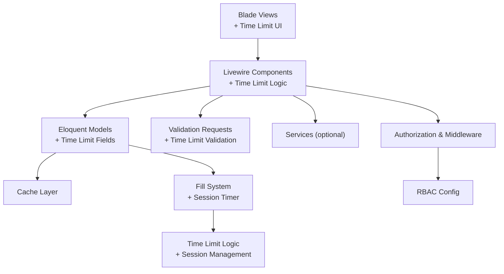

**Diagram sources**
- [user-directory.blade.php:78-98](file://resources/views/livewire/admin/user-directory.blade.php#L78-L98)
- [UserDirectory.php:131-193](file://app/Livewire/Admin/UserDirectory.php#L131-L193)
- [AvailableQuestionnaires.php:152-165](file://app/Livewire/Fill/AvailableQuestionnaires.php#L152-L165)
- [2026_04_21_020644_add_time_limit_and_filling_started_at_to_users_table.php:14-16](file://database/migrations/2026_04_21_020644_add_time_limit_and_filling_started_at_to_users_table.php#L14-L16)

**Section sources**
- [AdminDashboard.php:11-135](file://app/Livewire/Admin/AdminDashboard.php#L11-L135)
- [DepartmentDirectory.php:15-161](file://app/Livewire/Admin/DepartmentDirectory.php#L15-L161)
- [UserDirectory.php:19-420](file://app/Livewire/Admin/UserDirectory.php#L19-L420)
- [RoleDirectory.php:14-155](file://app/Livewire/Admin/RoleDirectory.php#L14-L155)
- [QuestionnaireForm.php:17-131](file://app/Livewire/Admin/QuestionnaireForm.php#L17-L131)
- [QuestionnaireList.php:14-80](file://app/Livewire/Admin/QuestionnaireList.php#L14-L80)
- [QuestionnaireAssignment.php:12-90](file://app/Livewire/Admin/QuestionnaireAssignment.php#L12-L90)
- [QuestionManager.php:18-280](file://app/Livewire/Admin/QuestionManager.php#L18-L280)

## Detailed Component Analysis

### AdminDashboard
- Purpose: Provide an overview dashboard with cached metrics.
- State: Uses a cache key with TTL to avoid repeated heavy queries.
- Metrics: Active questionnaires, total respondents, participation rate, average score, and role-based breakdown cards.
- Authorization: Requires permission to view questionnaires.

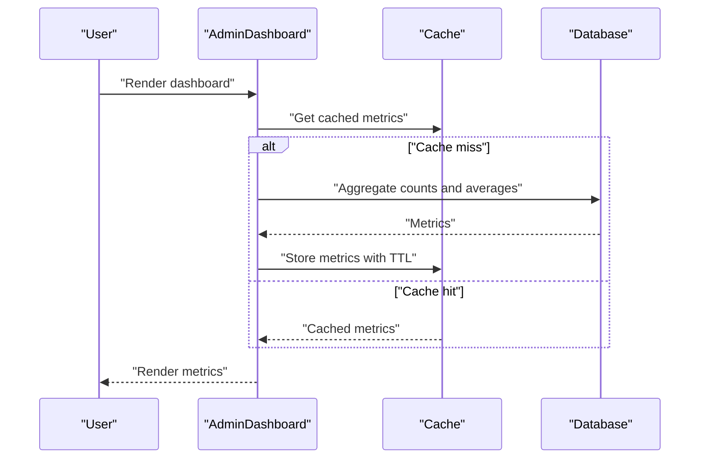

**Diagram sources**
- [AdminDashboard.php:27-130](file://app/Livewire/Admin/AdminDashboard.php#L27-L130)

**Section sources**
- [AdminDashboard.php:20-135](file://app/Livewire/Admin/AdminDashboard.php#L20-L135)
- [admin-dashboard.blade.php:17-49](file://resources/views/livewire/admin/admin-dashboard.blade.php#L17-L49)

### DepartmentDirectory
- Purpose: Manage departments with CRUD, search, pagination, sorting, and validation.
- State: Tracks search term, per-page, sort column, direction, and form visibility.
- Validation: Unique name, integer range for order, optional description.
- Actions: Create, update, delete with soft-delete safety checks and logging.

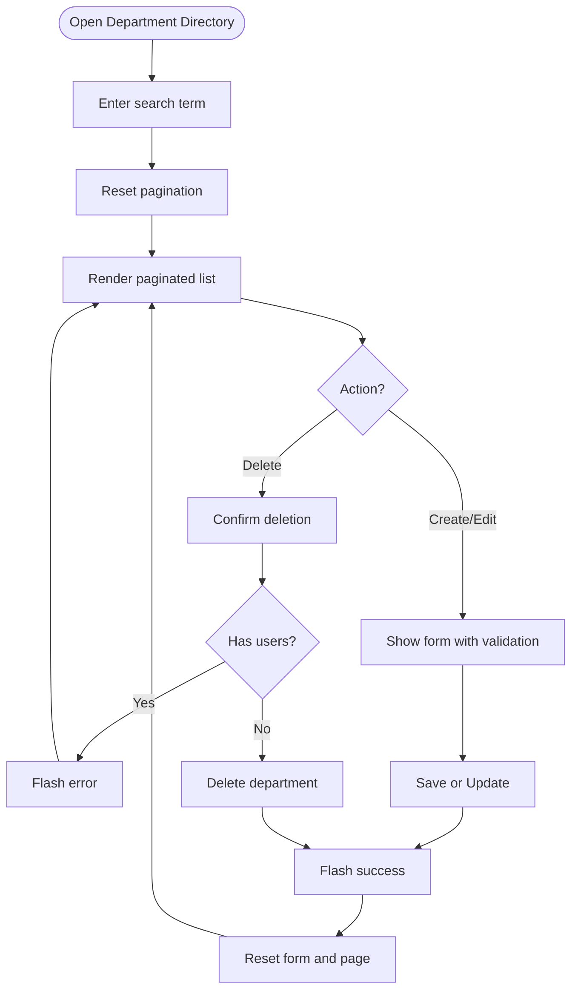

**Diagram sources**
- [DepartmentDirectory.php:40-118](file://app/Livewire/Admin/DepartmentDirectory.php#L40-L118)
- [department-directory.blade.php:44-96](file://resources/views/livewire/admin/department-directory.blade.php#L44-L96)

**Section sources**
- [DepartmentDirectory.php:35-161](file://app/Livewire/Admin/DepartmentDirectory.php#L35-L161)
- [department-directory.blade.php:1-98](file://resources/views/livewire/admin/department-directory.blade.php#L1-L98)
- [StoreDepartementRequest.php](file://app/Http/Requests/StoreDepartementRequest.php)
- [UpdateDepartementRequest.php](file://app/Http/Requests/UpdateDepartementRequest.php)

### UserDirectory
- Purpose: **Enhanced** Full user administration with filters, sorting, password handling, role/department resolution, and comprehensive time limit management.
- State: Tracks search, role/status/department/phone filters, pagination, form fields, and time limit components (hours and minutes).
- Validation: Email uniqueness, phone regex, password rules, role exists, department exists, time limit validation.
- Actions: Create/update (with optional password), delete with self-protection, time limit configuration, and session reset functionality.
- **New Features**: Individual user time limit configuration, session reset capability, time-based access control integration.

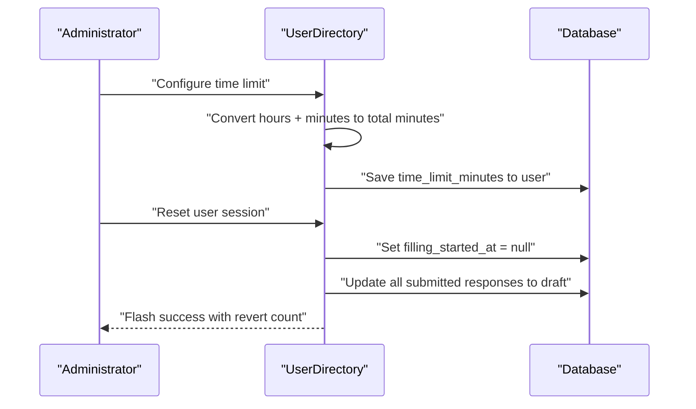

**Diagram sources**
- [UserDirectory.php:131-193](file://app/Livewire/Admin/UserDirectory.php#L131-L193)
- [UserDirectory.php:221-245](file://app/Livewire/Admin/UserDirectory.php#L221-L245)
- [user-directory.blade.php:78-98](file://resources/views/livewire/admin/user-directory.blade.php#L78-L98)

**Section sources**
- [UserDirectory.php:56-420](file://app/Livewire/Admin/UserDirectory.php#L56-L420)
- [user-directory.blade.php:1-234](file://resources/views/livewire/admin/user-directory.blade.php#L1-L234)
- [StoreUserRequest.php](file://app/Http/Requests/StoreUserRequest.php)
- [UpdateUserRequest.php](file://app/Http/Requests/UpdateUserRequest.php)

### RoleDirectory
- Purpose: Manage roles with validation and alias-aware persistence.
- State: Tracks search, per-page, sort column, direction, and form fields.
- Validation: Unique name, percentage range, boolean active flag.
- Actions: Create/update/delete with safety checks against existing users.

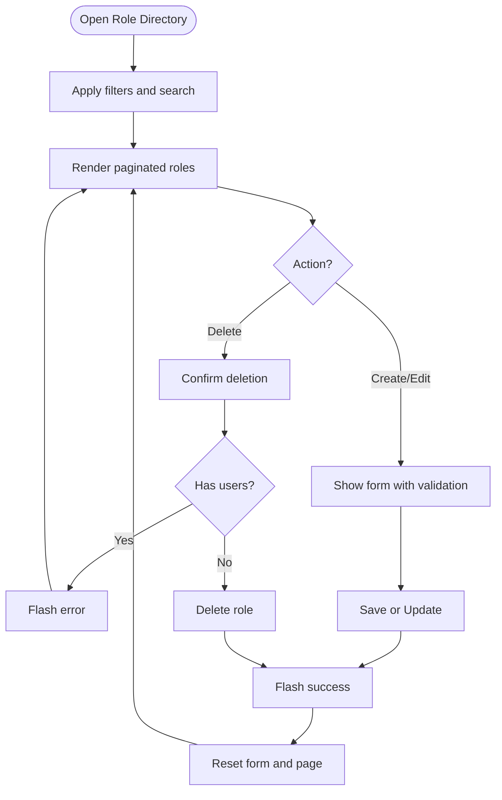

**Diagram sources**
- [RoleDirectory.php:61-109](file://app/Livewire/Admin/RoleDirectory.php#L61-L109)
- [role-directory.blade.php:61-103](file://resources/views/livewire/admin/role-directory.blade.php#L61-L103)

**Section sources**
- [RoleDirectory.php:28-155](file://app/Livewire/Admin/RoleDirectory.php#L28-L155)
- [role-directory.blade.php:1-105](file://resources/views/livewire/admin/role-directory.blade.php#L1-L105)

### QuestionnaireForm
- Purpose: Create or edit a questionnaire and sync target groups.
- State: Holds title, description, dates, status, and target groups; resolves labels from configuration.
- Validation: Uses dedicated request classes for create/update.
- Behavior: On save, persists questionnaire and target groups; redirects to edit page.

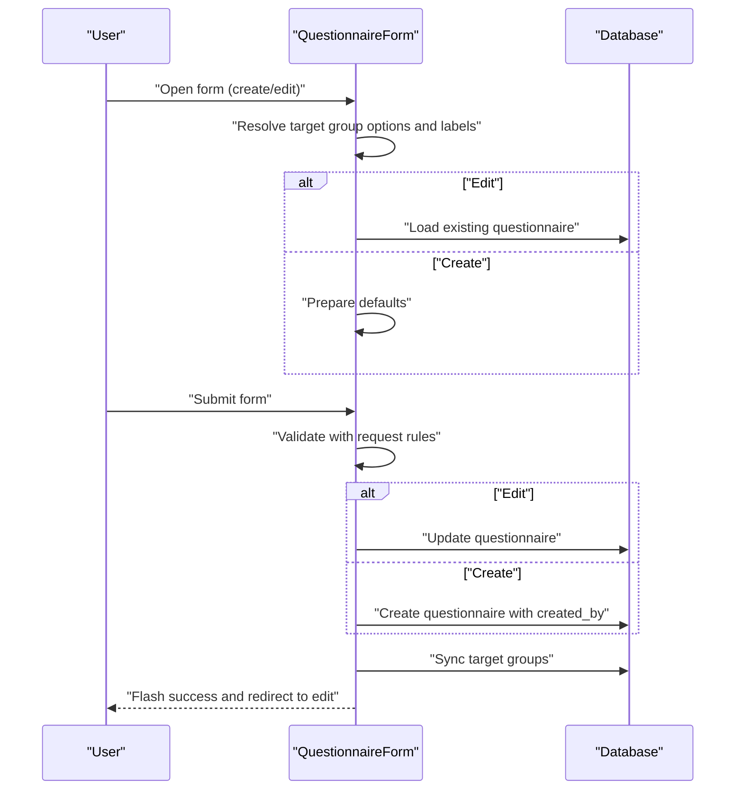

**Diagram sources**
- [QuestionnaireForm.php:40-106](file://app/Livewire/Admin/QuestionnaireForm.php#L40-L106)
- [questionnaire-form.blade.php:23-132](file://resources/views/livewire/admin/questionnaire-form.blade.php#L23-L132)

**Section sources**
- [QuestionnaireForm.php:40-131](file://app/Livewire/Admin/QuestionnaireForm.php#L40-L131)
- [questionnaire-form.blade.php:1-149](file://resources/views/livewire/admin/questionnaire-form.blade.php#L1-L149)
- [StoreQuestionnaireRequest.php](file://app/Http/Requests/StoreQuestionnaireRequest.php)
- [UpdateQuestionnaireRequest.php](file://app/Http/Requests/UpdateQuestionnaireRequest.php)

### QuestionnaireList
- Purpose: List questionnaires with search, status filter, and actions.
- State: Tracks search and status filter.
- Actions: Publish (set status to active), close (set status to closed), delete.

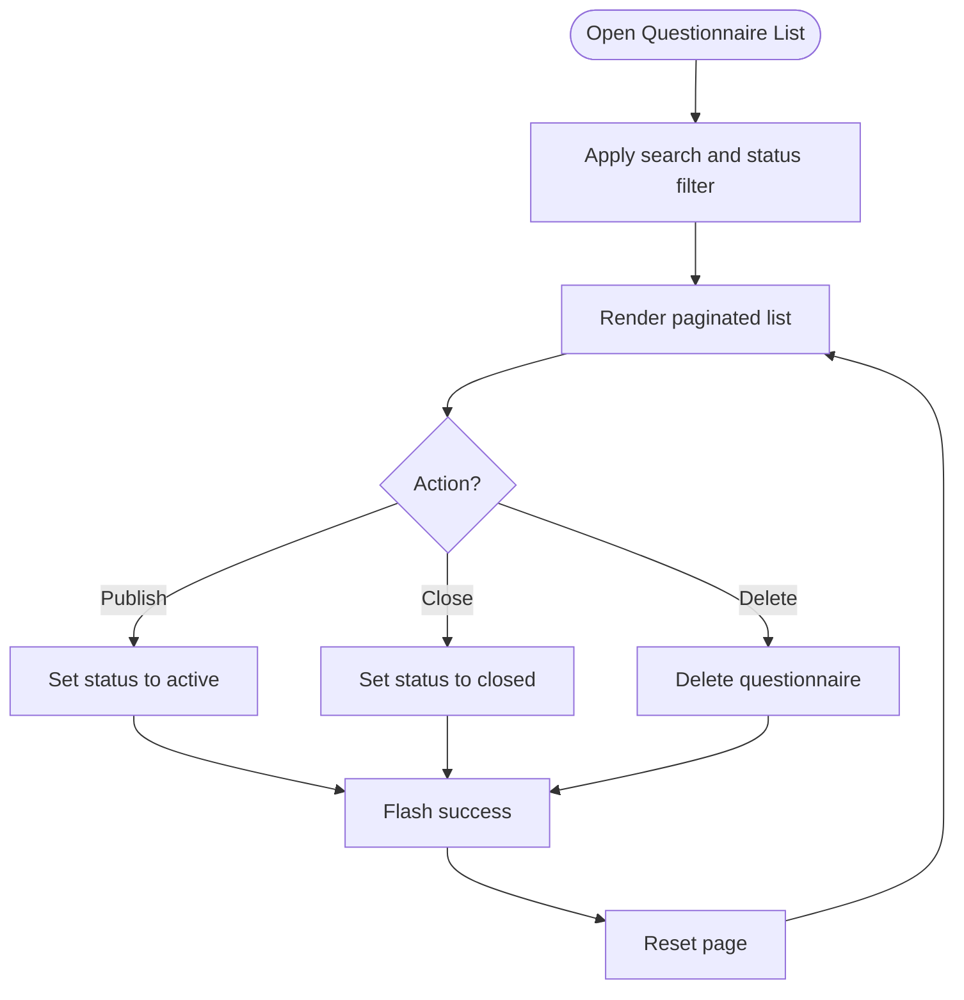

**Diagram sources**
- [QuestionnaireList.php:36-59](file://app/Livewire/Admin/QuestionnaireList.php#L36-L59)
- [questionnaire-list.blade.php:44-142](file://resources/views/livewire/admin/questionnaire-list.blade.php#L44-L142)

**Section sources**
- [QuestionnaireList.php:21-80](file://app/Livewire/Admin/QuestionnaireList.php#L21-L80)
- [questionnaire-list.blade.php:1-144](file://resources/views/livewire/admin/questionnaire-list.blade.php#L1-L144)

### QuestionnaireAssignment
- Purpose: Assign target groups to a questionnaire with validation and alias normalization.
- State: Holds selected target groups, available options, and labels.
- Behavior: Normalizes aliases via configuration, validates selection, syncs target groups, and dispatches an event to refresh parent.

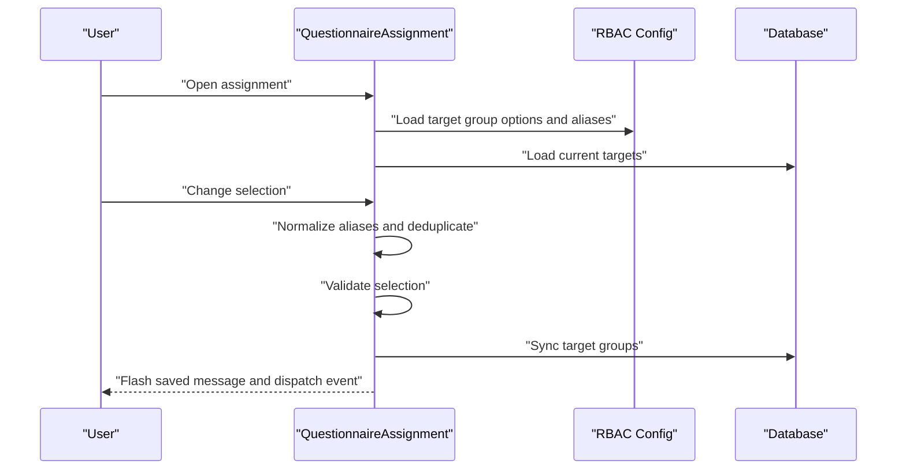

**Diagram sources**
- [QuestionnaireAssignment.php:27-68](file://app/Livewire/Admin/QuestionnaireAssignment.php#L27-L68)
- [questionnaire-assignment.blade.php:1-37](file://resources/views/livewire/admin/questionnaire-assignment.blade.php#L1-L37)
- [rbac.php](file://config/rbac.php)

**Section sources**
- [QuestionnaireAssignment.php:27-90](file://app/Livewire/Admin/QuestionnaireAssignment.php#L27-L90)
- [questionnaire-assignment.blade.php:1-37](file://resources/views/livewire/admin/questionnaire-assignment.blade.php#L1-L37)

### QuestionManager
- Purpose: Manage questions and answer options for a questionnaire, support ordering and scoring.
- State: Tracks editing question ID, form visibility, question text, type, requirement, and options array.
- Behavior: Validates options for selectable types, prepares options, persists question and options, swaps orders atomically, and cleans up orphaned options.

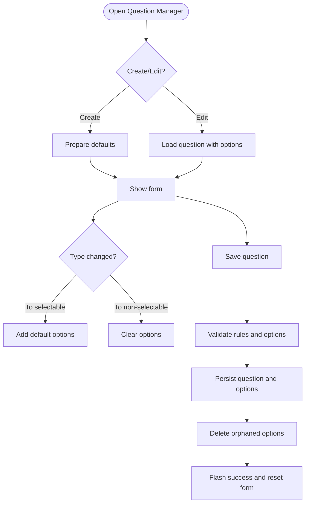

**Diagram sources**
- [QuestionManager.php:42-181](file://app/Livewire/Admin/QuestionManager.php#L42-L181)
- [question-manager.blade.php:19-186](file://resources/views/livewire/admin/question-manager.blade.php#L19-L186)

**Section sources**
- [QuestionManager.php:35-280](file://app/Livewire/Admin/QuestionManager.php#L35-L280)
- [question-manager.blade.php:1-188](file://resources/views/livewire/admin/question-manager.blade.php#L1-L188)
- [StoreQuestionRequest.php](file://app/Http/Requests/StoreQuestionRequest.php)
- [UpdateQuestionRequest.php](file://app/Http/Requests/UpdateQuestionRequest.php)

## Dependency Analysis
- Components depend on models for data access and relationships.
- Validation is centralized in request classes.
- Security is enforced via middleware and authorization gates.
- Configuration-driven behavior (RBAC) influences component logic.
- **Enhanced Integration**: User time limits integrate with the questionnaire filling system for real-time access control.

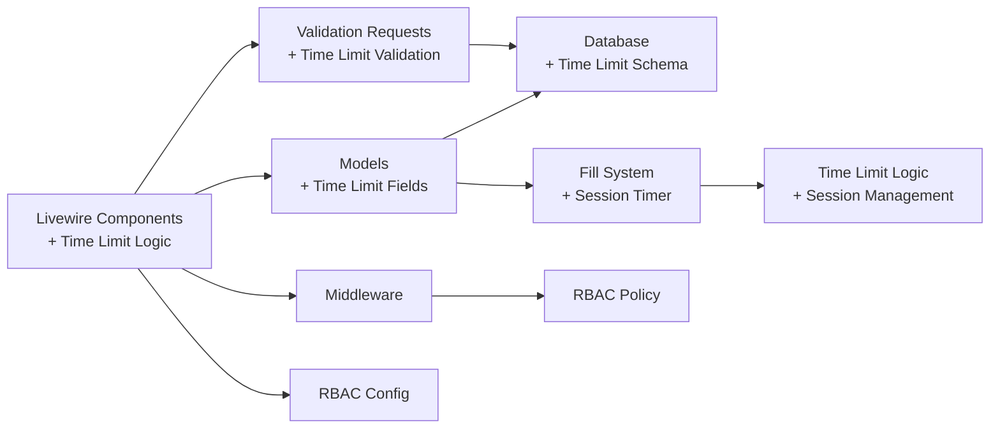

**Diagram sources**
- [UserDirectory.php:131-193](file://app/Livewire/Admin/UserDirectory.php#L131-L193)
- [AvailableQuestionnaires.php:152-165](file://app/Livewire/Fill/AvailableQuestionnaires.php#L152-L165)
- [2026_04_21_020644_add_time_limit_and_filling_started_at_to_users_table.php:14-16](file://database/migrations/2026_04_21_020644_add_time_limit_and_filling_started_at_to_users_table.php#L14-L16)

**Section sources**
- [AdminDashboard.php:5-12](file://app/Livewire/Admin/AdminDashboard.php#L5-L12)
- [DepartmentDirectory.php:5-10](file://app/Livewire/Admin/DepartmentDirectory.php#L5-L10)
- [UserDirectory.php:5-14](file://app/Livewire/Admin/UserDirectory.php#L5-L14)
- [RoleDirectory.php:5-9](file://app/Livewire/Admin/RoleDirectory.php#L5-L9)
- [QuestionnaireForm.php:5-12](file://app/Livewire/Admin/QuestionnaireForm.php#L5-L12)
- [QuestionnaireList.php:5-9](file://app/Livewire/Admin/QuestionnaireList.php#L5-L9)
- [QuestionnaireAssignment.php:5-8](file://app/Livewire/Admin/QuestionnaireAssignment.php#L5-L8)
- [QuestionManager.php:5-13](file://app/Livewire/Admin/QuestionManager.php#L5-L13)
- [EnsureUserIsAdmin.php](file://app/Http/Middleware/EnsureUserIsAdmin.php)
- [EnsureUserHasRole.php](file://app/Http/Middleware/EnsureUserHasRole.php)
- [rbac.php](file://config/rbac.php)

## Performance Considerations
- Dashboard caching: Metrics are cached with a TTL to reduce database load.
- Pagination: All list screens use pagination to limit payload sizes.
- Efficient queries: Components use eager loading and selective field retrieval.
- Debounced live updates: Inputs use debounced binding to minimize server round trips.
- Bulk operations: Deletion safeguards prevent accidental mass deletions; alias normalization avoids redundant writes.
- **Enhanced**: Time limit calculations are performed efficiently using simple arithmetic operations and database queries.

## Troubleshooting Guide
- Validation errors: Review request classes for precise validation messages and rules.
- Authorization failures: Ensure user roles and permissions align with middleware and authorization gates.
- Target group assignment: Verify RBAC aliases and availability; ensure at least one target remains selected.
- Soft deletes: Some delete actions are soft deletes; confirm model behavior and restore procedures.
- Logging: Components log significant changes; review logs for audit trails.
- **New Issues**: Time limit configuration errors: Verify that hours and minutes inputs are properly validated and converted to total minutes.

**Section sources**
- [StoreDepartementRequest.php](file://app/Http/Requests/StoreDepartementRequest.php)
- [UpdateDepartementRequest.php](file://app/Http/Requests/UpdateDepartementRequest.php)
- [StoreUserRequest.php](file://app/Http/Requests/StoreUserRequest.php)
- [UpdateUserRequest.php](file://app/Http/Requests/UpdateUserRequest.php)
- [StoreQuestionnaireRequest.php](file://app/Http/Requests/StoreQuestionnaireRequest.php)
- [UpdateQuestionnaireRequest.php](file://app/Http/Requests/UpdateQuestionnaireRequest.php)
- [StoreQuestionRequest.php](file://app/Http/Requests/StoreQuestionRequest.php)
- [UpdateQuestionRequest.php](file://app/Http/Requests/UpdateQuestionRequest.php)
- [EnsureUserIsAdmin.php](file://app/Http/Middleware/EnsureUserIsAdmin.php)
- [EnsureUserHasRole.php](file://app/Http/Middleware/EnsureUserHasRole.php)
- [RedirectByRole.php](file://app/Http/Middleware/RedirectByRole.php)

## Conclusion
The admin components provide a cohesive, secure, and efficient interface for managing departments, users, roles, and questionnaires. They emphasize real-time UX with Livewire, robust validation via request classes, strong authorization via middleware and policies, and configurable behavior through RBAC settings. **The UserDirectory component has been significantly enhanced with comprehensive time limit management capabilities**, allowing administrators to set individual time limits for users, reset user fill sessions, and manage time-based access controls, integrating seamlessly with the questionnaire filling system.

## Appendices

### Component State Management and Real-Time Updates
- Live bindings: Many inputs use live binding with debouncing to balance responsiveness and performance.
- Events: Components emit and listen to events (e.g., target-groups-updated) to synchronize state across panels.
- Flash messages: Success/error feedback is surfaced via session flash messages.
- **Enhanced**: Time limit inputs use live debounced binding for real-time conversion and validation.

**Section sources**
- [questionnaire-form.blade.php:109-121](file://resources/views/livewire/admin/questionnaire-form.blade.php#L109-L121)
- [questionnaire-assignment.blade.php:6-11](file://resources/views/livewire/admin/questionnaire-assignment.blade.php#L6-L11)
- [user-directory.blade.php:82-94](file://resources/views/livewire/admin/user-directory.blade.php#L82-L94)

### Integration with Admin Layouts and Navigation
- Layouts: Components declare the admin layout to ensure consistent navigation and styling.
- Navigation: Blade views include links to lists, forms, and analytics pages.

**Section sources**
- [admin.blade.php](file://resources/views/layouts/admin.blade.php)
- [questionnaire-form.blade.php:12-14](file://resources/views/livewire/admin/questionnaire-form.blade.php#L12-L14)
- [questionnaire-list.blade.php:8-10](file://resources/views/livewire/admin/questionnaire-list.blade.php#L8-L10)

### Security Considerations
- Role-based access: Middleware and authorization gates restrict access to admin and role-manage actions.
- Password handling: Passwords are hashed during create/update.
- Self-protection: Deleting self is prevented in user management.
- Logging: Administrative actions are logged for auditability.
- **Enhanced**: Time limit management includes proper validation and sanitization of time inputs.

**Section sources**
- [EnsureUserIsAdmin.php](file://app/Http/Middleware/EnsureUserIsAdmin.php)
- [EnsureUserHasRole.php](file://app/Http/Middleware/EnsureUserHasRole.php)
- [UserDirectory.php:174-182](file://app/Livewire/Admin/UserDirectory.php#L174-L182)
- [UserDirectory.php:221-245](file://app/Livewire/Admin/UserDirectory.php#L221-L245)

### Data Filtering and Bulk Operations
- Filtering: Users, roles, and questionnaires support multiple filters and sorting.
- Bulk operations: While individual actions are exposed, bulk operations are not explicitly implemented in the reviewed components.
- **Enhanced**: UserDirectory supports time limit filtering and management through individual user configuration.

**Section sources**
- [UserDirectory.php:286-420](file://app/Livewire/Admin/UserDirectory.php#L286-L420)
- [RoleDirectory.php:137-155](file://app/Livewire/Admin/RoleDirectory.php#L137-L155)
- [QuestionnaireList.php:61-80](file://app/Livewire/Admin/QuestionnaireList.php#L61-L80)

### Time Limit Management Features
**New Section**: The UserDirectory component now includes comprehensive time limit management capabilities:

#### Time Limit Configuration
- **Individual User Limits**: Administrators can set custom time limits for each user using hours and minutes components.
- **Real-time Conversion**: Hours and minutes are automatically converted to total minutes for storage.
- **Flexible Input**: Empty fields indicate no time limit, while values are validated and sanitized.
- **Display Integration**: Time limits are displayed in human-readable format (hours and minutes) throughout the interface.

#### Session Management
- **Session Reset**: Administrators can reset user fill sessions to allow users to retake questionnaires.
- **Automatic Status Recovery**: Submitted responses are automatically reverted to draft status when sessions are reset.
- **Timer Control**: The filling_started_at timestamp controls when the time limit countdown begins.

#### Database Integration
- **Schema Enhancement**: New columns added to users table: `time_limit_minutes` and `filling_started_at`.
- **Data Persistence**: Time limits are stored as total minutes for efficient calculation and comparison.
- **Session Tracking**: Filling sessions are tracked per user for accurate time limit enforcement.

#### Frontend Implementation
- **Dual Input Fields**: Separate hour and minute input fields with validation constraints.
- **Live Calculation**: Real-time display of total minutes equivalent to entered hours/minutes.
- **Conditional Display**: Time limit information is shown in user listings with appropriate formatting.
- **Session Controls**: Reset buttons appear when users have active sessions or submitted responses.

**Section sources**
- [UserDirectory.php:53-57](file://app/Livewire/Admin/UserDirectory.php#L53-L57)
- [UserDirectory.php:112-120](file://app/Livewire/Admin/UserDirectory.php#L112-L120)
- [UserDirectory.php:151](file://app/Livewire/Admin/UserDirectory.php#L151)
- [UserDirectory.php:179](file://app/Livewire/Admin/UserDirectory.php#L179)
- [UserDirectory.php:221-245](file://app/Livewire/Admin/UserDirectory.php#L221-L245)
- [user-directory.blade.php:78-98](file://resources/views/livewire/admin/user-directory.blade.php#L78-L98)
- [user-directory.blade.php:196-213](file://resources/views/livewire/admin/user-directory.blade.php#L196-L213)
- [2026_04_21_020644_add_time_limit_and_filling_started_at_to_users_table.php:14-16](file://database/migrations/2026_04_21_020644_add_time_limit_and_filling_started_at_to_users_table.php#L14-L16)
- [AvailableQuestionnaires.php:152-165](file://app/Livewire/Fill/AvailableQuestionnaires.php#L152-L165)