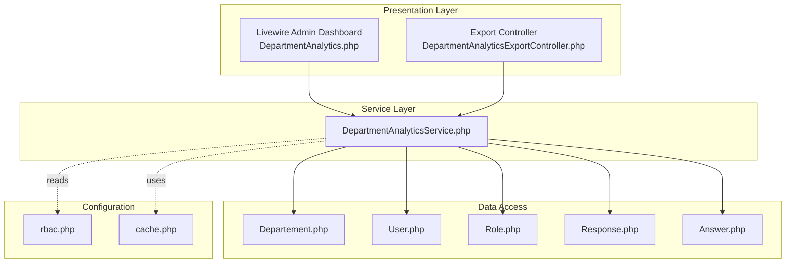
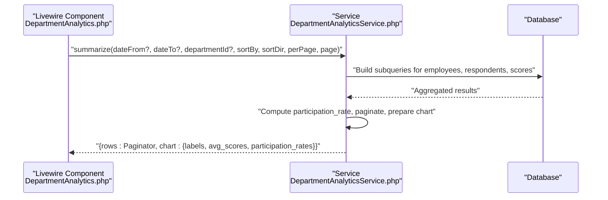
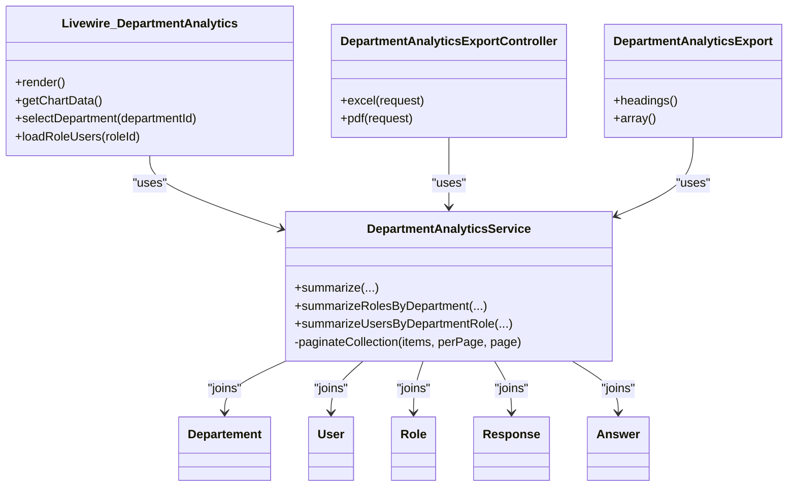

# Analytics Services

<cite>
**Referenced Files in This Document**
- [DepartmentAnalyticsService.php](file://app/Services/DepartmentAnalyticsService.php)
- [DepartmentAnalytics.php](file://app/Livewire/Admin/DepartmentAnalytics.php)
- [DepartmentAnalyticsExport.php](file://app/Exports/DepartmentAnalyticsExport.php)
- [DepartmentAnalyticsExportController.php](file://app/Http/Controllers/Admin/DepartmentAnalyticsExportController.php)
- [Departement.php](file://app/Models/Departement.php)
- [User.php](file://app/Models/User.php)
- [Role.php](file://app/Models/Role.php)
- [Answer.php](file://app/Models/Answer.php)
- [Response.php](file://app/Models/Response.php)
- [rbac.php](file://config/rbac.php)
- [cache.php](file://config/cache.php)
</cite>

## Table of Contents
1. [Introduction](#introduction)
2. [Project Structure](#project-structure)
3. [Core Components](#core-components)
4. [Architecture Overview](#architecture-overview)
5. [Detailed Component Analysis](#detailed-component-analysis)
6. [Dependency Analysis](#dependency-analysis)
7. [Performance Considerations](#performance-considerations)
8. [Troubleshooting Guide](#troubleshooting-guide)
9. [Conclusion](#conclusion)

## Introduction
This document provides comprehensive documentation for the analytics services focused on DepartmentAnalyticsService. It explains the three primary analytical functions:
- summarize(): Department-wide metrics with sorting, filtering, pagination, and chart data
- summarizeRolesByDepartment(): Role-based analytics within a selected department
- summarizeUsersByDepartmentRole(): Individual user performance tracking filtered by department and role

It also covers query optimization techniques (subqueries, caching, pagination), data aggregation logic, score calculations, participation rate computations, parameter validation, controller and Livewire usage examples, and performance considerations for large datasets.

## Project Structure
The analytics domain spans several layers:
- Service layer: DepartmentAnalyticsService encapsulates all analytics logic
- Presentation layer: Livewire component renders interactive dashboards and charts
- Export layer: Excel/PDF exports leverage the same service for consistent data
- Models: Eloquent models define relationships and attributes used in analytics queries
- Configuration: RBAC and cache settings influence evaluator slugs, caching behavior, and role-based access

**Diagram sources**
- [DepartmentAnalytics.php:1-271](file://app/Livewire/Admin/DepartmentAnalytics.php#L1-L271)
- [DepartmentAnalyticsExportController.php:1-63](file://app/Http/Controllers/Admin/DepartmentAnalyticsExportController.php#L1-L63)
- [DepartmentAnalyticsService.php:1-279](file://app/Services/DepartmentAnalyticsService.php#L1-L279)
- [Departement.php:1-34](file://app/Models/Departement.php#L1-L34)
- [User.php:1-94](file://app/Models/User.php#L1-L94)
- [Role.php:1-31](file://app/Models/Role.php#L1-L31)
- [Response.php:1-42](file://app/Models/Response.php#L1-L42)
- [Answer.php:1-44](file://app/Models/Answer.php#L1-L44)
- [rbac.php:1-64](file://config/rbac.php#L1-L64)
- [cache.php:1-131](file://config/cache.php#L1-L131)

**Section sources**
- [DepartmentAnalytics.php:1-271](file://app/Livewire/Admin/DepartmentAnalytics.php#L1-L271)
- [DepartmentAnalyticsExportController.php:1-63](file://app/Http/Controllers/Admin/DepartmentAnalyticsExportController.php#L1-L63)
- [DepartmentAnalyticsService.php:1-279](file://app/Services/DepartmentAnalyticsService.php#L1-L279)

## Core Components
- DepartmentAnalyticsService: Implements three analytical functions with optimized SQL subqueries, caching, and pagination
- Livewire Admin Dashboard: Provides interactive UI for date filters, sorting, pagination, role expansion, and user loading
- Export Controller and Export Class: Produce Excel and PDF reports using the same service logic for consistency
- Models: Define relationships and attributes used in joins and aggregations

Key responsibilities:
- summarize(): Aggregates department-level metrics, computes participation rates, and prepares chart data
- summarizeRolesByDepartment(): Aggregates role-level metrics within a department
- summarizeUsersByDepartmentRole(): Lists users with submission counts and average scores per role

**Section sources**
- [DepartmentAnalyticsService.php:20-95](file://app/Services/DepartmentAnalyticsService.php#L20-L95)
- [DepartmentAnalyticsService.php:109-189](file://app/Services/DepartmentAnalyticsService.php#L109-L189)
- [DepartmentAnalyticsService.php:199-256](file://app/Services/DepartmentAnalyticsService.php#L199-L256)
- [DepartmentAnalytics.php:181-205](file://app/Livewire/Admin/DepartmentAnalytics.php#L181-L205)
- [DepartmentAnalyticsExportController.php:15-62](file://app/Http/Controllers/Admin/DepartmentAnalyticsExportController.php#L15-L62)
- [DepartmentAnalyticsExport.php:29-49](file://app/Exports/DepartmentAnalyticsExport.php#L29-L49)

## Architecture Overview
The analytics pipeline follows a clean separation of concerns:
- UI triggers analytics via Livewire actions
- Service executes optimized SQL with subqueries and applies caching
- Results are paginated and transformed for charts and tables
- Export layer reuses the same service for batch reporting

**Diagram sources**
- [DepartmentAnalytics.php:244-252](file://app/Livewire/Admin/DepartmentAnalytics.php#L244-L252)
- [DepartmentAnalyticsService.php:20-95](file://app/Services/DepartmentAnalyticsService.php#L20-L95)

## Detailed Component Analysis

### DepartmentAnalyticsService
The service encapsulates three analytical functions with robust query optimization and caching.

#### Function: summarize()
Purpose:
- Compute department-level metrics: total employees, total respondents, average score, and participation rate
- Support filtering by department, date range, sorting, and pagination
- Return both paginated rows and chart-ready arrays

Implementation highlights:
- Subqueries:
  - Employees: count active evaluators grouped by department
  - Respondents: distinct user submissions within status and date bounds
  - Scores: average calculated scores per department within date bounds
- Left joins with departments to ensure all departments appear even without activity
- Participation rate computed as respondents/employees (rounded)
- Sorting validated against allowed fields
- Pagination performed on the full collection then sliced into paginator

Performance and correctness:
- Uses COALESCE to handle zero-division safely
- Applies when() clauses to conditionally filter by dates
- Sort field validation prevents SQL injection via dynamic order-by
- Paginates after sorting to maintain deterministic ordering

Usage in Livewire:
- Called from render() and getChartData() with appropriate parameters

**Section sources**
- [DepartmentAnalyticsService.php:20-95](file://app/Services/DepartmentAnalyticsService.php#L20-L95)
- [DepartmentAnalytics.php:244-252](file://app/Livewire/Admin/DepartmentAnalytics.php#L244-L252)
- [DepartmentAnalytics.php:181-205](file://app/Livewire/Admin/DepartmentAnalytics.php#L181-L205)

#### Function: summarizeRolesByDepartment()
Purpose:
- Provide role-level analytics within a selected department
- Computes total users per role, participation rate, and average score

Implementation highlights:
- Caching:
  - Cache key includes departmentId and optional date range
  - Cache lifetime set to 5 minutes
- Subqueries:
  - Total users per role within department and active conditions
  - Active respondents per role within department and submission status
  - Average score per role within department and submission status
- Participation rate computed as respondents/total users (rounded)
- Returns department name and rows array

Usage in Livewire:
- Called from selectDepartment() to populate role rows and error handling

**Section sources**
- [DepartmentAnalyticsService.php:109-189](file://app/Services/DepartmentAnalyticsService.php#L109-L189)
- [DepartmentAnalytics.php:107-125](file://app/Livewire/Admin/DepartmentAnalytics.php#L107-L125)

#### Function: summarizeUsersByDepartmentRole()
Purpose:
- List users within a department and role, showing submission counts and average scores

Implementation highlights:
- Caching:
  - Cache key includes departmentId, roleId, and optional date range
  - Cache lifetime set to 5 minutes
- Subqueries:
  - Submission counts per user within status and date bounds
  - Average score per user within status and date bounds
- Left joins ensure users without submissions appear with zeros
- Sorting by user name

Usage in Livewire:
- Called from loadRoleUsers() to lazily fetch user lists per role

**Section sources**
- [DepartmentAnalyticsService.php:199-256](file://app/Services/DepartmentAnalyticsService.php#L199-L256)
- [DepartmentAnalytics.php:149-172](file://app/Livewire/Admin/DepartmentAnalytics.php#L149-L172)

#### Pagination Utility
Private method paginateCollection():
- Accepts a Collection, perPage, and page number
- Calculates offset and slices the collection
- Returns a LengthAwarePaginator configured with current request URL and page name

**Section sources**
- [DepartmentAnalyticsService.php:258-277](file://app/Services/DepartmentAnalyticsService.php#L258-L277)

### Livewire Admin Dashboard
The DepartmentAnalytics Livewire component orchestrates:
- Date filters (dateFrom, dateTo) with automatic page reset on change
- Sorting by allowed fields with direction toggling
- Department selection and role expansion
- Lazy loading of user lists per role with error handling
- Chart data retrieval and export URLs

Key behaviors:
- Parameter validation mirrors service-side validation for sort fields
- Error messages surfaced to the UI for failed analytics loads
- Export URLs generated with current query parameters

**Section sources**
- [DepartmentAnalytics.php:49-95](file://app/Livewire/Admin/DepartmentAnalytics.php#L49-L95)
- [DepartmentAnalytics.php:97-172](file://app/Livewire/Admin/DepartmentAnalytics.php#L97-L172)
- [DepartmentAnalytics.php:181-234](file://app/Livewire/Admin/DepartmentAnalytics.php#L181-L234)
- [DepartmentAnalytics.php:236-269](file://app/Livewire/Admin/DepartmentAnalytics.php#L236-L269)

### Export Controller and Export Class
- Export Controller:
  - Generates Excel and HTML/PDF exports
  - Reads query parameters (date_from, date_to, department_id) and passes to service
  - Enforces admin authorization
- Export Class:
  - Implements FromArray and WithHeadings
  - Calls service with large perPage to export full dataset

**Section sources**
- [DepartmentAnalyticsExportController.php:15-62](file://app/Http/Controllers/Admin/DepartmentAnalyticsExportController.php#L15-L62)
- [DepartmentAnalyticsExport.php:29-49](file://app/Exports/DepartmentAnalyticsExport.php#L29-L49)

### Data Aggregation and Score Calculations
- Participation Rate:
  - Department level: total_respondents / total_employees (rounded)
  - Role level: active_respondents / total_users (rounded)
- Average Score:
  - Computed as AVG(calculated_score) per department, role, or user
  - Uses COALESCE to treat missing scores as zero
- Subqueries:
  - Consolidate counts and averages per grouping dimension
  - Apply status and date filters consistently across aggregations

**Section sources**
- [DepartmentAnalyticsService.php:67-70](file://app/Services/DepartmentAnalyticsService.php#L67-L70)
- [DepartmentAnalyticsService.php:167-170](file://app/Services/DepartmentAnalyticsService.php#L167-L170)

### Parameter Validation
- Allowed sort fields: name, total_respondents, participation_rate, average_score, urut
- Sort direction normalized to asc/desc
- Department ID filter applied when provided
- Date filters conditionally applied via when() clauses

**Section sources**
- [DepartmentAnalyticsService.php:73-77](file://app/Services/DepartmentAnalyticsService.php#L73-L77)
- [DepartmentAnalytics.php:82-95](file://app/Livewire/Admin/DepartmentAnalytics.php#L82-L95)

## Dependency Analysis
The service depends on:
- Eloquent models for relationships and attributes
- RBAC configuration for evaluator slugs and role-based access
- Cache configuration for caching strategy and store selection

**Diagram sources**
- [DepartmentAnalyticsService.php:12-279](file://app/Services/DepartmentAnalyticsService.php#L12-L279)
- [DepartmentAnalytics.php:13-271](file://app/Livewire/Admin/DepartmentAnalytics.php#L13-L271)
- [DepartmentAnalyticsExportController.php:13-62](file://app/Http/Controllers/Admin/DepartmentAnalyticsExportController.php#L13-L62)
- [DepartmentAnalyticsExport.php:9-50](file://app/Exports/DepartmentAnalyticsExport.php#L9-L50)
- [Departement.php:9-34](file://app/Models/Departement.php#L9-L34)
- [User.php:12-94](file://app/Models/User.php#L12-L94)
- [Role.php:9-31](file://app/Models/Role.php#L9-L31)
- [Response.php:11-42](file://app/Models/Response.php#L11-L42)
- [Answer.php:10-44](file://app/Models/Answer.php#L10-L44)

**Section sources**
- [DepartmentAnalyticsService.php:5-10](file://app/Services/DepartmentAnalyticsService.php#L5-L10)
- [rbac.php:4-6](file://config/rbac.php#L4-L6)
- [cache.php:18](file://config/cache.php#L18)

## Performance Considerations
- Subqueries and pre-aggregation:
  - Minimizes repeated scans by computing counts and averages in dedicated subqueries
  - Joins use left joins to preserve departments/roles/users even without activity
- Caching:
  - Role and user analytics cached for 5 minutes keyed by departmentId/roleId and date range
  - Reduces database load for repeated requests within short windows
- Pagination:
  - Full collection sorted then paginated to ensure consistent ordering
  - Export uses large perPage to produce complete datasets
- Indexing recommendations:
  - Ensure indexes on foreign keys (department_id, role_id, user_id, questionnaire_id)
  - Indexes on responses.status, responses.submitted_at, answers.calculated_score
  - Consider composite indexes for frequent filters (e.g., responses(status, submitted_at), users(department_id, role_id))
- Query safety:
  - when() clauses prevent unnecessary conditions
  - COALESCE guards against division-by-zero and null aggregates
- RBAC and evaluator slugs:
  - Evaluator slugs configured centrally; ensure proper indexing on users.role or users.role_id for efficient filtering

[No sources needed since this section provides general guidance]

## Troubleshooting Guide
Common issues and resolutions:
- Empty or missing analytics data:
  - Verify date filters and department selection
  - Confirm evaluator slugs in configuration align with deployed roles
- Slow performance:
  - Check cache store configuration and connectivity
  - Review database indexes on join and filter columns
- Incorrect participation rates:
  - Ensure employees are counted among active evaluators with valid department_id
  - Validate that respondents are filtered by submitted status and date range
- Pagination anomalies:
  - Confirm page resets when filters change
  - Validate perPage and page parameters passed to service

**Section sources**
- [DepartmentAnalytics.php:54-72](file://app/Livewire/Admin/DepartmentAnalytics.php#L54-L72)
- [DepartmentAnalyticsService.php:114-119](file://app/Services/DepartmentAnalyticsService.php#L114-L119)
- [DepartmentAnalyticsService.php:205-211](file://app/Services/DepartmentAnalyticsService.php#L205-L211)
- [cache.php:18](file://config/cache.php#L18)

## Conclusion
DepartmentAnalyticsService delivers efficient, scalable analytics through optimized SQL subqueries, strategic caching, and robust pagination. Its three analytical functions support comprehensive oversight of department performance, role-level insights, and individual user tracking. Livewire and export integrations ensure consistent, user-friendly delivery of actionable metrics.

[No sources needed since this section summarizes without analyzing specific files]