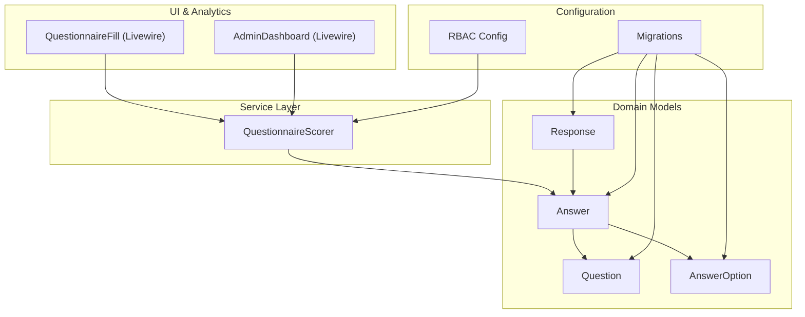
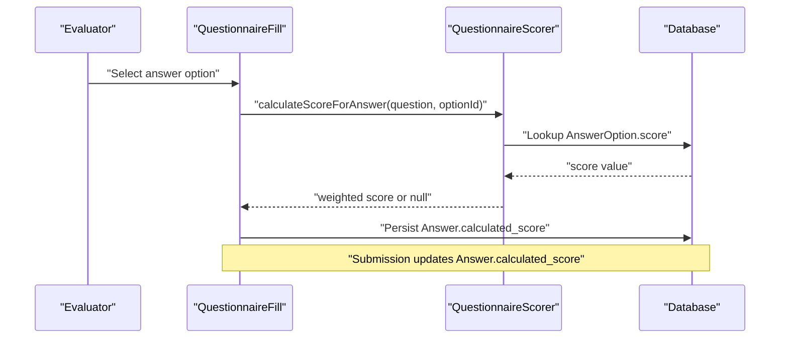
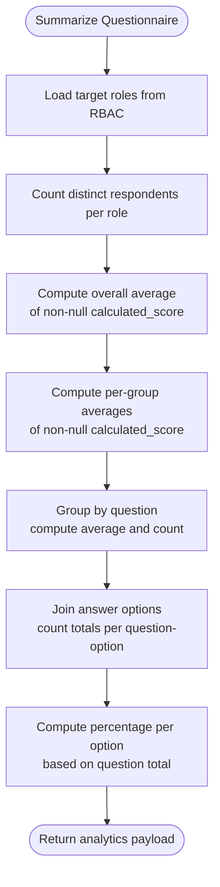
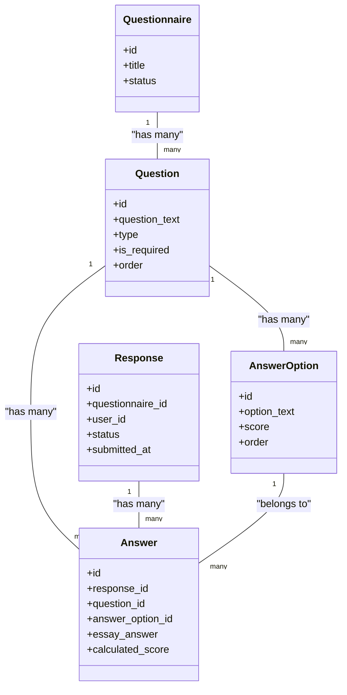
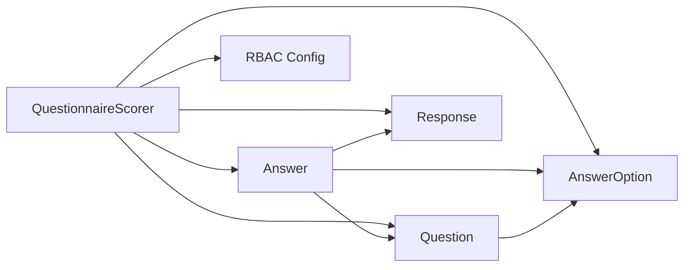

# Assessment Scoring Services

<cite>
**Referenced Files in This Document**
- [QuestionnaireScorer.php](file://app/Services/QuestionnaireScorer.php)
- [Answer.php](file://app/Models/Answer.php)
- [AnswerOption.php](file://app/Models/AnswerOption.php)
- [Question.php](file://app/Models/Question.php)
- [Response.php](file://app/Models/Response.php)
- [2026_04_16_020000_create_responses_table.php](file://database/migrations/2026_04_16_020000_create_responses_table.php)
- [2026_04_16_020100_create_answers_table.php](file://database/migrations/2026_04_16_020100_create_answers_table.php)
- [2026_04_16_010242_create_answer_options_table.php](file://database/migrations/2026_04_16_010242_create_answer_options_table.php)
- [2026_04_16_010241_create_questions_table.php](file://database/migrations/2026_04_16_010241_create_questions_table.php)
- [2026_04_16_010239_create_questionnaires_table.php](file://database/migrations/2026_04_16_010239_create_questionnaires_table.php)
- [rbac.php](file://config/rbac.php)
- [07-scoring.md](file://.clinerules/07-scoring.md)
- [QuestionnaireFill.php](file://app/Livewire/Fill/QuestionnaireFill.php)
- [AdminDashboard.php](file://app/Livewire/Admin/AdminDashboard.php)
</cite>

## Table of Contents
1. [Introduction](#introduction)
2. [Project Structure](#project-structure)
3. [Core Components](#core-components)
4. [Architecture Overview](#architecture-overview)
5. [Detailed Component Analysis](#detailed-component-analysis)
6. [Dependency Analysis](#dependency-analysis)
7. [Performance Considerations](#performance-considerations)
8. [Troubleshooting Guide](#troubleshooting-guide)
9. [Conclusion](#conclusion)
10. [Appendices](#appendices)

## Introduction
This document describes the Assessment Scoring Services with a focus on the QuestionnaireScorer service. It explains how raw scores are derived from selected answer options, aggregated into averages and distributions, and how the service integrates with the domain models and analytics dashboards. It also outlines scoring methodology, weighted answer calculations, grade computation logic, threshold calculations, performance band assignments, response validation, and score caching mechanisms. Finally, it provides examples of scoring configurations, custom scoring rules, and performance optimization techniques for bulk scoring operations.

## Project Structure
The scoring service is implemented as a dedicated service class and integrates with Eloquent models representing responses, answers, questions, and answer options. Database migrations define the schema for storing scored responses and computed metrics. RBAC configuration defines target groups used for analytics breakdowns. The scoring logic is invoked during form submission and leveraged by analytics dashboards.

**Diagram sources**
- [QuestionnaireScorer.php:12-139](file://app/Services/QuestionnaireScorer.php#L12-L139)
- [Answer.php:10-44](file://app/Models/Answer.php#L10-L44)
- [AnswerOption.php:10-38](file://app/Models/AnswerOption.php#L10-L38)
- [Question.php:11-43](file://app/Models/Question.php#L11-L43)
- [Response.php:11-42](file://app/Models/Response.php#L11-L42)
- [rbac.php:1-64](file://config/rbac.php#L1-L64)
- [2026_04_16_010241_create_questions_table.php:1-30](file://database/migrations/2026_04_16_010241_create_questions_table.php#L1-L30)
- [2026_04_16_010242_create_answer_options_table.php:1-28](file://database/migrations/2026_04_16_010242_create_answer_options_table.php#L1-L28)
- [2026_04_16_020000_create_responses_table.php:1-30](file://database/migrations/2026_04_16_020000_create_responses_table.php#L1-L30)
- [2026_04_16_020100_create_answers_table.php:1-30](file://database/migrations/2026_04_16_020100_create_answers_table.php#L1-L30)

**Section sources**
- [QuestionnaireScorer.php:12-139](file://app/Services/QuestionnaireScorer.php#L12-L139)
- [Answer.php:10-44](file://app/Models/Answer.php#L10-L44)
- [AnswerOption.php:10-38](file://app/Models/AnswerOption.php#L10-L38)
- [Question.php:11-43](file://app/Models/Question.php#L11-L43)
- [Response.php:11-42](file://app/Models/Response.php#L11-L42)
- [rbac.php:1-64](file://config/rbac.php#L1-L64)
- [2026_04_16_010241_create_questions_table.php:1-30](file://database/migrations/2026_04_16_010241_create_questions_table.php#L1-L30)
- [2026_04_16_010242_create_answer_options_table.php:1-28](file://database/migrations/2026_04_16_010242_create_answer_options_table.php#L1-L28)
- [2026_04_16_020000_create_responses_table.php:1-30](file://database/migrations/2026_04_16_020000_create_responses_table.php#L1-L30)
- [2026_04_16_020100_create_answers_table.php:1-30](file://database/migrations/2026_04_16_020100_create_answers_table.php#L1-L30)

## Core Components
- QuestionnaireScorer: Central scoring service providing:
  - Weighted answer calculation for single-choice questions
  - Questionnaire-wide analytics: overall averages, group averages, question averages, and distribution percentages
- Answer model: Stores calculated_score and links to Response, Question, and AnswerOption
- Question model: Defines question type and maintains ordered AnswerOption entries
- AnswerOption model: Holds option_text and numeric score used for weighted scoring
- Response model: Represents a single submission with status and user linkage
- RBAC configuration: Defines questionnaire target slugs used for analytics grouping
- Migrations: Define schema for questionnaires, questions, answer options, responses, and answers

Key responsibilities:
- Weighted scoring: Selects the score value associated with the chosen AnswerOption for a given Question
- Aggregation: Computes averages and distributions across submitted responses
- Validation: Ignores null calculated_score entries in averages and counts
- Grouping: Uses RBAC target slugs to segment analytics by evaluator categories

**Section sources**
- [QuestionnaireScorer.php:14-23](file://app/Services/QuestionnaireScorer.php#L14-L23)
- [QuestionnaireScorer.php:33-112](file://app/Services/QuestionnaireScorer.php#L33-L112)
- [Answer.php:15-22](file://app/Models/Answer.php#L15-L22)
- [AnswerOption.php:15-21](file://app/Models/AnswerOption.php#L15-L21)
- [Question.php:16-26](file://app/Models/Question.php#L16-L26)
- [rbac.php:6-11](file://config/rbac.php#L6-L11)
- [2026_04_16_020100_create_answers_table.php:14-16](file://database/migrations/2026_04_16_020100_create_answers_table.php#L14-L16)

## Architecture Overview
The scoring pipeline connects UI interactions to the scoring service and persists results in the Answer model. Analytics dashboards consume summarized statistics produced by the service.

**Diagram sources**
- [QuestionnaireFill.php:225-240](file://app/Livewire/Fill/QuestionnaireFill.php#L225-L240)
- [QuestionnaireScorer.php:14-23](file://app/Services/QuestionnaireScorer.php#L14-L23)
- [Answer.php:15-22](file://app/Models/Answer.php#L15-L22)

## Detailed Component Analysis

### QuestionnaireScorer: Scoring and Analytics
Responsibilities:
- Weighted answer calculation: Returns the score associated with a selected AnswerOption for a Question; returns null if no option is selected
- Summarization: Produces:
  - Respondent breakdown by evaluator role
  - Overall average and per-group averages
  - Question-level averages sorted descending
  - Distribution of answer options with counts and percentages

Processing logic highlights:
- Weighted scoring: Retrieves score from AnswerOption when optionId is present; otherwise returns null
- Averages: Computes overall average and per-group averages using only answers with non-null calculated_score
- Question averages: Groups by question and computes rounded averages with response counts
- Distribution: Aggregates counts per question-option, then computes percentages based on total responses per question

**Diagram sources**
- [QuestionnaireScorer.php:33-112](file://app/Services/QuestionnaireScorer.php#L33-L112)
- [QuestionnaireScorer.php:118-137](file://app/Services/QuestionnaireScorer.php#L118-L137)

**Section sources**
- [QuestionnaireScorer.php:14-23](file://app/Services/QuestionnaireScorer.php#L14-L23)
- [QuestionnaireScorer.php:33-112](file://app/Services/QuestionnaireScorer.php#L33-L112)
- [QuestionnaireScorer.php:118-137](file://app/Services/QuestionnaireScorer.php#L118-L137)

### Data Models and Relationships

**Diagram sources**
- [Question.php:11-43](file://app/Models/Question.php#L11-L43)
- [AnswerOption.php:10-38](file://app/Models/AnswerOption.php#L10-L38)
- [Answer.php:10-44](file://app/Models/Answer.php#L10-L44)
- [Response.php:11-42](file://app/Models/Response.php#L11-L42)
- [2026_04_16_010241_create_questions_table.php:11-22](file://database/migrations/2026_04_16_010241_create_questions_table.php#L11-L22)
- [2026_04_16_010242_create_answer_options_table.php:11-20](file://database/migrations/2026_04_16_010242_create_answer_options_table.php#L11-L20)
- [2026_04_16_020000_create_responses_table.php:10-22](file://database/migrations/2026_04_16_020000_create_responses_table.php#L10-L22)
- [2026_04_16_020100_create_answers_table.php:10-22](file://database/migrations/2026_04_16_020100_create_answers_table.php#L10-L22)

### Scoring Methodology and Weighted Answer Calculations
- Single choice scoring: The score returned by calculateScoreForAnswer is the score value stored in AnswerOption for the selected option
- Essay and combined questions: The current implementation focuses on single choice; essay answers are stored separately and do not contribute to calculated_score in the referenced logic
- Null handling: If no option is selected, the method returns null; downstream analytics exclude null values from averages

Integration points:
- UI writes Answer.calculated_score during submission
- Analytics queries filter out null calculated_score when computing averages

**Section sources**
- [QuestionnaireScorer.php:14-23](file://app/Services/QuestionnaireScorer.php#L14-L23)
- [Answer.php:15-22](file://app/Models/Answer.php#L15-L22)
- [AnswerOption.php:15-21](file://app/Models/AnswerOption.php#L15-L21)
- [QuestionnaireFill.php:225-240](file://app/Livewire/Fill/QuestionnaireFill.php#L225-L240)

### Grade Computation and Thresholds
- Current implementation does not compute letter grades or performance bands; averages are rounded to two decimals
- To add grade thresholds, extend the summarization logic to map averages to grade bands and include band counts in the analytics payload
- Thresholds can be configured via configuration files and applied consistently across services

**Section sources**
- [QuestionnaireScorer.php:58-66](file://app/Services/QuestionnaireScorer.php#L58-L66)
- [QuestionnaireScorer.php:78-84](file://app/Services/QuestionnaireScorer.php#L78-L84)
- [07-scoring.md:14-22](file://.clinerules/07-scoring.md#L14-L22)

### Response Validation and Data Integrity
- Status filtering: Analytics queries restrict to responses with status "submitted"
- Non-null filtering: Averages and counts exclude answers with null calculated_score
- Unique constraints: Responses are unique per questionnaire-user pair; Answers are unique per response-question pair
- Required questions: Questions can be marked as required; however, the scoring service itself does not enforce requiredness

**Section sources**
- [QuestionnaireScorer.php:36-38](file://app/Services/QuestionnaireScorer.php#L36-L38)
- [QuestionnaireScorer.php:48-53](file://app/Services/QuestionnaireScorer.php#L48-L53)
- [QuestionnaireScorer.php:57-65](file://app/Services/QuestionnaireScorer.php#L57-L65)
- [QuestionnaireScorer.php:71-77](file://app/Services/QuestionnaireScorer.php#L71-L77)
- [2026_04_16_020000_create_responses_table.php:14-16](file://database/migrations/2026_04_16_020000_create_responses_table.php#L14-L16)
- [2026_04_16_020100_create_answers_table.php:16](file://database/migrations/2026_04_16_020100_create_answers_table.php#L16)
- [Question.php:24-26](file://app/Models/Question.php#L24-L26)

### Score Caching Mechanisms
- The scoring service does not implement explicit caching; analytics are computed on demand
- Recommendation: Cache summarized results keyed by questionnaire_id while invalidating on new submissions
- Consider cache tags or TTL aligned with questionnaire lifecycle

**Section sources**
- [07-scoring.md:37-38](file://.clinerules/07-scoring.md#L37-L38)
- [QuestionnaireScorer.php:33-112](file://app/Services/QuestionnaireScorer.php#L33-L112)

### Examples of Scoring Configurations and Custom Rules
- Default single-choice scoring scale: Configure AnswerOption scores to reflect desired scale (e.g., 5, 4, 3, 2, 0)
- Custom per-question weights: Introduce a multiplier field on Question and adjust Answer.calculated_score accordingly
- Threshold bands: Add a configuration array mapping average ranges to grade bands and update summarization to include band counts

**Section sources**
- [07-scoring.md:3-12](file://.clinerules/07-scoring.md#L3-L12)
- [AnswerOption.php:15-21](file://app/Models/AnswerOption.php#L15-L21)
- [Question.php:16-26](file://app/Models/Question.php#L16-L26)

### Performance Optimization for Bulk Scoring Operations
- Batch writes: Persist Answer.calculated_score in batches after scoring to reduce database round trips
- Index utilization: Ensure indexes on questionnaire_id, status, and calculated_score improve query performance
- Aggregation caching: Cache summarized analytics per questionnaire and invalidate on submission events
- Pagination and chunking: For very large datasets, process analytics in chunks and stream results

**Section sources**
- [2026_04_16_020100_create_answers_table.php:16](file://database/migrations/2026_04_16_020100_create_answers_table.php#L16)
- [2026_04_16_020000_create_responses_table.php:19-21](file://database/migrations/2026_04_16_020000_create_responses_table.php#L19-L21)
- [07-scoring.md:37-38](file://.clinerules/07-scoring.md#L37-L38)

## Dependency Analysis

**Diagram sources**
- [QuestionnaireScorer.php:5-10](file://app/Services/QuestionnaireScorer.php#L5-L10)
- [Answer.php:24-42](file://app/Models/Answer.php#L24-L42)
- [Question.php:28-41](file://app/Models/Question.php#L28-L41)
- [AnswerOption.php:23-36](file://app/Models/AnswerOption.php#L23-L36)
- [Response.php:27-40](file://app/Models/Response.php#L27-L40)
- [rbac.php:6-11](file://config/rbac.php#L6-L11)

**Section sources**
- [QuestionnaireScorer.php:5-10](file://app/Services/QuestionnaireScorer.php#L5-L10)
- [Answer.php:24-42](file://app/Models/Answer.php#L24-L42)
- [Question.php:28-41](file://app/Models/Question.php#L28-L41)
- [AnswerOption.php:23-36](file://app/Models/AnswerOption.php#L23-L36)
- [Response.php:27-40](file://app/Models/Response.php#L27-L40)
- [rbac.php:6-11](file://config/rbac.php#L6-L11)

## Performance Considerations
- Use non-null filtering for averages to avoid skewing results
- Leverage database indexes on frequently filtered columns (questionnaire_id, status, calculated_score)
- Cache analytics results for active questionnaires and invalidate on submission
- Batch database writes for Answer.calculated_score during bulk operations
- Stream large analytics exports to avoid memory pressure

[No sources needed since this section provides general guidance]

## Troubleshooting Guide
Common issues and resolutions:
- Null calculated_score in averages: Ensure UI writes Answer.calculated_score on submission; verify that nulls are excluded from averages
- Incorrect averages due to draft responses: Confirm analytics filter by status "submitted"
- Missing roles in analytics: Verify RBAC questionnaire_target_slugs configuration
- Unexpected distribution percentages: Confirm counts aggregation per question-option and percentage calculation logic

**Section sources**
- [QuestionnaireScorer.php:48-53](file://app/Services/QuestionnaireScorer.php#L48-L53)
- [QuestionnaireScorer.php:57-65](file://app/Services/QuestionnaireScorer.php#L57-L65)
- [QuestionnaireScorer.php:71-77](file://app/Services/QuestionnaireScorer.php#L71-L77)
- [QuestionnaireScorer.php:118-137](file://app/Services/QuestionnaireScorer.php#L118-L137)
- [rbac.php:6-11](file://config/rbac.php#L6-L11)

## Conclusion
The QuestionnaireScorer service provides a focused, efficient mechanism for weighted scoring and analytics. It relies on AnswerOption-defined scores, enforces response validation via status and non-null constraints, and segments analytics by evaluator roles. Extending the service to support grade thresholds, caching, and batch operations aligns with the project’s scoring guidelines and enhances scalability.

[No sources needed since this section summarizes without analyzing specific files]

## Appendices

### API and Data Contracts
- Summarization output keys:
  - respondent_breakdown: role => count
  - averages.overall: float
  - averages.per_group: role => average
  - question_scores: array of {question_id, question_text, type, average_score, responses_count}
  - distribution: array of {question_id, question_text, option_text, score, count, percentage}

**Section sources**
- [QuestionnaireScorer.php:26-32](file://app/Services/QuestionnaireScorer.php#L26-L32)
- [QuestionnaireScorer.php:99-111](file://app/Services/QuestionnaireScorer.php#L99-L111)